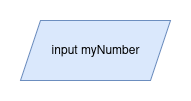
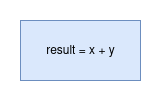
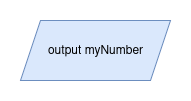
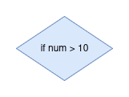
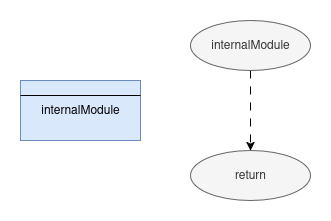
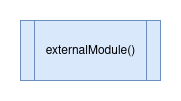
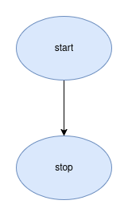
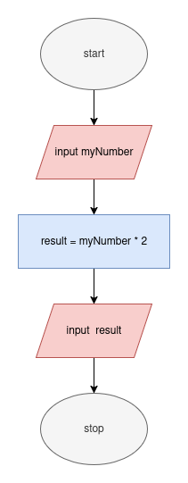

# Flow Charts

When planning code, psuedocode sometimes does not provide us
a good "visual" to look at, since it is just lines of words.

Flowcharts show the logic of a piece of code with symbols representing each step.
This gives us a nice picture to look at to EASILY visualize the code 
we are trying to understand.

So we are representing the same ideas, but with specific shapes... so let's just get into them!

-----

# input

to denote inputs with a flow chart, we can use a parallelogram.

as we can see, the same 'code' we would use is still in the shape, 
but the shape helps us easily tell what the purpose of this portion is.

We are going to see this same format (the actual code being contained withing a
specific shape) over and over again!

# calculation

to denote any time of calculation, we use a rectangle

# output

to denote output, we use the same shape as input, i.e., a parallelogram

# decision

to denote a decision being made (for instance, with an if statement), we use a diamond:

# module call

we have not discussed modules yet, but when we do, we will denote them as such:

## internal module call\

## external module call

# flowline

Use an arrow to connect these steps and to show the flow

# starting and stopping.

Now, just like psuedocode, we NEED to indicate that our code is starting and stopping.

We do this with a circle (or oval, if you want to be technical)!

Now we don't need to only use the words "start" and "end"...
any words to indicate such is fine, just as long as there are these
two circles denoting these points.

-----

# Simple Example

Let's put these together and make the previously discussed program into a flow chart.
> input a single value and find and output the value multiplied by 2

* erm pretend the last red parallelogram said "output" instead of "input"

-----

# Where to draw these??

# [draw.io](https://www.drawio.com/)

A good tool for making these flowcharts is draw.io

# A few things to show off

Honestly, this resource is very easy to use, but we will briefly discuss
its basics:

- Get there
    - Either draw.io
    - or go through website and "start using"
- Make shapes
- Change Color
- Add Text
- Represent small piece of code
- Add description
- Save
- Export