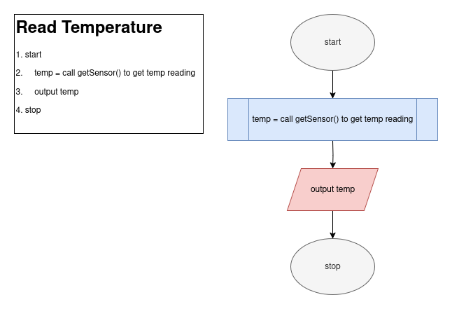
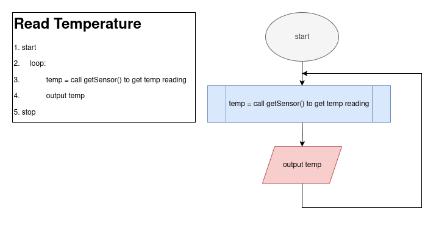
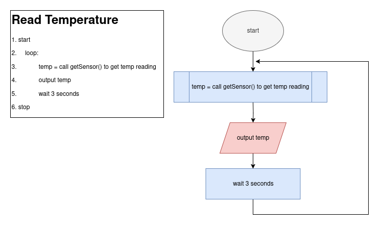
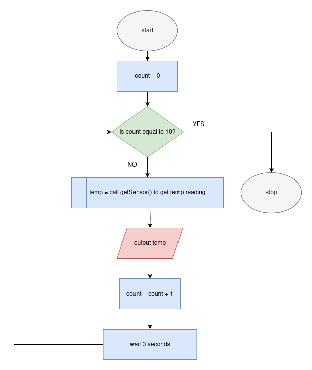

# Repeating Instructions (aka Loops)

Sometimes, you need to make your piece of code do something more than once... repeatedly

Up to thing point, we have just made pieces of code that does a single task and ends.
We may need more than this though.

# Example (weather station temperature detection thing):

For instance, let us pretend you work at a weather station.
You have a piece of code that gets the temperature from some sensor.

Let's pretend it maybe looks like this:

Typically, you want to detect more than just 1 temperature at 1 point in time,
and having a person manually re-run a piece of code is incredibly inconvenient...
and we have computers so this is kinda their job.

this now solves our problem! It is giving us the temperature all the time.
We do have 2 problems:

the first problem is that we would barely be able to read the temperature, as this code
would loop as fast as the computer can make it, so it is going to be printing out values
SUPER FAST

- show example

to prevent this, we can add an extra step to allow the program to wait a moment
this gives us readings every 3 seconds instead of literally every moment:

- show example of now slower piece of code

THE OTHER PROBLEM IS....

# Infinite Loop

currently this code runs forever. Honestly, in this current context, maybe we want to program to run
forever (if we are trying to always get the temperature to report it).

The problem is that we typically do not want this in any other scenario.

In most situations, we would want the program to end... and
we can easily tell from the flow chart that this does now end since 
there is literally no "stop" or "end" circle we connect to.

The psuedocode does indicate this as well, but we at least still include the word
stop... despite it never reaching it.

# Ending Programs

To end a program up to this point, we have just allowed it to 
reach it's final line... to end naturally.
- No more lines to run (ends "naturally")

Now, though, with a loop:
- If it is a loop, it will run forever without us preventing it

So, WE MUST USE:
> We can use a **_sentinel value_** to end a program if it is running forever!

Typically, we would use these in conjuction with some conditional statement like
a for or if statement, but we have not gotten to those quite yet, so we are instead going to 
just use a "decision" flowchart item.

SO, what we can do is create a sentinel value, that being the variable "count" and count how many times
we read the temperature sensor. We can use this as a sentinel value by stopping the program when it reaches a count of
10... so let's do just that!

Now, this program will reach the "stop" part when it has gotten the temperature 10 times!

Notice the very important step where we increase the count by 1.
If we set up the code exactly the same but do not include this step, the code will STILL RUN FOREVER.

Whenever we are making repeating instructions in a piece of code, we need to make sure there is something pushing
us towards ending the loop... otherwise the code will never end.

Even this code kinda has an oversight. Currently, it works, but let's say someone changed the count to increment by
3 instead of 1. This would mean that the count would never equal 10 exactly and the loop would still run forever.

For this reason, we will typically use a greater than or less than conditional statement in place of checking for an 
exact value for loops like this.

> When we refer to the end of a file, we can use the initials "eof" to represent it (standing for "**E**nd **O**f **F**ile")

# while and for loops (kinda)

we will officially get to this later (see structured programming)
