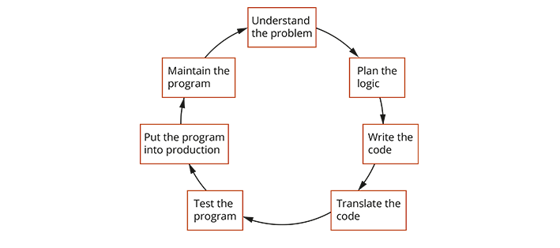
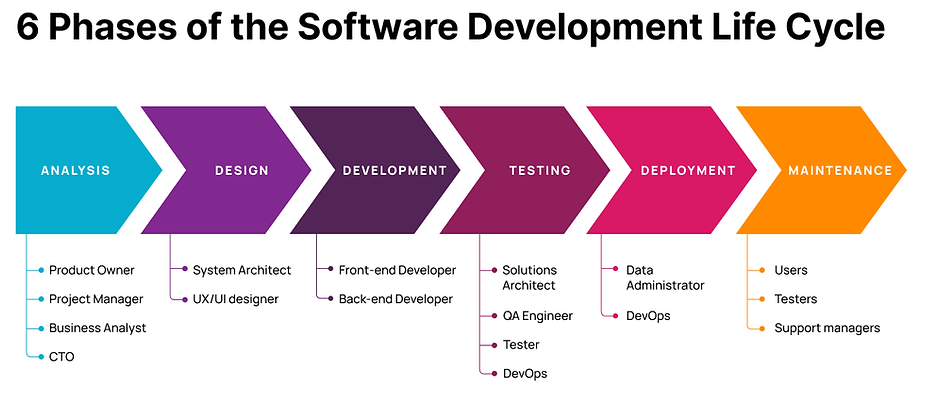
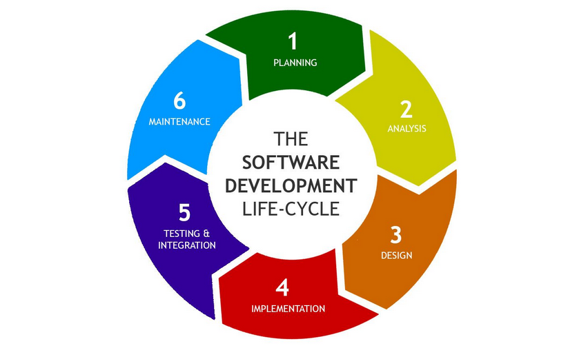
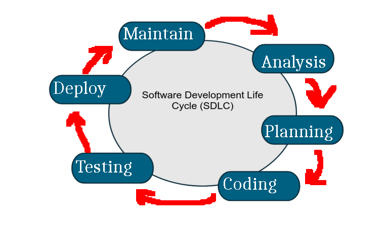

# The Software Development Cycle

To be clear, there are many ways the software development cycle can be outlined, and we 
are going to discuss nearly what the book is using, but I will be omitting 1 of their steps.

### The book's SDLC

### Other SDLC From online
If you look up SDLC, you will find even more ways to outline creating software:

# What we are going to talk about

-----

## Analysis
> Understand the problem

When making software, you may not initially KNOW what you want to or if you need to do it.

Sometimes, you have a brilliant idea in your mind, so you write it down and get to work.

Other times, you have an individual who is asking you (with money) to develop a piece of software for them. In this 
situation, the analysis is going to go over many things.

The first thing to understand it "what is it we want". If this is your own idea, you should already know this, but maybe
a few parts are needing cleaned up. If this is the product is for someone else, you really need to pick their brain
in this step to understand what it is their asking for.

The second thing to consider is "is it worth our time". Maybe after some consideration, the thing that is
desiring to be developed is unnecessary. Maybe it already exists, so you can just use that, or maybe
the "solution" is not really going to fix the desired problem, so you shift your efforts elsewhere.

Regardless, you want to KNOW what it is you are getting into, because if there is
any misunderstanding, you may work on a piece of software which NO ONE WANTS, or IS A WASTE OF TIME and won't be used.

## Planning
> Plan the logic

With the knowledge as to what you want, you can begin planning on how it comes about.
This step basically includes everything that occurs before code is written,
so maybe you are considering what programming language is best suited for this 
project, where this fits in with an existing code base, how will it be deployed, and, most
important to us, how will the logic in the program work.

This step will include lots of psuedocode/flowcharts... hopefully.

## Coding
> Code the program

With an understanding on how this should work, you begin actually coding!
You may find that what you planned is impossible and needs changing, but hopefully your 
good planning prevented this!

## Testing
> Use software (a compiler or an interpreter) to translate the program into machine language

> Test the program

Go through and see if it works as intended. This may involve using lots of people to make
sure it works well, looks pretty, and can run on various hardware.

## Deploy
> Put the program into production

Actually putting it out there. If it is a video game, this would be putting on the shelves (or like in Steam).
If this is a website, you would put it on the web. You actually get your program in front of it's intended audience!

## Maintain
> Maintain the program

Things still can go wrong, so you need to be there to fix them!

-----

# IMPORTANT NOTE: All of these steps can go backwards to any previous step

-----

# How it differs from the books

Does not include the step about compiling the code...
I think this is insinuated by testing it

# Official Software Development methodology

There are "official" software development methodology
which REALLY are particular about which steps happen when
and how the group should work together,
like Agile and Waterfall, but those are not
within the bounds of this course

# GUI environment vs command-line environment

So really simple programs we have seen here already, that being ones which run on a command line.

> Regardless of whether it is a GUI program or command-line program, 
> if they are made to do the same task, the logical process behind the scenes will be the same.