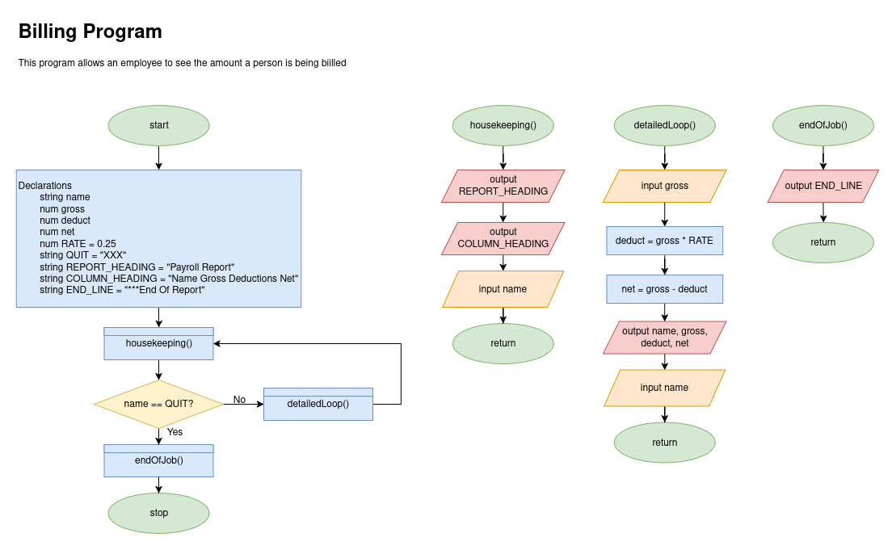
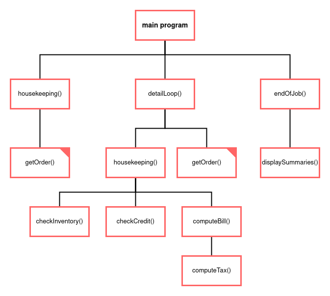

# Hierarchy Charts

In our attempt to modularize our programs, being able to break up and view our problems
as smaller individual programs is vital. This is where hierarchy charts are useful.

Currently, in either flowchart or psuedocode, it can be difficult to see:
- what pieces of code are being run multiple times
- how many subprocesses are currently existing for a current process

Making a hierarchy chart will outline these exact things; there can be super helpful in seeing what a change 
in code might affect. We are going to look at a kinda bad example from the book to understand:

### The code

### The hierarchy chart

Notice:
- the same methods will have their corners filled in so you can easily tell what two parts of code will change
- only major/modules are written out; not every line is part of the hierarchy chart, just major features

# House Keeping, Detail Loop, and End Of Job Tasks, three main parts of many programs

# Example: Make Hierarchy Chart of the program to find the distance between multiple locations

