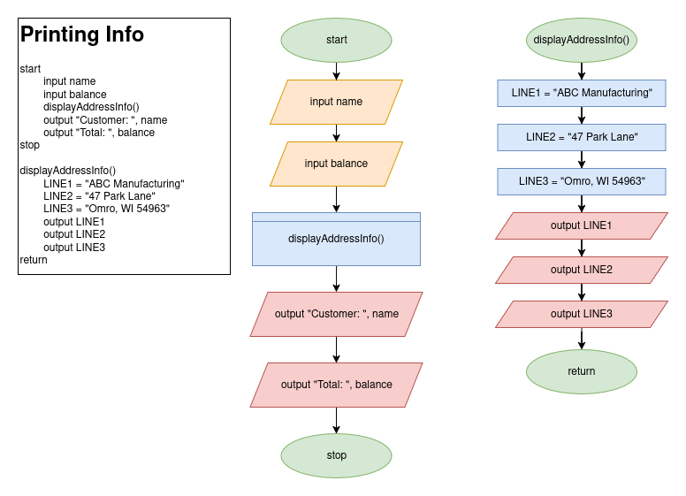
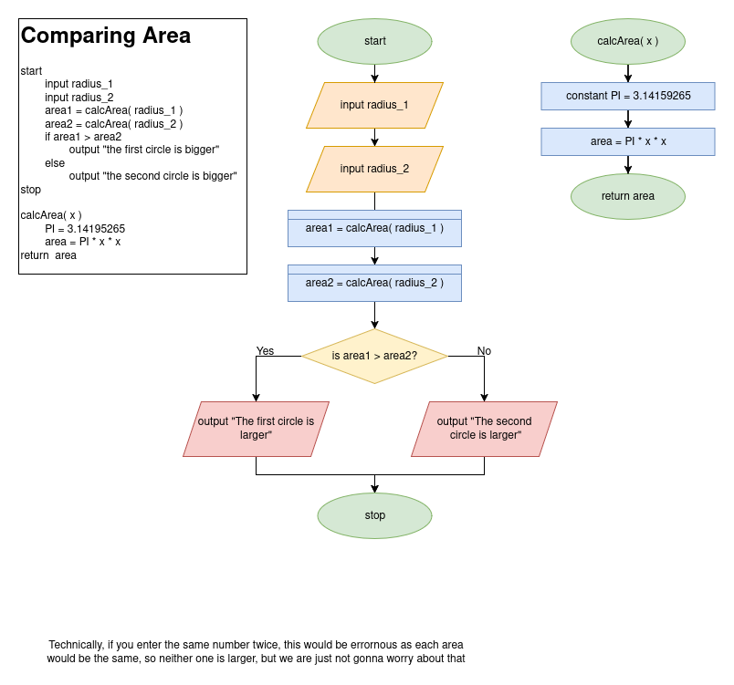

# Modularization (making modules) [functional decomposition]

# Why we do it

When writing code, you could technically just write all the steps to complete a problem
as a huge piece of code. Although, inevitably, when you write code, you are going to find yourself
solving the same problem over and over again. Now, we kinda want to avoid wasting time and re-writing code over and over again.

So, how do we go about solving this problem: MODULARIZATION

# What is it?

What we should do is break down these LARGER problems into SMALLER problems and solve
each one of these individually, so we MODULATIZE.

> **_Modularization_** is the process of breaking down a program into _modules_

Now you might be wondering, what is a module?

> **_Module:_** a program unit that contains a series of statements that carry out a task. See also function, method, procedure, and subroutine

We have seen 'some' modules being called, but all they really are ARE smaller pieces of code found
elsewhere... whether that be inside of a preinstalled package that comes with your programming language, or 
on the same file that you are editing.

Regardless of the case, to actually USE this other piece of code, we need to CALL it!
This is essentially saying, HEY OTHER PIECE OF CODE, CAN YOU RUN RIGHT NOW???

# Technically, why do we do it:

1. Modularization provides abstraction (helps simplify problems for our silly human brains)
   - What is abstraction
     - > **book definition:** the process of paying attention to important properties while ignoring nonessential details.
     - It is really allowing us to look at the big picture
   - Once we have successfully modularized our problem, we can focus on both the individual problems to solve, and the greater solution or project we are construction. See hierarchy charts for further detail
2. Modularization helps multiple programmer to work on a problem
3. Modularization allows you to reuse work more easily (not waste time)

# How to do it

So, with all of this context, we can show off examples of simplifying some problems

## Example From Book (figure 2-5, altered)
This program just prints out user information 
and modularize the problem of "displaying the address"

## Example for input/output

In this example, we want to ask the user for two radii
for two circles to compare their size (area). 

Instead of re-writing the code for finding area, we put it in a module and just call it.

