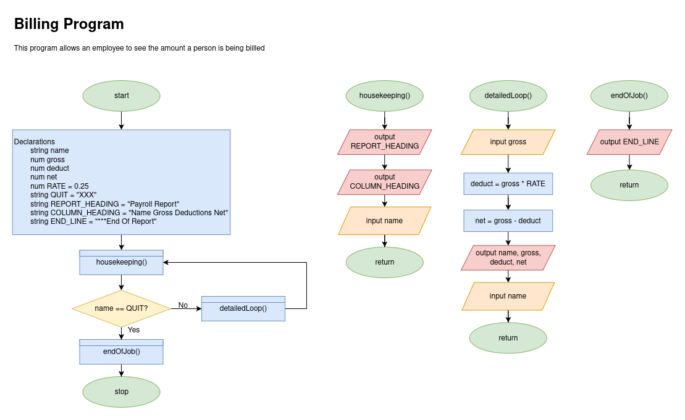
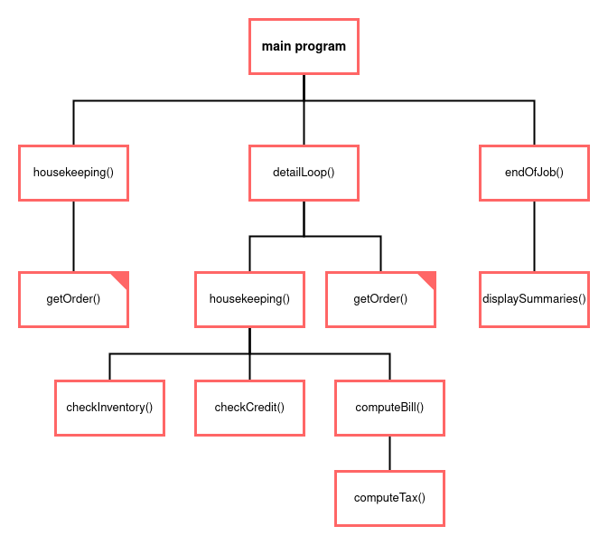
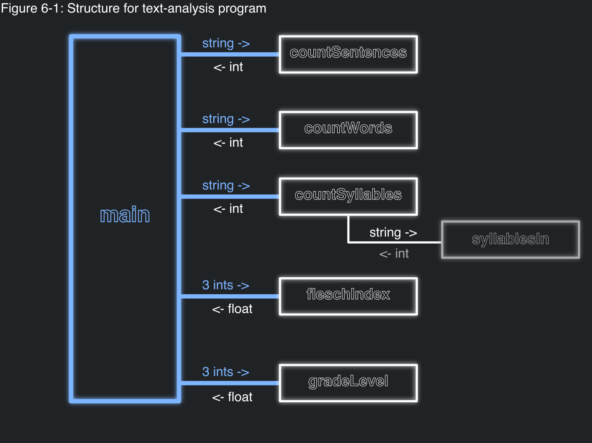

# Hierarchy Charts

In our attempt to modularize our programs, being able to break up and view our problems
as smaller individual programs is vital. This is where hierarchy charts are useful.

Currently, in either flowchart or psuedocode, it can be difficult to see:
- what pieces of code are being run multiple times
- how many subprocesses are currently existing for a current process

Making a hierarchy chart will outline these exact things; there can be super helpful in seeing what a change 
in code might affect. We are going to look at a kinda bad example from the book to understand:

### The code



### The hierarchy chart



Notice:
- the same methods will have their corners filled in so you can easily tell what two parts of code will change
- only major/modules are written out; not every line is part of the hierarchy chart, just major features

# House Keeping, Detail Loop, and End Of Job Tasks, three main parts of many programs


# Top Down Design Example (is kinda similar)

There is a program called Text Analysis. The goal of the program
is to measure text readability that is determined by the Flesch Index. It is based off
the average number of syllables per word and the average number of words per sentence in a piece of text.
With these averages, we plug it into Flesch's Formula to get the index:
```
F = 206.835 - 1.015 X (words / sentences) - 84.6 X (syllables / words)
```

There is also the Flesch-Kincaid Grade Formula which we can use to determine what grade level reading we are looking
at:
```
G = 0.39 X (words / sentence) + 11.8 X (syllabes / words) - 15.59
```


