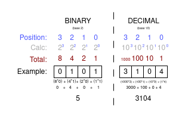
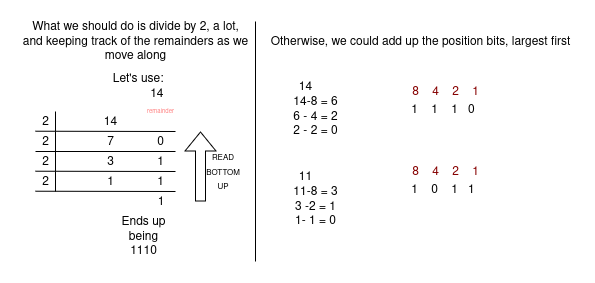
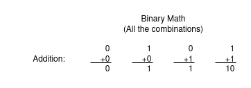
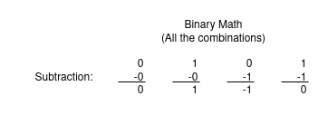
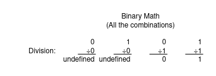

# Binary (BASE 2)

So, the fundamental numbering system for computing logic is the base 2 numbering system.
This is because in the real world, an easy way to story and manipulate data
is by have things be ON and OFF, that is, 1 and 0.

Now since Binary is a base 2 numbering system, this means that there is only 2 digits, that
being 0 and 1.

So, just like in the decimal system, every digit position increments by the base value.
For instance, once we reach TEN, we move from using a single digit to using two digits:
9 -> 10

Each digit is the BASE for a new 10.

Therefore, if we start counting up to 2 in binary, it would look like this:

0     <- 0
1     <- 1
10    <- 2

So, since there is a 2 in the second position, you get one '2'.

If we wanted to represent 3 in binary, we would need a 2 (which we already know how to make),
with a 1, which also know. SO, we can just combine them:

11    <- 3

# Binary Conversion

Now, we can count to 3, but, in a more general sense, how do we convert these values
to decimal values in a more general sense.

So, just like in the base 10 decimal system, we can use each position to represent 10, and
as we move LEFT, each position is multiplied by 10.

So, 520, we know the '5' represent 500 because it is in the third position, so it ACTUALLY represents
5 * 100. The '2' represents 20 because it is in the second position. Thus, we do 2 * 10 (which equals 20).

To know the value of any digit, we can use this formula: 10^(position - 1).

This is the same thing for binary.
The only thing we change is make the 10 a 2, since we are now in base 2.





To get a better idea on doing these conversion, let's do a few more:

BINARY VALUES TO CONVERT TO DECIMAL:

1111

1001

1000 0000 0000 0001

1010 1010


### CONVERTING FROM DECIMAL TO BINARY




DECIMAL VALUES TO CONVERT TO DECIMAL:

100

81

236


# Binary Math

Doing math with binary is very similar to normal math, but we have 2 digits.
Really, we can easily represent all possibilities in a small amount of time.

Just to be very clear, the results, mathematically, are always going to be the same as they are 
in decimal values. So the 7 + 8 (in binary) is obviously still going to result in 15.

## Addition

Adding is exactly what you think, in most cases. 0+1, 1+0, it results in 1, as you would suspect.
The only real difference is when we add two ones. Since, again, we are only working with 1 and 0, our answer CAN'T be
two. It just carries over into the next position. We just looked at 2 as binary, and this is that same thing!



With this in mind, we should be able to do any sort of binary math,
but, what about with multiple digits?

What is the solution here?
```
   10001
   +1001
--------
   11010
```

note: this is 5 + 9

So, as we can see, we just carry the 1 to the next position.
Now, this is pretty simple. This is very simple due to the carried 1 going to a column with 
just 0 and 0, but what if that wasn't the case:

```
 0110
+ 010
------
 1000
```

As we can see from this example, the 1 is carried to the
next position, where we NOW HAVE two 1', so, we carry the 1 once more.

We only have one scenario to really cover. This is the situation where we already have two
ones. So, we carry a 1 to the 1 + 1. REALLY, this is just like the last example, where we carry a 1
to the next position, BUT, we have one extra 1. So, we leave that 1 behind.

```
 0110
+ 110
------
 1100
```


Here is a more clear example:
```
  11
+ 11
------
 110
```

That is basically all the possibilities; other examples are just longer iterations of this.


## Subtraction

Subtraction works as you might expect:




EXAMPLE:
```
 1100
 - 10
-----
 1010 
```

```
  1011
 - 101
------
   110
```

The only thing is that we begin seeing negative values.

```
   10
 -111
-----
 -101  
```


## Multiplication

As with most of these, this works as you might expect:

> Works suspiciously like "AND"... which we will get to WEDNESDAY


## Division

Barely even worth talking about at all, but here are the rules.



(mostly showing this show off all the main operators)

# Why would we even do this:

So, within computers, we use things called transistors, which we will talk more about later, BUT,
they only have two options, OFF and ON. To store data, we can use a range of these, each one representing a 
0 as OFF and a 1 as ON and THESE allow use to represent EVERYTHING within computing. But, erm, what are these?
