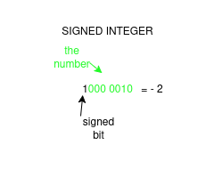

# Measuring Storage

These 0's and 1's that make up it's internal system store everything on the computer. These are the BITS and BYTES of the
computer.

# Bit

A **BIT** is ```a binary digit; a unit of storage equal to one-eighth of a byte.```

These are what we have been working with. A single 0 or 1 represents this binary value.
With bits, there are not many things we can represent (other than true or false).
So, we instead use a combination of these as larger sets to represent things.

# Nibble

A **NIBBLE** is ```half a byte or four bits.```


# Bytes

A **BYTE** is ```8 bits```.

Now, as computers progressed, we have been able to make these transistors 
smaller and smaller and use more and more of them in our computers.

Fun reference to read!
https://cacm.acm.org/news/the-long-road-to-64-bits/
https://www.historytools.org/vs/x86-vs-x64

At times, computers once had 8 and 16 bit processors (the part of the computer
that actually does computations).

Here is an 8 bit processor for reference:
https://en.wikipedia.org/wiki/Intel_8008

But this meant that all the processes it did all had to fit within the
8 bit range, that being 8 1's and 0's, AKA, 1 BYTE.

As we move up from 8 bits, we typically increment by BYTES, so we
can find 8 bit, 16 bit, 24 bit, 32 bit and 64 bit systems, but not like, 31 bit machines...
or so you may think:

https://en.wikipedia.org/wiki/31-bit_computing

Regardless, as we move forward, you just need to be aware that everything 
you see on a computer (at least, these old computers) had to fit within the 
bits it had.


# Integers

Integers work just like we have seen with binary.
One would be:

1

Two would be

10

15 would be:

1111

When actually storing integers within a system, it stores these a set amount.

In java, most numbers you use are going to be 'int's, for instance. 'int's are 32 values, so every number
you make is going to be using ALL 32 bits of storage i.e. storing the number 5 would look like this:

0000 0000 0000 0000 0000 0000 0000 0101

An 'int' gives us plenty of space to fit number within, but we have already looked at that range.

Java does offer smaller data types, those being 'byte' (8 bit) and 'short' (16 bit), so if you are
trying to save on memory, you can use those.

> NOTE: most 64 bit systems (which we use TODAY), are optimized for 32/64 bit calculations by the processors.
> When doing other bit calculation (i.e. using java byte and short types), it has to do some conversion to get these numbers working
> within the 64 bit registers. SO, you may actually suffer a hit to performance when using smallers bits; You still
> will be saving space on the device itself, but it will just run slower in comparison.

# Binary Negative Values

When we store these values on the computer, we need a way to actually store them with
all the information we have can have. For instance, integers can TYPICALLY be negative,

## SIGNED INTEGERS

So, to actually store this information, we designate one of the bits as
the SIGNED BIT; typically, if this SIGNED BIT is 0, the number is positive, if it
is 1, the number is negative:



We do have a lost of data though.

If we were using a byte to store a number, with 8 bit, the greatest number we could store is 255 (a total of 256 numbers
we could represent, since we could represent 0 as well). Notice this is 2^8 possibilities. With dedicating
the first bit to the sign, we only have 7 left, so our numeric limit is 127. So, with
an 8-bit signed integer, our limit becomes -127 to 127.

Now, as a fun little bit, most systems actually have the range of signed (8-bit) integers as -128 to 127.
This is because we have a wasted number:

1000 0000
vs
0000 0000

OR 0 vs -0

Since 0 can't really be negative, most systems use 1000 0000 as -1 and move up to -128 from there; thus, we 
get one extra digit to represent.

## UNSIGNED INTEGERS

Now, unsigned integers are just integers that do not allocate
the extra bit to negation, so, you can store larger values.

BUT, you can't represent negative values with them.

# Overflows

Now, this is not a problem in most systems, but, let's work through some fun math.

Let us pretend we are working with a signed 8-bit integer and we are adding:
```
0111 1111
+
0000 0001
---------
1000 0000
```

If we just add these values together, we do not


# Floating Point Values

This is our first instance of a non-straight whole number being stored.
Honestly... storing floating point values is very complicated since we can make 
infinitely small value.

To give us this range, there are many, MANY things that happen to help ensure we
don't lose very much precision.

We literally do not have the time or context to talk about this.
Here is a large paper speaking on it:
https://docs.oracle.com/cd/E19957-01/806-3568/ncg_goldberg.html


What you need to know is that sometimes, because of the lack
of EXACT precision, sometimes floating point values can lose EXACT values if the 
precision being held exceeds limits:

**Example 1:**


**Example 2:**


# Larger Storage

We store things on computers, we keep seeing BYTE vs BIT. Since BYTE is about the smallest
size we can use to store anything useful, we see the amount of storage available to computers
often expressed as BYTES

Normally, you don't see just BYTES, but instead extension of it.

Now in all the normal ways we see kilo and mega being used like
in the metric system, each increment is just the previous
amount multiplied by 1000, BUT in computers, they have to
be difficult, and each increment is actually 1024 i.e. 2^10

### Commonly used computer terms
| Term     | Smol | Number of bytes          | "what we kinda refer to it as" |
|----------|------|--------------------------|--------------------------------|
| kilobyte | KB   | 1024                     | one thousand                   |
| megabyte | MB   | 1,048,576  (1024 kb)     | one million                    |
| gigabyte | GB   | 1,073,741,824  (1024 mb) | one billion                    |
| terabyte | TB   | 1,024 gigabytes          | one trillion                   |
| petabyte | PB   | 1,024 terabytes          | one quadrillion                |

Also, Kb and KB may actually refer to different amounts because a lowercase
'b' refers to a bit while an uppercase 'B' refers to a BYTE.


