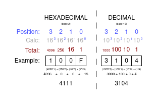

# Hexadecimal (BASE 16)

With understanding binary, this shouldn't bbe too crazy to understand. It is just base 16... instead of
base 2.

With a base 16 numbering system, we actually do not have enough digits in our
numbering system to represent this. SO, we bring in the first
couple letters in the alphabet to represent larger numbers

| Hexadecimal Digit | Decimal Value |
|-------------------|---------------|
| 0                 | 0             |
| 1                 | 1             |
| 2                 | 2             |
| 3                 | 3             |
| 4                 | 4             |
| 5                 | 5             |
| 6                 | 6             |
| 7                 | 7             |
| 8                 | 8             |
| 9                 | 9             |
| A                 | 10            |
| B                 | 11            |
| C                 | 12            |
| D                 | 13            |
| E                 | 14            |
| F                 | 15            |

We use hexadecimal system because we can represent larger numbers with a smaller set of characters, 
which is more compact and can be convenient sometimes.

# Hexadecimal Conversion

Convert these values to each other, back and forth

| HEXADECIMAL | DECIMAL |
|-------------|---------|
| 4E          | 78      |
| 16          | 22      |
| FF          | 255     |
| AB          | 171     |
| 131         | 305     |
| BAD         | 2989    |
| 999         | 2457    |

