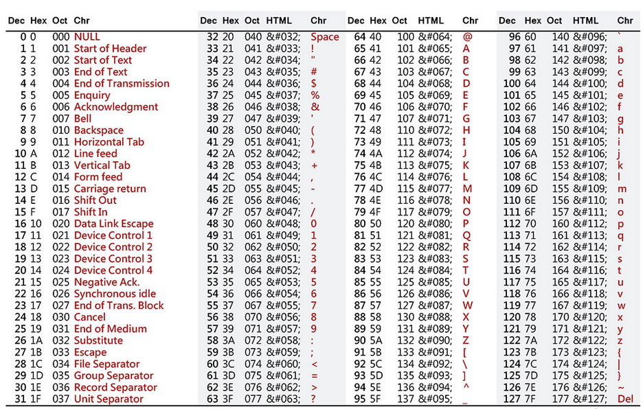

# Encoding

## What is it

Well, erm, according to the dictionary:

> Encode: to format data to a standard format

or 

> Encode: convert information into code

Now in the context of this discussion, we are going to be more talking about the first 
definition.

When we store everything on the computer as bits and bytes, we need a way to actually store the data
we want to see. Now, we have talked about how to store numbers already, but what if
we wanted to store more important information, like letters?

# ASCII

To store letters, one of the initial ways we encoded them was using the **American
Standard Code for Information Interchange (ASCII)**.

This was an accepted way to store most symbols. This was agreed upon for use of 1 byte, so ASCII supported
256 characters. This gave us plenty of space for all the characters in english, along with punctuation, digits, 
operators, and many more (invisible) characters, such as spaces.

With this agreed upon encoding, most computers had supported code to store characters as numbers, and 
convert them to the correct letter for viewing. Now, this was not the ONLY way to encode letters

### The Extended Binary Coded Decimal Interchange Code (EBCDIC) 

IBM had their own encoding for letters, that being the EBCDIC.
It does much of the same thing as ASCII, where each letter uses a number to represent itself,
and used 1 byte to do so, but the order is just different.

Eventually though, we had 2 facts:

- we had more space (64 bits :O instead of 8 bits :/ )
- not all letters were represented by these symbols

So we needed additional encodings!

# Unicode

Good resource: https://www.smashingmagazine.com/2012/06/all-about-unicode-utf8-character-sets/

Systems today mostly support unicode. Unicode is an extension of ASCII...
the first 256 characters in UNICODE is just the same ASCII list,
but with more bytes, we can store far more digits.

# UTF-what?

Good resource: https://www.geeksforgeeks.org/computer-organization-architecture/what-is-unicode/

Depending on your system/browser/usecase, you may be using a different set of UNICODE, those being 

## UTF-8

- backward compatible with ASCII
- used in most browsers/internet nad UNIX-like OS's

## UTF-16

- Used in Windows OS

## UTF-32

- less used because of fixed width (space inefficiency) and lack of compatibility

# Extra Bit

encoding is NOT encrypting and NOT compressing