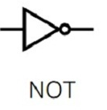
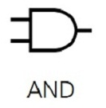
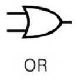

#  Logic Gates (binary edition)

We have seen booleans already, BUT, let us quickly look at it again as it is 
essential to understand logic gates!

## Booleans

Boolean variables are simply the words and ideas of **true** or **false**.
It is this binary set of values which underpin the whole field of logic and computer logic.

For the sake of understanding how computers work and operate in the real world, we use
0 to represent FALSE (or off), and 1 to represent TRUE (or ON). We do this because computer 
need to actually have a way to store values, and in the REAL world, this is done using transistors (which we 
will talk about soon).

## NOT

The NOT logical gate will negate/inverse the boolean value.

So, a NOT true results in false

A NOT false results in true

> For our sake, this means that a NOT 0 becomes, and a NOT 1 become 0

**NOT is represented in many ways:**
- negation
- ¬
- '
- 

**Truth Table Representation:**

| A | ¬A |
|---|----|
| 1 | 0  |
| 0 | 1  |

## AND

The AND logical gate expects 2 boolean values and will produce TRUE
if and only if both are TRUE. If either or both booleans are FALSE, you will result in FALSE.

> For our sake, this means that an AND gate will result in 1 only if both inputs are 1, and 0 otherwise

> NOTICE THIS IS VERY SIMILAR TO MULTIPLICATION FOR MATH

**AND is represented in many ways:**
- conjunction
- ^
- 

**Truth Table Representation:**

| A | B | A ^ B |
|---|---|-------|
| 1 | 1 | 1     |
| 1 | 0 | 0     |
| 0 | 1 | 0     |
| 0 | 0 | 0     |
 

## OR

The OR logical gate expects 2 boolean values and results in TRUE if either one is TRUE, and results in
FALSE otherwise.

**OR is represented in many ways:**
- disjunction
- V
- 

> For our sake, this means that the OR gate will result in 1 if there is at least one 1 between the two inputs, and results 0 otherwise.

**Truth Table Representation:**

| A | B | A V B |
|---|---|-------|
| 1 | 1 | 1     |
| 1 | 0 | 1     |
| 0 | 1 | 1     |
| 0 | 0 | 0     |

