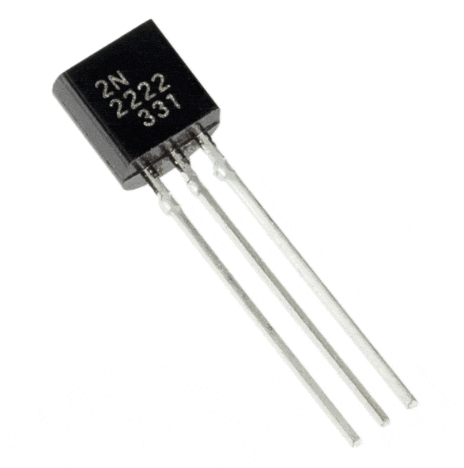
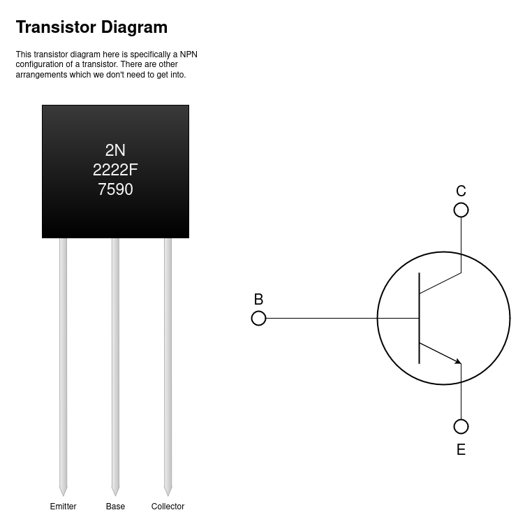
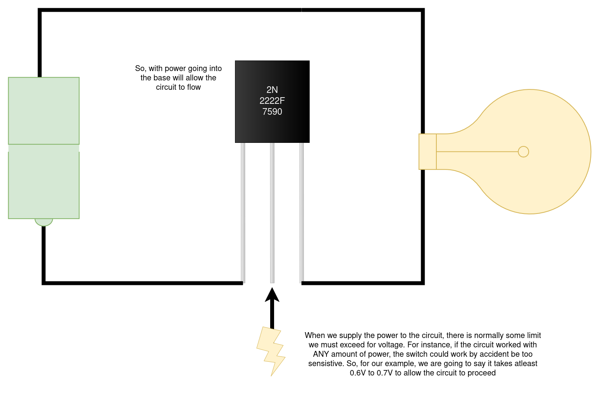

# Transistors

Transistors are a huge part of world technologically. They are essential to our
understanding to computer science and allows us to do what we do.

### Here it is:

------

### Definition

A **transistor** is a semiconductor that can be used to amplify and switch
electrical signals and power.

The one we are going to be talking about specifically is a **BJT** transistor. This is
a **Bipolar Junction Transistor**.

When looking at a transistor, it has 3 parts:

# Transistor acting as a switch (with given voltage)

With this, we can see data work as a switch, something that can be either ON or OFF.
A sort of, I don't know, BINARY situation.

If you don't know where I am going, this is what is the BASIS for storing data 
on devices. Now, this is not the only ways, but we can review this to begin atleast understanding
1 way in which this occurs.

But first, let us briefly return to logic gates

------

