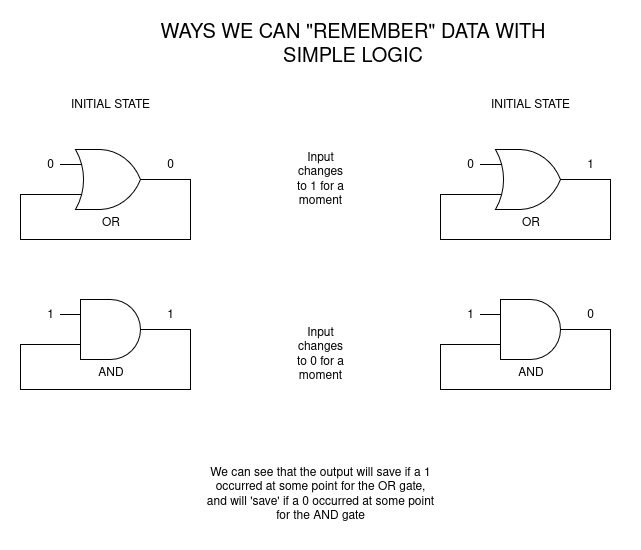
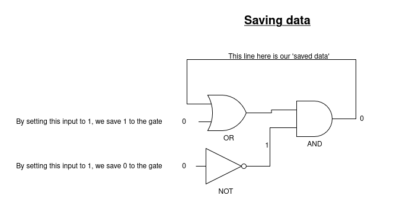

# Saving data

We can simply see use being able to save data using some basic AND/OR gates logic:

Now this is great for one time savings, but typically, we want to actually change
the value we are using.

So how can we save both a 0 and 1 in a logical gate?

### COMBING THEM!

