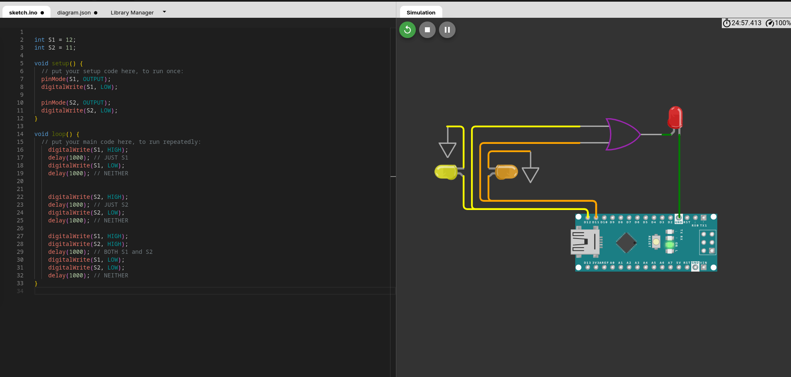

# WOKWI

We can begin understanding physical computers in the real
world by working with some.

Now, arduino machines are little circuit boards which are easily programmable and 
have physical space for things like wires to connect to them for us to mess with.

The board we are working with specifically is the ARDUINO NANO

Now, these boards are relatively cheap (~$25), but we aren't going to be buying them 
because we would still need all the wires and batteries and lights and stuff.

So, to work with these machines, we are going to use an online simulator: WOKWI

https://wokwi.com/

WOKWI simulates far more than just Arduino boards, but we will be using 
them for this module.

Here we can navigate to:
- Arduino (Uno, Mega, Nano)
- Arduino Nano (under "Start from Scratch")

And we have a blank slate.


# What are we looking at:

- Right area: the board and assets we are using/connecting together
- Left Side: Where you put your code to run the thing.

## Show Clicking Add

## Show connecting wires


## Show Simple Example:


The code:
```
// Make sure D8 is plugged into the light
int A = 8;

void setup() {
  // put your setup code here, to run once:
  pinMode(A, OUTPUT);
  digitalWrite(A, LOW);
}

void loop() {
  // put your main code here, to run repeatedly:
    digitalWrite(A, HIGH);
    delay(1000);
    digitalWrite(A, LOW);
    delay(1000);
}
```

Pictures just in case it don't load:


# NOT Gate Example

Code:
```
int S1 = 12;

void setup() {
  // put your setup code here, to run once:
  pinMode(S1, OUTPUT);
  digitalWrite(S1, LOW);
}

void loop() {
  // put your main code here, to run repeatedly:
    digitalWrite(S1, HIGH);
    delay(1000);
    digitalWrite(S1, LOW);
    delay(1000);
}

```

When no power (input) is supplied:


When power is supplied:


# The code for AND, OR and other gates:

Code:
```
int S1 = 12;
int S2 = 11;

void setup() {
  // put your setup code here, to run once:
  pinMode(S1, OUTPUT);
  digitalWrite(S1, LOW);

  pinMode(S2, OUTPUT);
  digitalWrite(S2, LOW);
}

void loop() {
  // put your main code here, to run repeatedly:
    digitalWrite(S1, HIGH);
    delay(1000); // JUST S1
    digitalWrite(S1, LOW);
    delay(1000); // NEITHER


    digitalWrite(S2, HIGH);
    delay(1000); // JUST S2 
    digitalWrite(S2, LOW);
    delay(1000); // NEITHER

    digitalWrite(S1, HIGH);
    digitalWrite(S2, HIGH);
    delay(1000); // BOTH S1 and S2
    digitalWrite(S1, LOW);
    digitalWrite(S2, LOW);
    delay(1000); // NEITHER
}
```


# AND Gate Example

So, in these examples, do be aware of the additional wires representing the GND; if the additional wires showing if the
2 inputs were ON/OFF were not grounded, this would not work. This is going to be seen in the next examples as well:

First, we see no signal in either loop:


Then we see only signal in the left; notice that the output is not on:


Then we see only signal in the right; notice that the output is still not on:


Finally, when both are turned on, we see the output on:


# OR Gate Example

No signal, not on:



In these next examples, the output light is ON with either signal being ON, or both!


## Save Data Example:

Finally, we can recreate saving data. Now, there are more complicated things that go into this
and how it is implemented inside of our devices, but this is a very much scaled down, simple version.

Here is the arrangement


Here is us saving "1" on to our circuit and it's persisting after the signal is gone


Here is us setting it back to "0" and the result is saved and persist after we stop sending the signal


