# Basic Types of Structures

> **Structure:** a basic unit of programming logic; each structure is a sequence, selection, or loop.

In the most general sense, algorithms can be organized into
3 main structures:

- sequence
- selection
- loop

In the mid 1960s, mathematicians proved any program
can be made using just these 3 structures.

We have used these already, but these are how they SHOULD be used.

What you will see is that these are all different building blocks for code.
When we talk about a "sequence" structure, this is simply a small portion of what is usually a larger
piece of code. When referring to these and showing examples, you can just imagine them inside 
a piece code.


# Sequence Structure

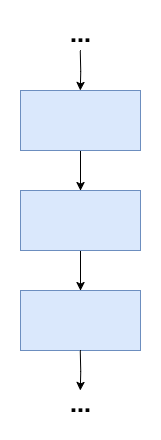

This is the simplest and is the structure which is used most often!

> **Sequence**: a program structure that contains steps that execute in order with no chance to branch off and skip any of the tasks. Contrast with loop structure and selection structure. 

In a sequence, steps are performed one after each other
in, well, sequence.

They can contain any number of steps, but do not diverge in path. They HAVE to
perform steps in a line to be considered a sequence.

## Example:

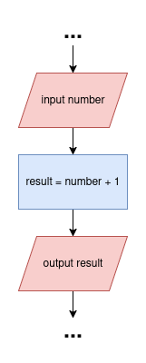

```
psuedocode:
...
input number
result = number + 1 
output number
...
```

------

# Selection Struction (aka Decision Struction)

The selection structure is what we have often referred to as an if statement.

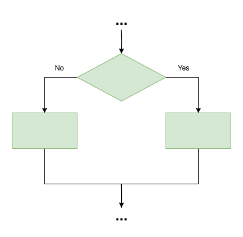

> **Selection**: a program structure that defines one action to be taken when the tested condition is true, and another action to be taken when it is false. See also dual-alternative if and dual-alternative selection. Contrast with loop structure and sequence structure.

A selection structure is one where typically a decision is made to do one of two alternative routes.
This decision is a binary one; you only go down one or the other. 

This decision is represented by a BOOLEAN EXPRESSION. We have talked about boolean data types, which
is a variable/value which is either True or False. A boolean expression is a statement
which does the same thing: be true or false. Typically though, we don't see the 
value just as true or false, but instead something that can be "calculated" to be true or false.

When we talk in terms of selection statements, a TRUE result from this boolean will go down one path, and 
a FALSE selection statement will go down another.

## If statement

Within the realm of a flowchart, we have absolutely seen this; it just uses the DIAMOND 
shape to create a piece of code which goes down different paths.

Although, we've not OFFICIALLY talked about how to represent this in terms of psuedocode.
In psuedocode and most programming languages, we use an IF/ELSE statement to be these selection making
tools. In generally, what we have looks like this:

```
if someCondition is true then
    process A
else
    process B
endif
```

> End-structure statement (endif): a statement that designates the end of a pseudocode structure.

## Dual Alternative

This type of structure is a DUAL ALTERNATIVE type of decision-making structure. This
is the binary type of structure, where two different processes can occur.

Not super complicated. ONE BOOLEAN STATEMENT, TWO DIFFERENT PATHS
Let's look at one:

### Example


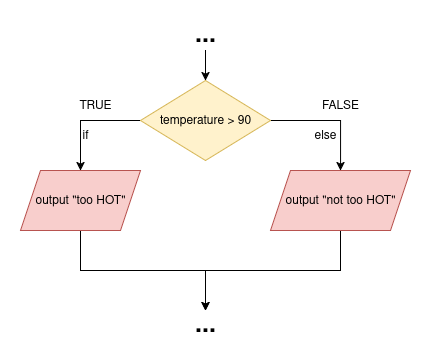


```
...
if temperature > 90 then
    output "too HOT"
else
    output "not too hot"
endif
...
```

Here, we see two paths doing two whole two different things.
Now, you might this might be anything crazy because, well, it's noting new.

Only thing to really HIGHLIGHT here is that there is this ELSE keyword denoting what
occurs when the boolean is FALSE, as opposed to an else.

This really is just a definition. And, it's a distinction to our next type.

## Single Alternative

Sometimes, you don't need another path to do something. Sometimes, you just need a single thing to happen
if your boolean is true. If the statement ISN'T true, then nothing happens and the code just continues on as if nothing
happens.

### Example

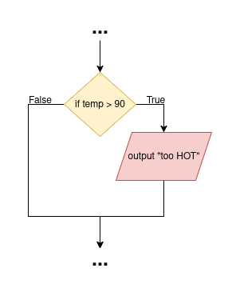

```
...
if temp > 90 then
    output "too HOT"
endif
...
```

If for instance, you wrote some code to do
some division given a value, if 
you want to prevent an error, you can
use an if statement to prevent a division by 0.

We can use an additional single alternative statement to print out that
we tried dividing by zero

```
start
    float numerator
    float denomiator
    float result
    bool divideByZeroFlag = False
    
    output "Please type in the numerator: "
    input numerator
    output "Please type in the denomiator: "
    input denomiator
    
    if denominator == 0 then
        numerator = 0
        denominator = 1
        divideByZeroFlag = true
    endif
   
    result = numerator / denomiator
    output "Result: ", result
    
    if divideByZeroFlag then
        output "Hey you attempted to divide by zero; thats no good!"
    endif
end
```

## More Options

NOW, sometimes, you need to have more options. Now, if you were writing code that needs
more options than this binary decision, you can connect these if/else statements together.

Here is an example to print out the grade one receives based on their score value.


### Example

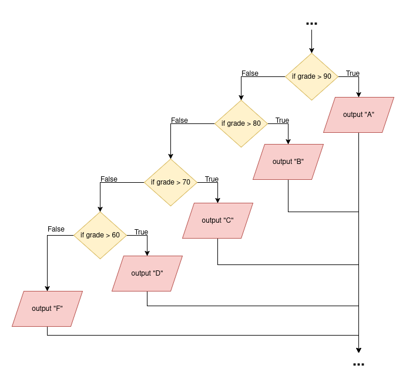

```
...
if grade > 90 then
    output "A"
else
    if grade > 80 then
        output "B"
    else
        if grade > 70 then
            output "C"
        else
            if grade > 60 then
                output "D"
            else
                output "F"
            endif
        endif
    endif
endif
...
```

Now, in terms of psuedocode, this looks kinda messy.

Alot of times in code/psuedocode, we simplify this with an 'else if'
statement. This is where we combine the else and if into ONE statement, which
instead of working as an else, where it runs if the OG if is false, it instead
runs if the OG if statement is false, and THIS if statement is true.

The previous problem can be simplified to this:

```
...
if grade > 90 then
    output "A"
else if grade > 80 then
    output "B"
else if grade > 70 then
    output "C"
else if grade > 60 then
    output "D"
else
    output "F"
endif
...
```

This helps get rid of all the endif's and connects them all into one LARGE structure.

We can also see we still end using an else statement at the end; this
one runs if none of the previous else-if statements were true; so, if EVERYTHING is
FALSE, the last else runs. Now you don't have to use one if you don't want to!

Let's move on from decision-making!

-----

# Loop Structure

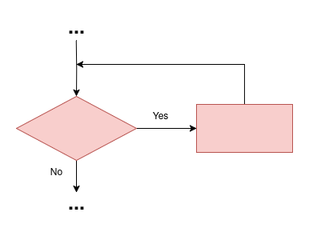

> Loop structure: a structure that repeats actions while a test condition remains true. Contrast with selection structure and sequence structure. 

Loops repeat instructions based off of a boolean value, just like an if statement. Really, this is a repeating decision
structure, which, we can cleary seen within the terms of flowcharts

In psuedocode, we can use a while loop, or more specifically, a while do loop:

> while-do: a loop in which a condition is tested and executes statements while the condition continues to be true. See also while loop.

```
...
while CONDITION then
    process
endwhile
...
```

this is what we have seen before, but it is not the only TYPE of loop:

> do-while: a loop which FIRST executes statements and then calculates a condition and runs the code if it is true.


## Example

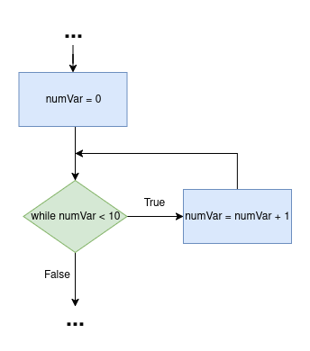

```
...
numVar = 0
while numVar < 10 then
    numVar = numVar + 1
endwhile
...
```


## Common Loop Specific Error:

### THE LOOP HAS TO RETURN TO THE CONDITIONAL TO REPEAT ITSELF

We are going to look at a program which is reading a file of numbers, and
for each number it encounters, it is going to multiply the number by 2
and print out the result until the end of the file.

In our example, we will find it NOT STRUCTURED!

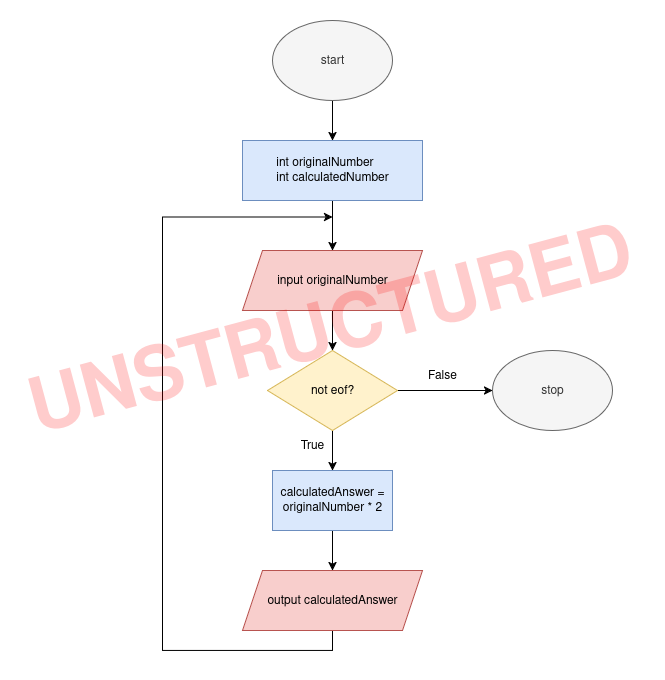

* PROBLEM: loop doesn't go around RIGHT before the decision shape

If we try to fix this with moving where the loop occurs, we still have a problem...

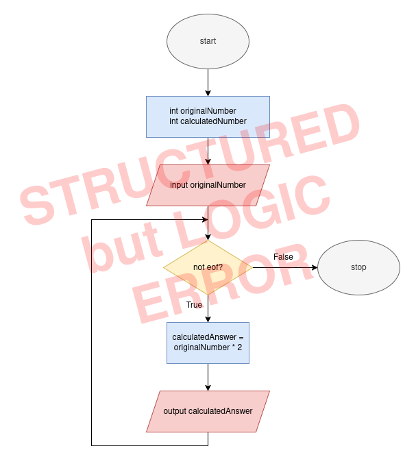

* PROBLEM: it doesn't read each number, so the eof is never reached, so this runs forever, which is not good logically!

What if we wanted to break it again but in a different way! Well, we could try just putting the reading
of the input inside the loop immediately, because at first we didn't hit the end of the file yet!

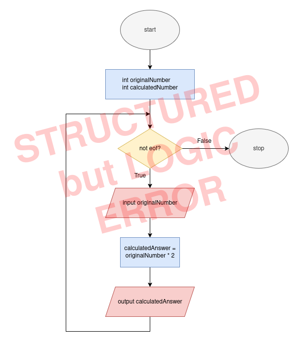

Don't do this! This breaks at the very end of the loop, when it finally reads the end of the file, it
will read in EOF and then try multiplying THAT, which don't work!

# When trying to understand your structure, it may be helpful to write out the psuedocode to

What we need to do is PRIME THE INPUT

> Priming Input/Priming Read: the statement that reads the first input data record

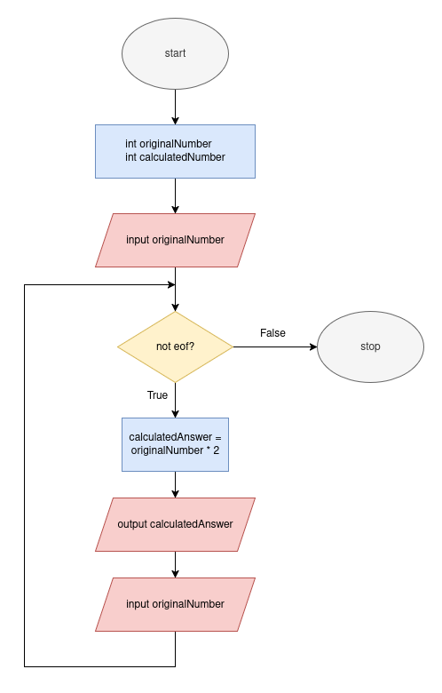


-----

# Combining Structure

Now, as we have said earlier, ALL problems should be able to be solved using 
just these 3 types  of structures.

But, how do we use these?

There are many ways to do so:

## Stacking Structures:

> **Stacking Structures:** attaching program structures end to end.

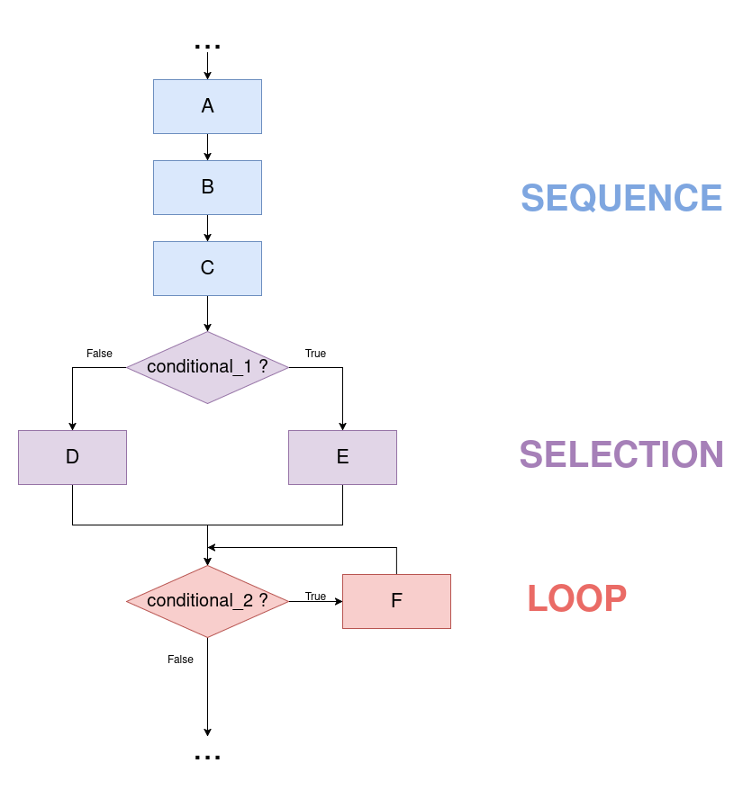

Here we see they are quite literally just combined and left like that.


## Nesting Structures:

> **Nesting Structures**: placing a structure within another structure.


Here, we can see that one structure is contained within another.
This is how we begin to solve "all" the problems. With the combination of these, we can begin making
complicated and worthwhile code.

# Large Example from Book

In chapter 3, the book provides this figure. This example uses many different structures within each other;
let's go through and identify each part... but how!

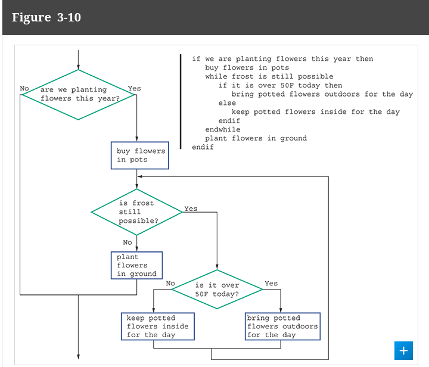


Here are our only "real" rules when using structures:


- A structured program includes only combinations of the three basic structures—sequence, selection, and loop. Any structured program might contain any number of structures, and they can be one, two, or all three types of structures.

- Each of the structures has a single entry point and a single exit point.

- Structures can be stacked or connected to one another only at their entry or exit points. (No connecting to outside/alternative routes of path(s))

- Any structure can be nested within another structure.
