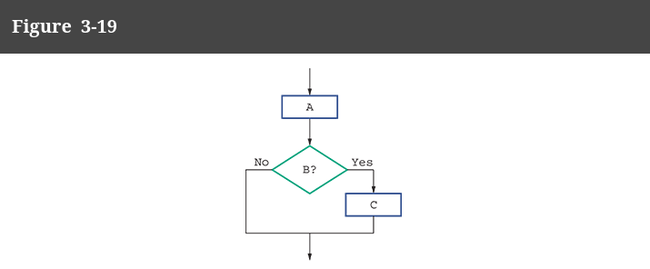
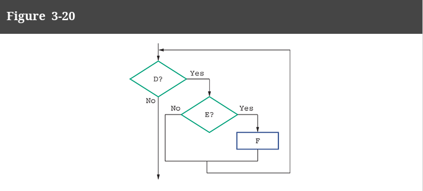
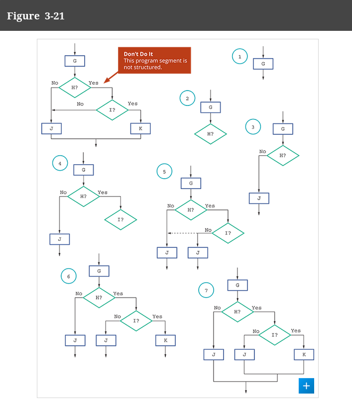

# Let's practice going through some examples and see if we can identify part of the structure

# Example 1:

This is a 
- sequence
- selection

It is also **structured** fine.

This one is **stacked**, so it is pretty easy here!

# Example 2:

This is a 
- selection
- another selection

This is also structured fine!

This one is nested!

# Example 3:

This one is NOT structured.

The main problem is the line connecting I? to J.
Now, if a structure is nested, it should not be able to attach itself to structures and code 
outside the scope of which it is nested.

This example here shows how we fix this (copy the J instruction to be within the scope/nest of the greater structure).

