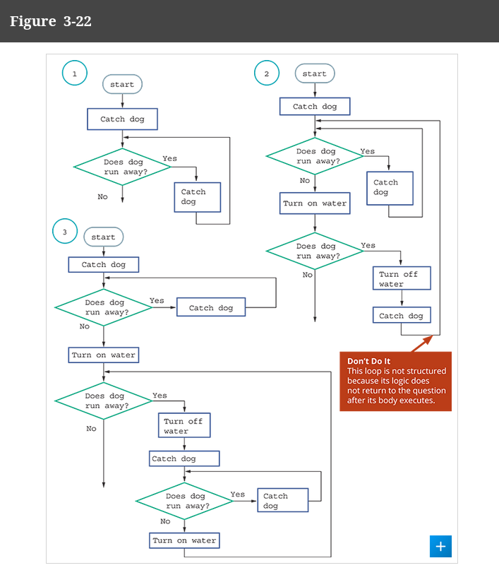
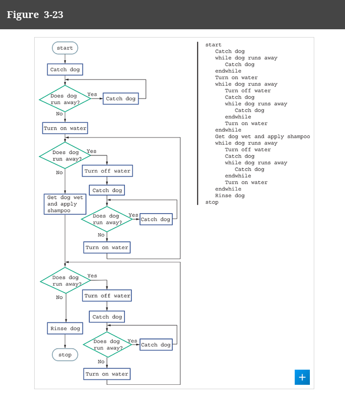

# Debugging

## MAKE SURE TO MENTION WHEN TRANSLATING TO PSUEDOCODE, THAT IF WE SEE REPEATED STEPS IN THE PSUEDOCODE, WE SHOULD SEE THOSE SAME REPEATED STEPS IN THE FLOWCHART WOOO

Debugging is all about walking through a program!

### HERE IS THE SOLUTION:

