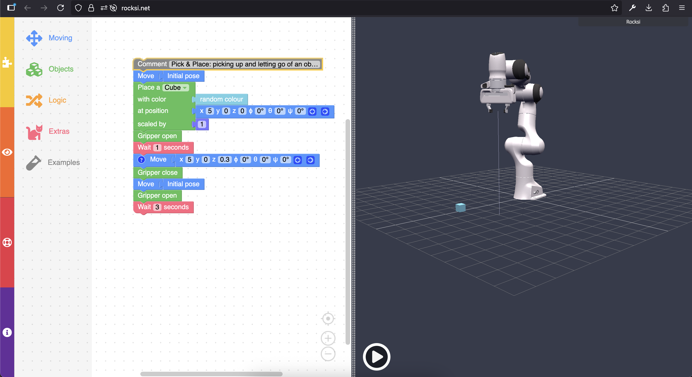
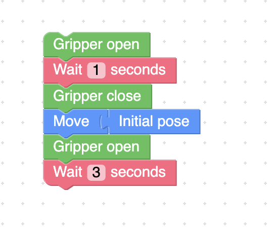
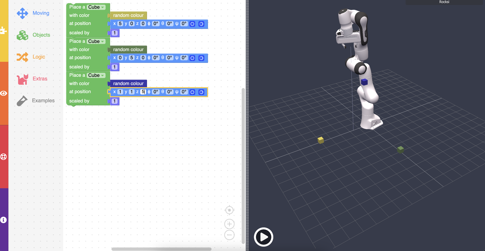
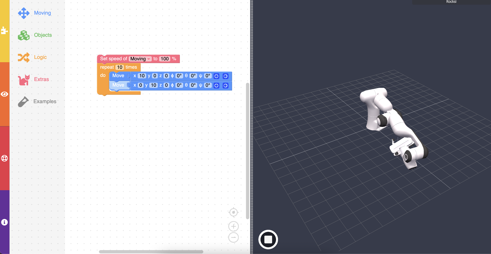
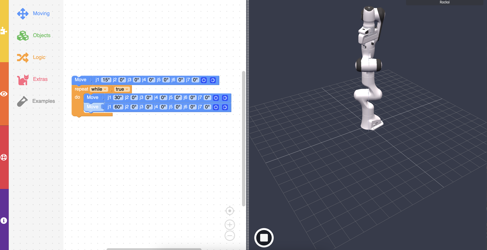
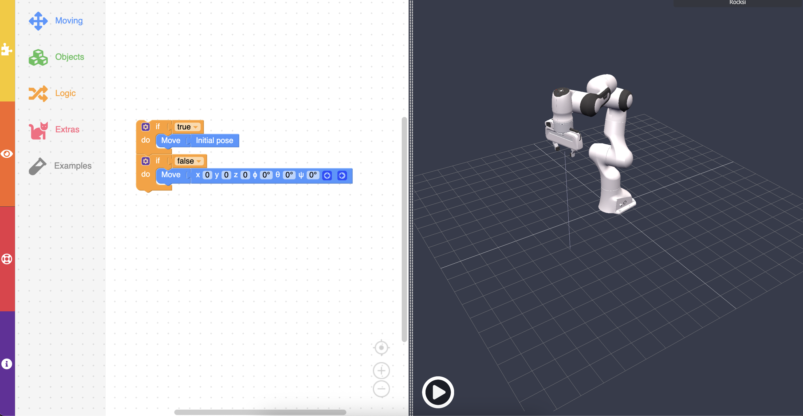
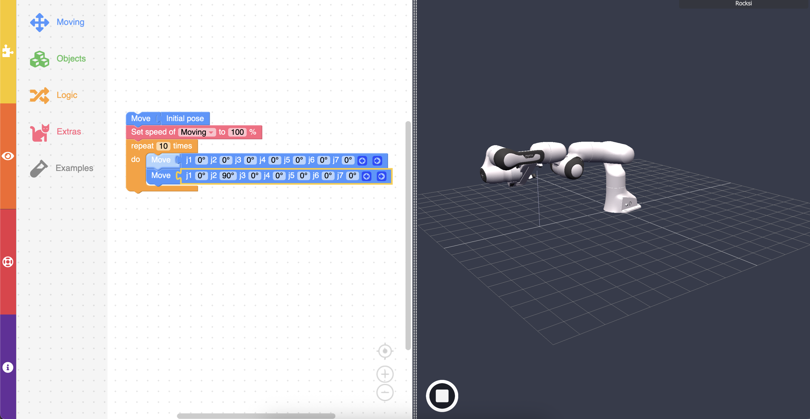

# Robot Simulation

## AKA [Rocksi](https://rocksi.net/)

This week, you are going to have an assignment to use a robot arm
and provide it some simple code to pick up a block.

We are going to look at it briefly to see how it works
so the assignment is not crazy difficult!

## There is a link to the website in the assignment, but if you can't find it, then it is rocksi.net

You are going to be met with a similar screen to the arduino lab we worked with
in the class: CODE ON THE LEFT, simulation on the right.

To run the code in the simulation, there is the big play button within the simulation.

## Code Blocks

A huge different with the code we have here is that is uses blocks of code and NOT written code.

A number of the blocks give you the option to type in values, but you are mostly going to be dragging and dropping
the blocks to create the actions with the arm. 

Some block-based programs allow you to also type in code, but this one does not!

## Example

To start off, you don't even need to worry about trying to copy some sort of starter code and hope it works:
there is a large button called "Examples" which places an example piece of code into the program
for you.

With this example we can see the main features of this simulation:

- move arm
- set blocks
- move blocks

That is really the whole point of this simulation.

The drag and drop coding style is honestly nothing too crazy, so
all you really need to see is how to use the different parts, and you
should be all good.

# Opening and Closing Gripper

# Placing blocks

# How to make loop

There are two types of loops; one which is conditional and one which 
just runs for a certain number of times:

Here, we are using the loop which runs for 10 times; this one is much easier!

For conditionals in roxsi, we really do not have a lot of options.
Although, you can easily tell what you can use by what fits into socket it provides.

This program is a little buggy and dumb though, so some things seem like
they can fit within the socket, but they cannot.

# If statement

# Using joint angles

What you need to understand today is that initially, the example 
gives us the way to move the robot using absolute positions,
but for the assignment we need to translate this
position into the correct angles to reach the box instead.

So, how do we do that?

Well, we use the rotate joint move command instead of the 
position move command block.

On the robot, there exists 6 joints, all of which can be moved. This
does give us incredible range for what we can accomplish, BUT, it 
can often be difficult to use.

# Which joint angle is which?

# The assignment:

Do what the example is doing, but use the joint angles instead of the 
position mover!

That's basically it!

