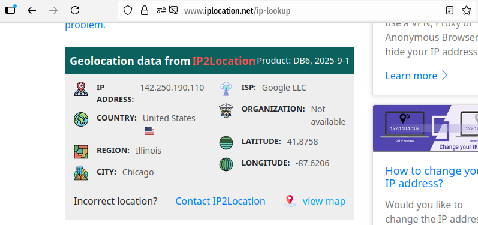

# Network Addresses

Computers can do a whole lot on their own.
Although, what is super important is connecting a computer to another computer.
Connecting a computer to another is known as "networking".

This obviously is essential for our world today, because this is
the basis for the internet. When you connect to a website,
or literally anything, it is through the network
and uses networking tools.

So, how does one connect a computer to another?

Well, it works a lot like mail!

When you want to send a piece of mail, you need
to first "write it", and then send the packet/package/message/letter
to the ADDRESS.

When we want to communicate to another computer, we just need to know "where it is"
on the network/internet!

# IP Addresses

An IP Address is just that!

IP (aka Internet Protocol) Address is a number which is assigned to every 
device connected to a computer network (which uses IP Addressing).

When you want to send a message or communicate to another device, you address
them to the IP address.

The IP does two things:
- Identify the host machine (what machine on a network)
- Provides the location of the host in a network

This is going to be the case for 'every' machine. So, any website you use, any
server you connect to, and any cloud service you save/load data from will be addressable
to some effect!

For instance, we can run a command to get see Google.com's IP address.
We can then take that IP address and cross reference it with Geolocation IP data
to see where the server is hosted from.

Google.com itself probably has multiple servers all around the world, and it is connecting me to the closest one here:

```
$ dig google.com

; <<>> DiG 9.18.39-0ubuntu0.24.04.1-Ubuntu <<>> google.com
;; global options: +cmd
;; Got answer:
;; ->>HEADER<<- opcode: QUERY, status: NOERROR, id: 6477
;; flags: qr rd ra; QUERY: 1, ANSWER: 1, AUTHORITY: 0, ADDITIONAL: 1

;; OPT PSEUDOSECTION:
; EDNS: version: 0, flags:; udp: 65494
;; QUESTION SECTION:
;google.com.                    IN      A

;; ANSWER SECTION:
google.com.             213     IN      A       142.250.190.110

;; Query time: 26 msec
;; SERVER: 127.0.0.53#53(127.0.0.53) (UDP)
;; MSG SIZE  rcvd: 55

$ geoiplookup 142.250.190.110
GeoIP Country Edition: US, United States

```

Now the geolocation data available through this command is a bit limited, but we can
also use websites to do this aswell:




# Ports

Before getting too deep in the weeds, we need to talk about ports.

Ports allow devices to communicate to other machines in an effective manner.

Essentially, we will have a list of potential "areas" where we can receive data, 
and if the port is open, data can be transferred into it. If it is closed, it cannot.

If you just host a website on your machine, you need to assign it to a port
on your device so others (or yourself) can connect to it.

The reason this exists is because your device can run multiple different programs/services on them, and you may need to be able to transfer the data on it at the same time.

So, the IP address will tell others what machine you are using, and the PORT will
tell the user what service they are connecting to.

Some port numbers are designated for specific uses, like HTTP.
Here is a list of alot of those:

> https://en.wikipedia.org/wiki/List_of_TCP_and_UDP_port_numbers


## IPV4

So, what we are seeing here in this example is a IP Address in 
the IPV4 version, aka Internet Protocol version 4. It was first deployed for
SATNET in 1982.

It consists of four 8-bit values making up the entire address.
This is often represetnted with each 8-bit value being seperated by a period, so
you will stuff that looks like this:

> 127.0.0.0

We can represent values from 0 to 255 with an 8-bit number, so it
gives us 256 options per 4 parts.

This means we have a total of 2^32 (4,294,967,296) options of addresses.

Now, for the internet to work, we all need a unique IP Address
to call. This amount, ~4 billion, is just not enough. Originally, it worked
for a while, but we soon updated.


## IPV6

To account for the number of computers that were connecting to the internet, we needed
more space. So now use IPV6 (Internet protocol version 6), which is has 2^128 number of posibilities. This gives us this many options total:

> 340,282,366,920,938,463,463,374,607,431,768,211,456

With this, we should be good for a while. This was made a Draft Standard in
1998, and then became an internet standard in 2017.

An example of what one looks like is this:

> 2001:0db8:0000:0000:0000:ff00:0042:8329

An IPV6 is split up into 8 groups of 16 bits each.
When we view these, they are nearly always shown as a hexadecimal values.

With this, every computer can have a unique IP address without any worries.

Also, when IPv4 was introduced, it had a sleuth of other benefits when compared to
IPv4 other than a larger range of numbers. For instance, it improved routing efficiency, but we really are not getting into that here.


# Where do you get an IP address

The IP address for your device should be assigned to you when the device connects to a network.

If you change networks, the IP address changes. Even when you turn off your device, your
IP address changes.

Typically, internet service providers will change IP addresses whenver is convient. They
are typically only allotted a certain number of them, so they need to switch them
out when needed.


# Why do we have both

What we see is that your device will have multiple IP Address, 
but of different types!

Some servers are not caught up with the times, and to make sure you can
connect to those outdated servers, we have both. So, in the instance you need to connect
to an old IPv4 web server, you can utilize one. Although, since there are not many, ISPs
only have so many. This is why they will allow you one for a time and take it away if your device is not ON or otherwise not connected to their servers.

Otherwise, we have the IPv6 Addresses to use!

## Public IP Address vs Private IP Address


| Public IP Address | Private IP Address |
| :---------------: | :----------------: |
| Connects to the GLOBAL internet      | Connects to your local network     | 
| Enables communication ACROSS networks       | Enables communications between devices on the same network   |
| Wide range of numerical addresses       | Narrow range of addresses   | 
| TRaceable to user / ISP      | Limited traceability      | 


# NAT (Network Address Translation)

Since IPV4 existed for a good while, and still today, there needs to be
a tool to help translate some IPV4 Addresses to IPv6 addresses. This is what
NAT is.

What this also allows is for multiple devices on a network to share a public ip address,
as the private ip addresses from each device is translated to one ip address when connecting through a NAT-enabled router.


# Mac Address (Medium Access Control Address) or (Media Access Control Address)

These are less important, but still should know what it is.

These are values assigned by the manufacturers of machines, so you won't change these when the network changes or anything.

Despite this, some network interfaces support change MAC addresses.
