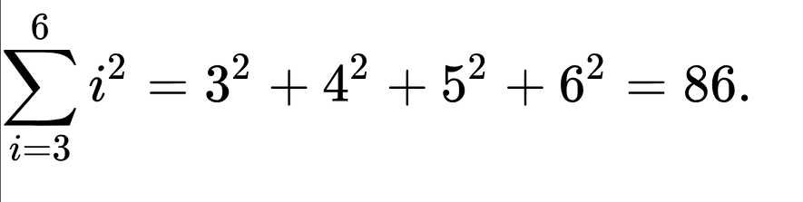
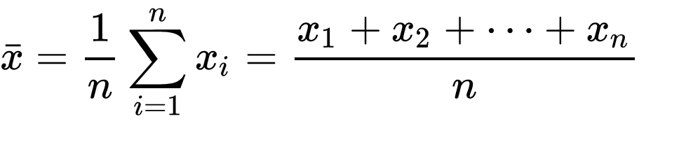
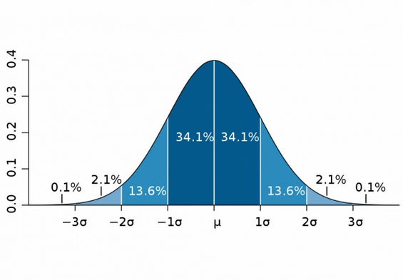
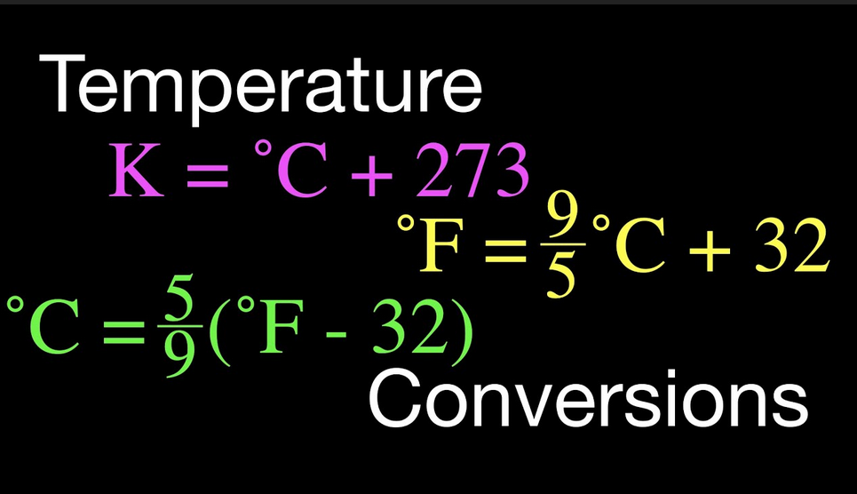
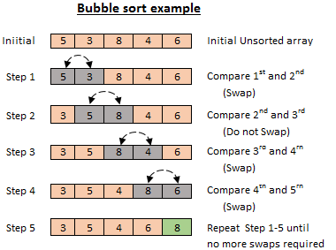

# Math

Honestly, many of these concepts are going to be
review, but many parts of the IT field and especially
coding is very much math based. So, we are going to
cover just the basics of some math formulas:

------

# Data Set Calculation (Statistics)

Much of what programs do is deal with calculating statistics.

We have lots of data in the world to go through, and having computers do it is very important.

So, before we get into coding these type of problems (which
typically deal with arrays and lists of sorts), we should understand how these calculations work!

## Minimum

The minimum value of set of numbers is the smallest.
To make sure you find the smallest value in a randomly
ordered set of values, you NEED to go through every value to
ensure you find the smallest.

Example:

```
6, 7, 2, 7, 1, 10, -20, 1, 4 , 5
```

The minimum value is -20.

Even if there were two -20's in set of data, we could still
say that -20 is the minimum value.


## Maximum

The maximum value is the LARGEST number in a data set. Again, SAME THING ABOUT SEARCHING EVERY VALUE.


Example:

```
6, 7, 2, 7, 1, 10, -20, 1, 4 , 5
```

The max value is 10 in this set of data.


## Sum

The sum of set of data is the value from adding all of the numbers in that set.

Even though we are adding, the result can still be less than an individual value, since we can add
negative values to each other.


Example:

```
1, 2, 3
```

the sum would be 6!

Summation can also be represetented with the sigma symbol and some identifiers:



Here, there are a few things to note:
- the number below the sigma sign (Σ) is the starting value (inclusive)
- the number above the Σ is the ending value (inclusive)
- the 'i' is simply the variable which takes on the value of every value between the starting and end values (working almost as indices)

All the values within the range are then added together!

See example above!


## Count

So the number of items in a set of data is it's count.
It can also be called it's size or length.


Example:

```
6, 7, 2, 7, 1, 10, -20, 1, 4 , 5
```

This set of data has 10 items, so its count is 10.


## Mean

The mean, or average, is the sum of all the values 
divided by the count.

i.e. SUM / COUNT

This gives us the CENTER of all the data in a set.
This can helps us locate generally what this data set is getting.





Example:

```
5, 1, 0, 4, 3

SUM = 5 + 1 + 0 + 4 + 3 = 13
COUNT = 5
MEAN = 13 / 5  = 2.6 
```

## Median

The median is the middle number in an ordered set of data.

Now, if this is an odd numbered set of data, this is pretty easy.
Just, put em in order and get the one in the middle.

Only thing to even note is when there is an even numbered set of data.
In this case, located the two middle most values, add em together, and divide by 2.
This is basically just finding the mean/average of the two numbers.

Odd Example:
```
1, 5, 7, 9, 19

      ^
      |
      This value is in the middle: 7
```


Even Example:
```
5, 8, 10, 12, 14, 55
      ^    ^
      |    |
      These two values are in the middle.

      To find the median, you
      median = 10 + 12 / 2
      median =  22 / 2
      median = 11

```


## Mode

The mode is the most common value found within a set of data.

If there are multiple numbers which all have the same number of appearances,
then they are all the modes.

Example:
```
1, 4, 6, 3, 78, 1 , 3, 22, 3, 2, 1, 1

mode: 1
It appears the most
```

Example 2:

```
7, 9, 6, 11, 20, 20, 41, 3, 9

Modes: 9, 29

```


## Range

The range is the difference between the maximum and minimum value.
The range shows how far spread a set of data is.

Example:

```
188, 64, 23, 34, 66, 124, 223

min value: 23
max value: 223

range = max - min
      = 223 - 23
      = 200
```


## Standard Deviation

The standard deviation is a measure of the amount of variation of the values aroud it's mean.

This standard deviation tells us many things about a population.

First of all, we have already discussed the mean; the mean
tells us the central point of our data... aka the average.

Although, it does not tell us how close our data is to that point. This is
what standard deviation DOES tell us. So, a large standard deviation value means that our
data is spread out away from the mean, which, if we are trying to use that mean to
do some data, maybe it is less useful.

Otherwise, a small standard deviation means the data is more closely packed around our mean.

So, instead of keeping yapping about it, let's look at a formula and solve an example.


### Population

Here is the formula, and yes it can look intimidating, but it is really not that bad:

> explain it, obviously.

$$
X_i =  \text{The value in the data set} \\
\mu =  \text{Population mean } \\
n =  \text{Total number of observations (count)} \\
\sigma  = \text{Standard Deviation} \\

-----------------------\\

\sigma = \sqrt {
      \frac{
            \sum_{i}^{n} (X_i - \mu)^2
      }{
            n
      }
}
$$

So, lets us this on some data.

Let's say I want to find the standard deviation for the times people arrive to a breakfast joint
that I have been wanting to eat at (so perhaps, I can eat food)


```
4, 5, 6, 6, 8, 8, 8, 8, 9, 9, 10, 10, 11, 12, 12

So, we first need to find the mean of these values.
Count: 15
Sum: 126
Mean: 8.4

With this, we need to 
- find the difference from this mean for every value
- square it
- add it all up
```

Difference       |  to power of c   |   count
-----------------|------------------|------------------
4 - 8.4 = -4.4   |   19.36          | 1
5 - 8.4 = -3.4   |   11.56          | 1
6 - 8.4 = -2.4   |   5.76           | 2
8 - 8.4 = -0.4   |   0.16           | 4
9 - 8.4 = 0.6    |   0.36           | 2
10 - 8.4 = 1.6   |   2.56           | 2
11 - 8.4 = 2.6   |   6.76           | 1
12 - 8.4 = 3.6   |   12.96          | 2


$$
SUM = 19.36\ +11.56+\left(5.76\cdot2\right)+\left(0.16\cdot4\right)+\left(0.36\cdot2\right)+\left(2.56\cdot2\right)+6.76+\left(12.96\cdot2\right) \\
SUM = 81.6
$$

$$
\sigma = \sqrt {
      \frac{
            \sum_{i}^{n} (X_i - \mu)^2
      }{
            n
      }
}
$$

becomes


$$
\sigma = \sqrt {
      \frac{
            81.6
      }{
            15
      }
}
$$

$$
\sigma = \sqrt{5.44}
$$

$$
\sigma = 2.3323
$$

So, our standard deviation is

Really, this formula we used is the "population" standard deviation. All this means is that
we would need the entire population we are trying to find the standard of.

In most situations, you probably don't have that. You are probably taking a small sample from a 
larger set of data. In which case, we use a slightly altered formula ---> see next section

### Sample

Unless we have literally

$$
X_i =  \text{The value in the data set} \\
\overline{X} =  \text{Sample mean } \\
n =  \text{Total number of observations (count)} \\
\sigma  = \text{Standard Deviation} \\

-----------------------\\

\sigma = \sqrt {
      \frac{
            \sum_{i}^{n} (X_i - \overline{X})^2
      }{
            n - 1
      }
}
$$

So, for the last calculation, it would be mostly the same, although, the n is substracted by 1

$$
\sigma = \sqrt {
      \frac{
            81.6
      }{
            15 - 1
      }
}
$$

this becomes

$$
\sigma = 2.41424
$$


### Bell Curve

So, once we have the standard deviation, we can interpret lots of data from this.
Most importantly, is seeing how many data points fall within specific ranges.

This is where the bell curve comes from:



From the mean, we can now add/subtract a certain number of standard deviations to see
how many people fall between certain number of percentage ranges! WOO!

NOW, all these calculations are great and all, but if we are working with HUGE sets of data, then
this would be very annoying to find out. So, this is why this is a common
computer problem because this would be trivial to solve with code.

## Variance

The variance is the standard deviation squared.
Or... it is the same forumla but you don't
squareroot it.

It is also helpful in some situations apparently
to use this infor to analyze data.

$$
X_i =  \text{The value in the data set} \\
\mu =  \text{Population mean } \\
n =  \text{Total number of observations (count)} \\
\sigma^2  = \text{Variance} \\

-----------------------\\

\sigma^2 = \frac{
            \sum_{i}^{n} (X_i - \mu)^2
      }{
            n
      }
$$

-------
# Others

## Converting between Celcius and Fahrenheit



- F -> C
- C -> F

show if you just know one of them,
you can find the other


## Converting units

Being able to convert from 
one type of data to another is very important in many situations..

Understanding the basics is important.

Here we are using inches to centimeters.

1 in  =  2.54 cm

When you have one of the two types, you need to set up
a small equation where you are 'getting rid of' your type in a
dision problem.

Just look at this example and understand:

Example 1:

```
8 in

I want it in cm


8 in      2.54 cm
     *   --------- = 20.32 cm
            1 in
```

Example 2:

```
8 cm

I want it in inches


8 cm       1 in
     *   --------- =  3.14 in
          2.54 cm  
```

## Sorting set of data

There are multiple ways or sorting data.

The following sorting method is called bubble sort and
it is pretty ineffcient.

But it is a simple way to understand sorting



