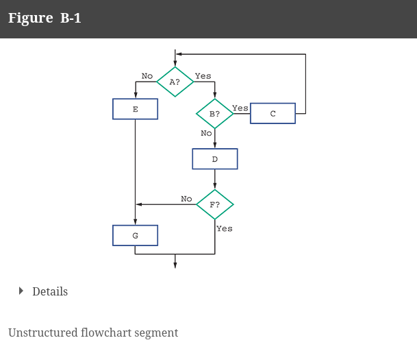
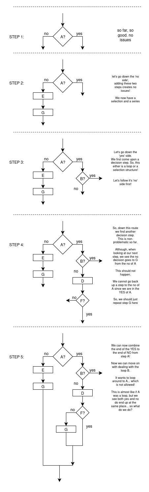
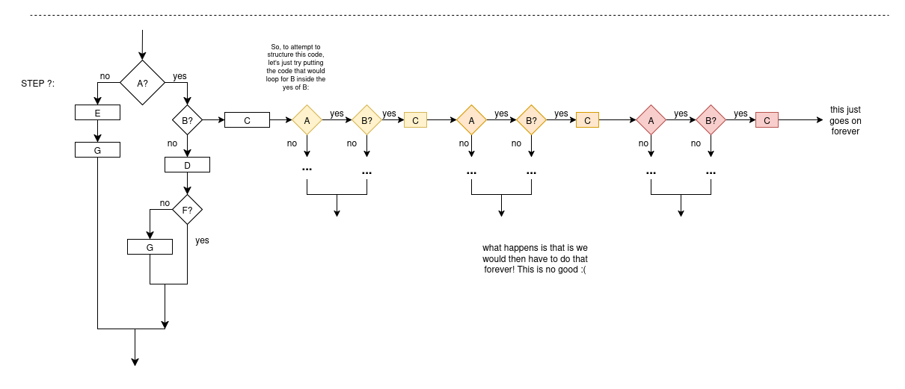
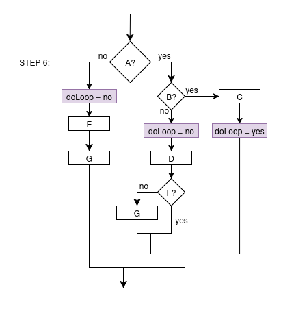
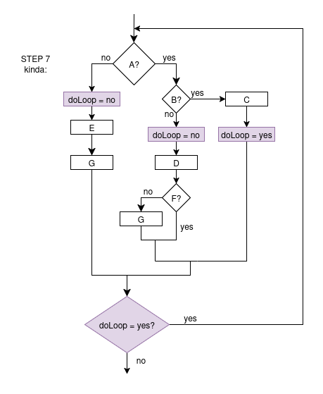
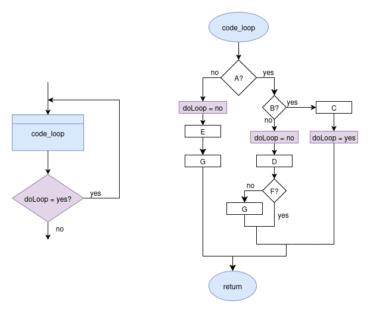
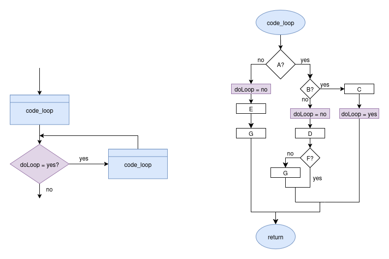

# Advanced Structuring i.e. Solving Difficult Structuing Problems

> For more information, see appendix B in the textbook

So, we have solved many structuring problems at this point.
We are going to go a bit further today though!

Let's look at another flowchart example:

Now this flow chart is unstructured, but we do need to fix it!
So, we are going to go about this using a new way: 
the speghetti method!

# Spaghetti Method

 What the spaghetti method is all about
 is going through an existing flowchart and 'untangling it'
 like you may do to strands of spaghetti.

 So, we go step by step, recreating the 
 flowchart, and have it still LOGICALLY
 perform the algorithm.

 

So, at this point, we need to do the yes of
B?, and currently, the way they do this is messed up.

It looks like it wants to loop based off of B, although, if that was the case,
it would loop right before B, but it doesn't. It loops around to A.

Now, trying to resolve this by putting the needed steps inside B has a small problem!

This will not work. What we need to introduce is our own loop.

What we see in the original diagram is that REALLY, if we go down A? yes and B? yes, 
the whole thing repeats. So, we just need to repeat with the whole thing... again
ONLY IF A and B are both yes.

What we can do to accomplish this is FLAGS.

# Flags

Flags are a fundamental part of many programming langauge dynamics.

Really, it is just a boolean variable designating if something is true or not,
i.e., either true or false.

So, here, in our example, we want a flag to designate if we should loop!

So. let's add those flags first!

Now, with a flag created, we can use that for a larger loop!

Now, this is better and logically "work", but this is not structured.
So, what are we doing. Why did we just make still unstructured code?

Well, let's first simplify this problem and maybe we can see!

Let us put everything being looped inside of a module!

Here, this is suddenly a much simpler problem. We have actually already solved
this problem before!

We know in this situation, all we need to do is let the 'code_loop'
run first, then within the loop, have there be another 'code_loop'
module call. Therefore, we can allow the loop to start RIGHT before the
decision block, and it is now structured!

