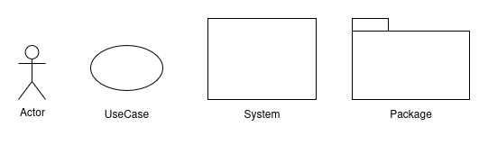
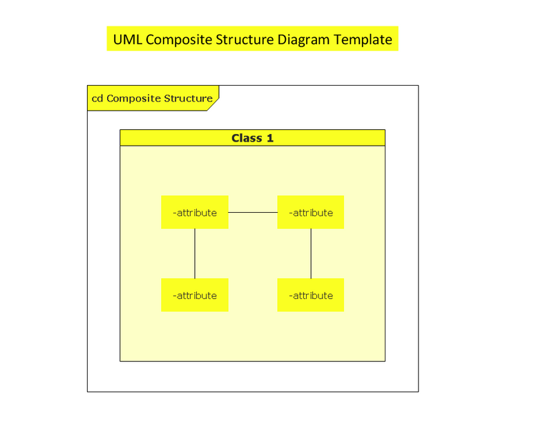
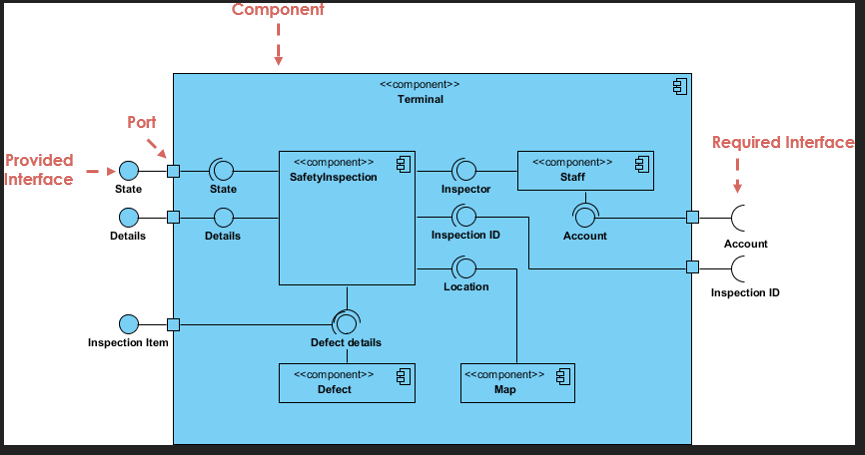
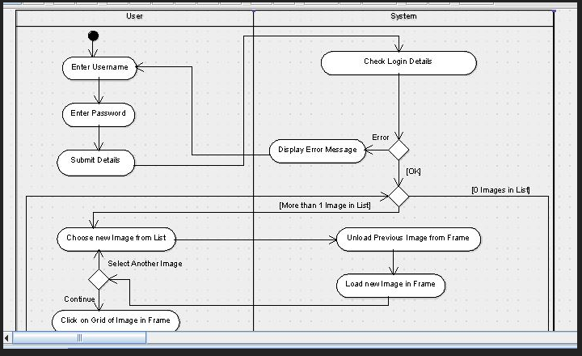
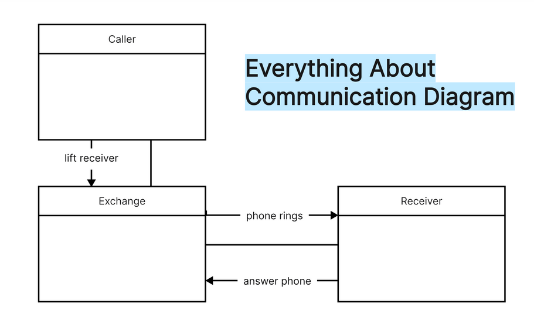

# UML Charts

Unified Modeling Langauge charts aim to establish a standard approach for depicting the design of a system, 
akin to the blueprints used in various engineering fields. UML diagrams are utilized to 
visually illustrate the workings of a system, aiding software engineers, business 
professionals, and system architects in modeling, designing, and analyzing systems.

These will, just like flowcharts, connect a few parts together to show the flow / way / functions
to take in input/outputs to solve a given problem.

Instead of representing algorithms, we are representing where an algorithm/system is located a larger
group of database, people, and things in the real world.

# Parts of UML Diagrams

When creating these diagrams, we use many symbols to represent different parts of a
system.

Now, honestly, there are not many parts to this.

UML diagrams are very much less describing the specifics, and instead describe general ways things work.
Here are those parts:

## Actor

Within an uml chart, actors represent entities that interact with your system.
This can be users, testers, other systems, devices, or anything else. 
These are the individuals providing **inputs** and receiving the **outputs** 
from the system.

## UseCase

Use Case show specific functions of a system. This is normally equivalent to either
modules, or "greater" purposes. Maybe this would be a larger system with many
inner modules all being part of it.

This should normally be bigger ideas, such as a "Submit Order" function.

## System

When describing these smaller functions, they are all typically part of larger ideas or 
systems. These should all be bounded together within the parameters of a System Boundary
and labeled accordingly. Typically depicted by a rectangular shape encompassing all system use cases,
the system boundary helps define the system's scope and limitations.

## Packages

Packages  are basically the same thing as systems. They contain UseCases to be grouped.
We are not going to be really using them for this class though; just know they exist!

 

------------

# Relationships

When connecting and combining these elements, we have five ways to do so:

1. Associate between an actor and a use case
    - actors must be associated with at least 1 use case
    - can be associated with multiple use cases
    - multiple actors can be associated with a single use case
    - 
2. Generalization of an actor
    - Generalizations allow us to connect one actor to another so they 'inherit' all the traits about that actor, but can have a few special traits of their own
    - 
3. Extend relationship betwwen two use cases
    - Extended use case is dependednt on the use case extended upon
    - Extended use case is (usually) optional (see the conditional statement)
    - The use case extended upon (the base use case) must be meaningful on its own
    - 
4. Include relationship between two use cases
    - Unlike extends, the includes is MANDATORY and NOT optional
    - This describes feature step of use case; this is often used when the included use case is something mulitple other BASE use cases NEED to do
    - 
5. Generalization of a use case
    - This is similar to generalization of an actor.
    - Used to inherit everything about a use case, but gives it its own special spin.
    - 

# THIS IS WHERE YOU CAN GO WRONG. Its hard to describe a function or actor wrong, BUT IT IS EASY TO CONNECT THEM WRONG!

# Use Case Diagrams

Per canvas
> Use Case Diagrams are utilized to visually represent the functionality of a system or  
> specific components within a system. They are commonly employed to demonstrate the  
> functional requirements of the system and how it interacts with external agents, also  
> known as actors. A use case diagram portrays various scenarios in which the system may  
> be utilized. By providing a broad overview, a use case diagram showcases the  
> capabilities and actions of the system without delving into specific implementation  
> details.

Before even creating your UML chart to begin representing larger systems, you need to
make sure you get everything you need!

Now you probably won't plan everything out until you start working on the 
UML chart and/or the actual system, but all of this is to make sure we are planning out
as much as we can.

## Identifying Actors

You first need to identify everyone using the system, including other systems and perhaps things
like companies and organizations.

## Identifying Use Cases

This is where you specify the specific things your system will do. What you want
to do is start with what you know the actors need to do... and build on that.

## Look for Common Functionality (i.e. <<includes>>)

This is then building on those use cases! With the main things the system does laid out, you should
then describe inner systems that those MAIN use cases rely on to work.

## Anything to generalize

With the main outline for your system complete, if you can think of a generalization for any actors, please come up with these as well.
Again, this is simply an extension of the existing things, so see if there is just anything that makes sense for this case.

## Optional Functions (extend)

Finally, once everything that is necessary for the system to function is done, you can add
the extra parts of the system now!

# Bank Example

               
------------
               

--------

# Class Diagram

Per canvas
> The most commonly utilized UML diagram in software development is the class diagram,
> which serves as the foundation for all object-oriented systems. Class diagrams 
> are used to visually represent the static structure of a system, illustrating the 
> classes, methods, and attributes within the system. Additionally, they aid in 
> identifying relationships between various classes or objects.

# Composite Structure Diagram

Per canvas
> We utilize composite structure diagrams to visually illustrate the internal structure of 
> a class and its interactions with other components within the system. These diagrams 
> represent the relationships between parts and their configurations, showcasing how the 
> classifier (such as a class, component, or deployment node) functions within the system.

# Object Diagram

Per canvas
> An Object Diagram is a visual representation of the instances in a system and the 
> relationships between them. Object diagrams provide insight into the behavior of a 
> system at a specific moment, as they illustrate the behavior of instantiated objects.

# Component Diagram

Per canvas
> Component diagrams are utilized to illustrate the organization of physical components 
> within a system. They are utilized for modeling implementation specifics. These diagrams 
> depict the structural relationship between elements of a software system and aid in 
> determining if planned development adequately addresses functional requirements.

# Deployment Diagram

Per canvas
> Deployment diagrams are utilized to depict the system hardware and software. They 
> provide insight into the hardware components present and the software components that 
> are operational on them. These diagrams showcase the system architecture by illustrating 
> the distribution of software artifacts across multiple targets.

# Package Diagram

Per canvas
> We utilize Package Diagrams to illustrate the organization of packages and their 
> components. A package diagram visually represents the relationships between various 
> packages and the internal structure of packages. Packages aid in organizing UML diagrams 
> into coherent groups, thereby enhancing the clarity and comprehension of the diagram. 
> They are commonly employed in organizing Class and Use case diagrams.

# State Machine Diagrams

Per canvas
> A state diagram is utilized to depict the current state of the system or a specific 
> component of the system at distinct points in time. This type of diagram is considered a 
> behavioral representation, showcasing behavior through finite state transitions. While 
> the terms may be used interchangeably, a state diagram is primarily utilized to outline > the dynamic behavior of a class in reaction to time and external influences.

# Activity Diagrams

Per canvas
> Activity Diagrams are utilized to visually represent the flow of control within a  
> system, including outlining the steps involved in executing a use case. These diagrams  
> are used to model both sequential and concurrent activities within a process.  
> Essentially, they depict workflows in a visual format, focusing on the condition of  
> flow and the specific sequence in which activities occur.

# Sequence Diagram

Per canvas
> A sequence diagram depicts the interactions among entities in a system.step-by-step  
> manner, showcasing the order in which these interactions occur. It is also referred to  
> as an event diagram or event scenario. These diagrams are commonly utilized by  
> professionals in business and software development to document and comprehend the  
> requirements for both new and current systems.

# Communication Diagram

Per canvas
> A Communication Diagram, previously known as a Collaboration Diagram in UML 1.x, is  
> utilized to illustrate the sequential exchange of messages between objects. Although  
> similar information can be represented using Sequence diagrams, Communication Diagrams  
> present objects and connections in a more flexible layout.

# Timing Diagram

Per canvas
> Timing Diagrams are a specialized version of Sequence diagrams that depict the behavior  
> of objects over a specific time period. They are useful for showing timing constraints  
> that dictate changes in the states and behavior of objects.

# Interaction Overview Diagram

Per canvas
> An Interaction Overview Diagram represents a series of actions in a simplified manner,  
> breaking down complex interactions into more manageable occurrences. It combines  
> elements of activity and sequence diagrams to streamline the depiction of interactions.

