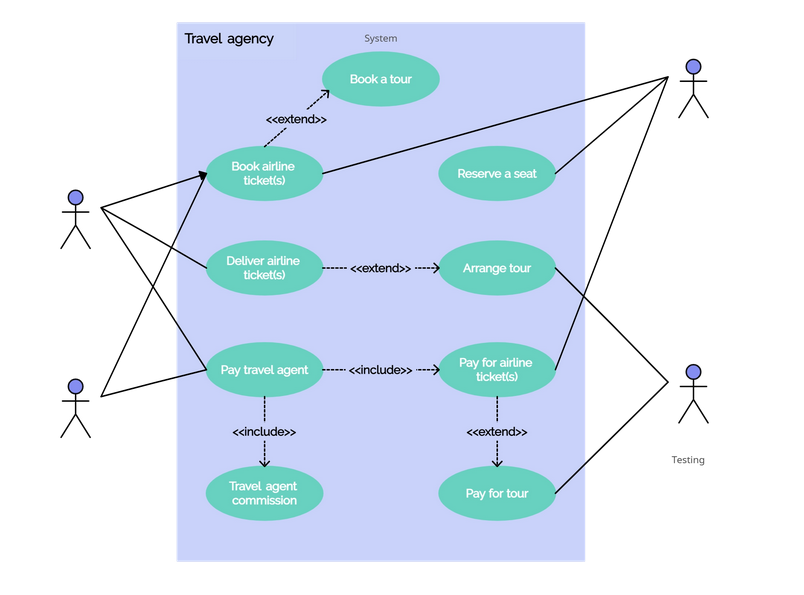
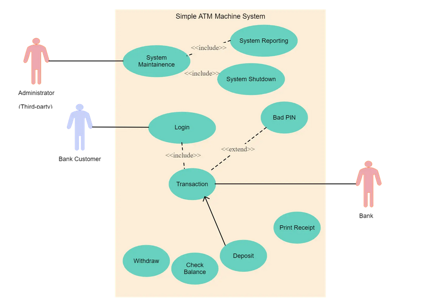
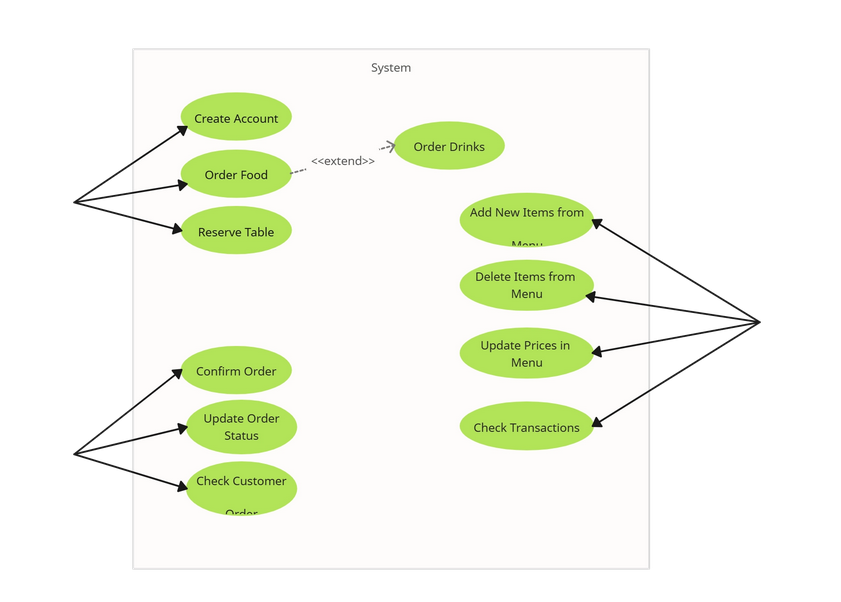
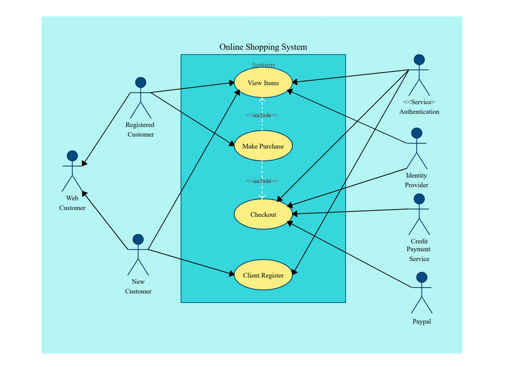
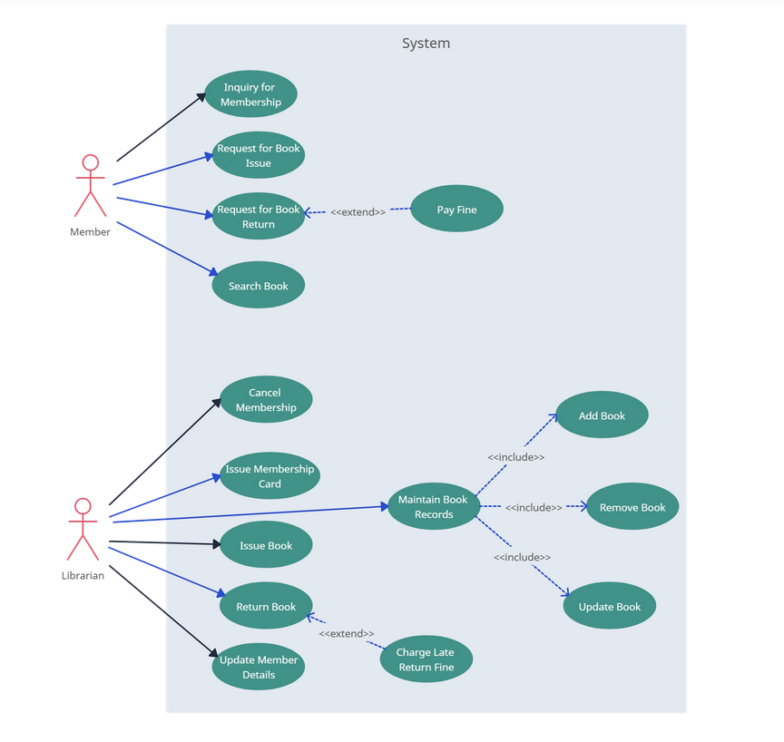

# Examples

These examples are mostly pulled from: https://creately.com/guides/use-case-diagram-tutorial/

## Travel Agency System

## ATM System

## Restaurant Order System

## Online Shopping System (this one might be important wink wink)

## Library Management System

# In class work through these as examples and ask people in class like what to include

## Simple Website

do on the spot

## Group voice chat type system

do on the spot

## Multiplayer game

do on the spot

