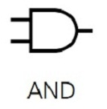
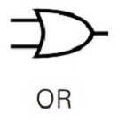
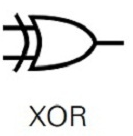
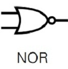
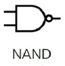

#  Logic Gates (Fully In-Depth)

We have seen booleans already, BUT, let us quickly look at it again as it is 
essential to understand logic gates!

## Booleans

Boolean variables are simply the words and ideas of **true** or **false**.
It is this binary set of values which underpin the whole field of logic and computer logic.

It was "invented" by George Boole in 1847 in his book "The Mathematical Analysis of Logic".
Obviously, things being true or false wasn't just made of then, but the math and use of it in logic
was always there.

# Where we see this in computers: boolean expressions

We do see booleans used directly in code, such as this statement:

```java
public class example {
    public static void main(String[] args) {
        if (true) {
            System.out.println("The thing was true");
        }   
    }
}
```

In this example, the boolean ```true``` is put directly in the code;
if something is true, it typically means that the code will execute its contents.
If we replace ```true``` with ```false```, this code would not execute... or well the 
System.out.println(...) line.

```java
public class example {
    public static void main(String[] args) {
        while (true) {
            System.out.println("The thing was true");
        }   
    }
}
```

This piece of code will do a very similar thing, but loop the code infinity instead.
We have already seen this.

Now, normally, we wouldn't just use these, as the code wouldn't really change from
iteration to iteration.

NORMALLY, we have expression which evaluate to a boolean value. This is much more helpful!

For instance, this example:

```java
public class example {
    public static void main(String[] args) {
        int num = 10;
        
        if (num == 10) {
            System.out.println("The thing was true");
        }   
    }
}
```

In this example, we have a boolean example: ```num == 10``` which, in this instance, results in true
and this code would run.

This is as basic as it gets.

Now with booleans, we can represent logical situations.

So. we can ask questions and assign them a truth values:

"the sun rose this morning" -> true
"my name is <your name>" -> true
"i was born in the year 1300 AD" -> false

What helps us further represent this are what known as logical gates.

# Logic Gates

Logic gates are ways of combining and evaluating boolean variables with other
boolean values. Most of these "logically" make sense but may have never been 
plainly written out and made as "rules".

Many of these rules are written in a million different ways and can be represented differently across programming
languages, so make sure you understand what you are actually working with in specific situations. 

Most of the gate we will see are going to work a lot like mathematical expressions
that take two operands and 1 operator and produce 1 result... this is true
except the first one we will see, NOT.


## NOT

The NOT logical gate will negate/inverse the boolean value.

So, a NOT true results in false

A NOT false results in true

**NOT is represented in many ways:**
- negation
- ¬
- '
- 

**Truth Table Representation:**

| A     | ¬A    |
|-------|-------|
| true  | FALSE |
| false | TRUE  |


## AND

The AND logical gate expects 2 boolean values and will produce TRUE
if and only if both are TRUE. If either or both booleans are FALSE, you will result in FALSE.

**AND is represented in many ways:**
- conjunction
- ^
- 

**Truth Table Representation:**

| A     | B     | A ^ B |
|-------|-------|-------|
| true  | true  | TRUE  |
| true  | false | FALSE |
| false | true  | FALSE |
| false | false | FALSE |
 

## OR

The OR logical gate expects 2 boolean values and results in TRUE if either one is TRUE, and results in
FALSE otherwise.

**OR is represented in many ways:**
- disjunction
- V
- 

**Truth Table Representation:**

| A     | B     | A V B |
|-------|-------|-------|
| true  | true  | TRUE  |
| true  | false | TRUE  |
| false | true  | TRUE  |
| false | false | FALSE |


## XOR

The XOR logical gate also take 2 operands; XOR results in TRUE only if 1 of the two operands are TRUE; it will
result in FALSE otherwise

**XOR is represented in many ways:**
- 

**Truth Table Representation:**

| A     | B     | A XOR B |
|-------|-------|---------|
| true  | true  | FALSE   |
| true  | false | TRUE    |
| false | true  | TRUE    |
| false | false | FALSE   |

## NOR (Not Or)

NOR is shorthand for NOT OR, so it first does a OR operation, then not.
That is to say, it results in TRUE only if both operands are FALSE, and results in FALSE otherwise.

**NOR is represented in many ways:**
- 

**Truth Table Representation:**

| A     | B     | ¬(A V B) |
|-------|-------|----------|
| true  | true  | FALSE    |
| true  | false | FALSE    |
| false | true  | FALSE    |
| false | false | TRUE     |

* NOTE: instead of `¬(A V B)`, one could have used `A NOR B`


## NAND (Not And)

The NAND logical gate result in TRUE when there is at least 1 FALSE boolean operand;
if all the operands are TRUE, then the NAND results in FALSE.

Similarly to NOR, NAND is just negating the result of AND

**NAND is represented in many ways:**
- 

**Truth Table Representation:**

| A     | B     | ¬(A ^ B) |
|-------|-------|----------|
| true  | true  | FALSE    |
| true  | false | TRUE     |
| false | true  | TRUE     |
| false | false | TRUE     |

* NOTE: instead of `¬(A ^ B)`, one could have used `A NAND B`