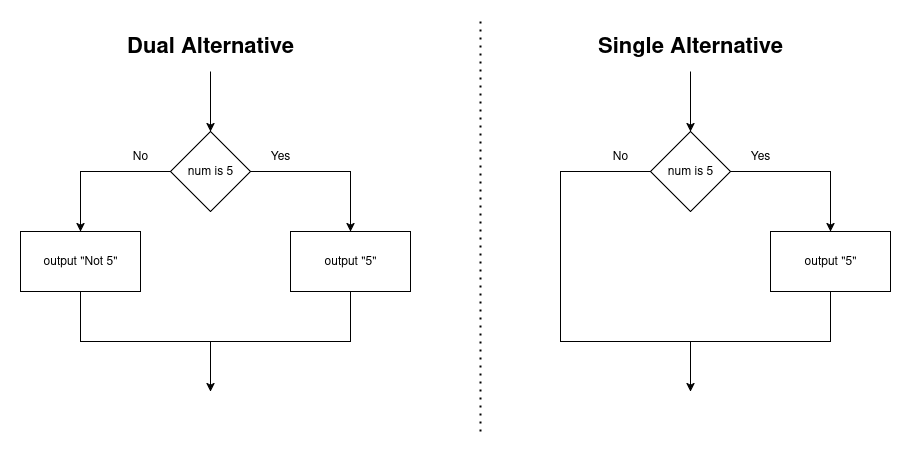

# Selection

We have obviously already discussed selection statements before, but let's quickly rehash the basics
so we can begin discussing more advanced topics:


So, selection statements are decision-making steps which will diverge
our path to another option.

This is done using some type of boolean value; if it is true, it goes down
one path; if false, it goes down another.

Within code, this is represented as an if/else structure.

Dual-Alternative Path:
```
if num is 5 then
    output "5"
else:
    output "Not 5"
endif
```

Single-Alternative Path:
```
if num is 5 then
    output "5"
endif
```

Within flowcharts, it is represented as such:




Notice that the "yes" path on the single alternative NEEDS to be the path with code
being executed. Otherwise, this would not be a valid selection structure.

These are the basics which we already have discussed.