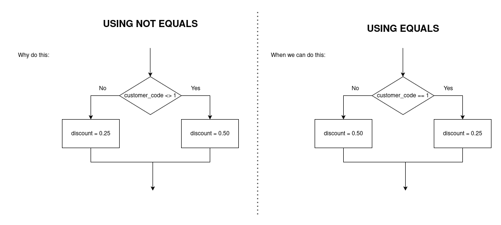

# Relational Comparison Operators

When using a selection statement, like we have said, you normally are not
simply checking for if something is literally TRUE or FALSE.

We are typically making sure a variable has met some sort of qualification.


# The Operators


## Equivalency operator

Book Definition:
> Evaluates as true when its operands are equivalent.

Representations:
- =
- ==
- EQUALS


## Greater-than operator

Book Definition:
> Evaluates as true when the left operand is greater than the right operand.


Representations:
- `>`
- GREATER THAN


## Less-than operator

Book Definition:
> Evaluates as true when the left operand is less than the right operand

Representations:
- `<`
- LESS THAN


## Greater-than-or-equal-to operator


Book Definition:
> Evaluates as true when the left operand is greater than or equivalent to the right operand

Representations:
- `>=`
- GREATER THAN OR EQUAL TO


## Less-than-or-equal-to operator


Book Definition:
> Evaluates as true when the left operand is less than or equivalent to the right operand

Representations:
- `<=`
- LESS THAN OR EQUAL TO


## Not-equal-to operator


Book Definition:
> Evaluates as true when its operands are not equivalent

Representations:
- `<>`
- !=
- NOT EQUAL


-----

-----

# Rules

> Any decision can be made using combinations of just three types of comparisons: equal, greater than, and less than

> When doing a comparison, we NEED to have them be the same data type.

We need to compare apples to apples!

Some programming languages will allow you to compare different types of variables, for instance:
- characters to integers
- booleans to integers
- floating points to integers

When it does this, it will first always do some conversion of one
of the data types to make this work, for instance, some languages will
convert the characters to ASCII value equivalences in INTEGERS to then
allow for the compparison!


> When doing a comparison, we can compare in many ways,
for instance:

### Variable with Constant

```
NUM > 10
```

### Variable with variable


```
NUM > MAX
```

## Trivial expressions (Constant with Constant)

When working with booleans expressions,
if our expression only contains constant values, the expression is trivial

TRIVIAL EXPRESSION:
> an expression that always evaluates to the same value

That is to say, we could replace it with TRUE/FALSE without
any loss of logic.

For instance, the statement:

```
14 < 10
```

This is a trivial expression. The result from evaluating this will ALWAYS be false.
There are no variables present found in this expression

If there was a variable, then it would have the ability to result in something else. But here, we
have no VARIABILITY.

These trivial questions do not need to necessarily need to be only numbers.
For instance, this is also a trivial expression:

```
"dog" == "dog"
```

# Less Than / Greater Than with Strings!

Some programming languages have built in support to compare strings.

Sometimes, this is labeled as an invalid operation, but sometimes not!

For instance:

```
"APPLE" < "BANANA"
```
This can be labeled as TRUE.

Typically, when it does this operation, it compares each character alphanumerically from left
to right until it finds one that is not equal.

Sometimes it converts each character to the ascii equivalence and does a comparision character by character.


# Confusion of the NOT EQUAL OPERATOR

Using the not equals operator can be confusing sometimes so maybe sometimes avoid using it lol




They ARE still useful though. **They are more useful when it is a Single-Alternative Path!**
They are clearer in what is going on.

```
if customerZipCode <> LOCAL_ZIP_CODE then
    total = total + deliveryCharge
endif
```

