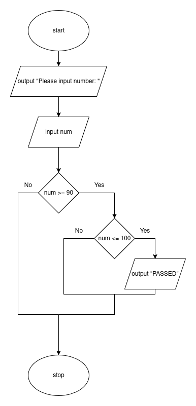

# AND

The AND statement, found within code, is actually a type of compound condition:

> Compound Condition: an evaluation with multiple parts.

The AND conditional is a shorter way to write a set of nested decision steps:



Here is this piece of code as psuedocode:

```
start
    output "Please input number: "
    input num
    if num >= 90 then
        if num <= 100 then
            output "PASSED"
        endif
    endif
stop
```

An AND statement LITERALLY combines TWO BOOLEAN STATEMENTS together.
If we didn't have AND statement we would have to organize it in the same way as I am above.

We can simplify this by using an AND statement:

```
start
    output "Please input number: "
    input num
    if num >= 90 AND num <= 100 then
        output "PASSED"
    endif
stop
```


# Short Circuiting AND Conditionals

Finding the thing which is FALSE first means you technically do not need to evaluate the remaining statement

Since we know BOTH need to be TRUE for an AND statement to be true, if the first thing
we evaluate is false, we don't even need to consider the second part.

In most programming languages, stopping the evaluation after the first boolean statement is
called SHORT CIRCUITING. This saves time as it doesn't need to solve the second part.

Here is an example:

```
start
    output "Please input number: "
    input num // PRETEND 10 IS INPUTTED
    if num >= 90 AND num <= 100 then
        output "PASSED"
    endif
stop
```


# Mistakes that can be made

- if you meant to have statements nested with steps in between, you should not replace these two if's with 1 as you now don't have the extra step running in the proper place!
- make sure they are not trivial statements by accident:
  - ```
    if num < 5 AND num > 2000 then...
    ```
