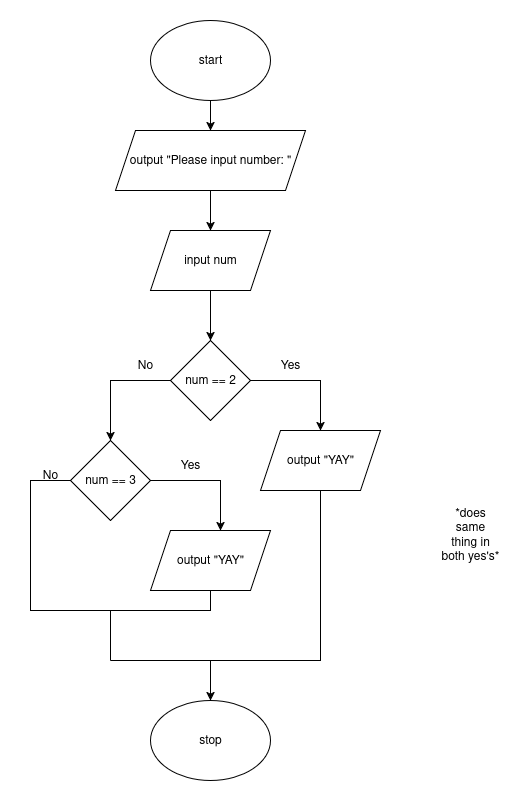
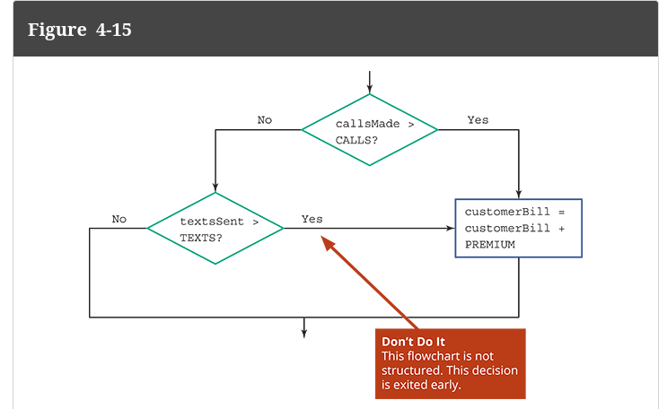

# OR

Just like AND, OR is really just a combination of boolean statements



Pseudocode version:
```
start
    output "Please input number: "
    input num
    if num == 2 then
        output "YAY"
    else
        if num == 3 then
            output = "YAY"
        endif
    endif
end
```

Again, this can simplified using the OR statement:

```
start
    output "Please input number: "
    input num
    if num == 2 OR num == 3 nthen
        output "YAY"
    endif
end
```

# Short Circuiting OR Statements

Finding the thing which is TRUE first means you technically do not need to evaluate the remaining statement

Just like AND, we can arrange our OR statement to short circuit the statement:

Like this:
```
start
    output "Please input number: "
    input num // PRETEND 10 IS INPUTTED
    if num == 10 OR num > 100 then
        output "PASSED"
    endif
stop
```

In this example, you can see we don't even need the second part, since it 
all evaluates to true without needing to check the second part!


# Common Errors

- not completing OR statements: ```num = 0 OR > 50```
- Easy to not structure it:
  - 
