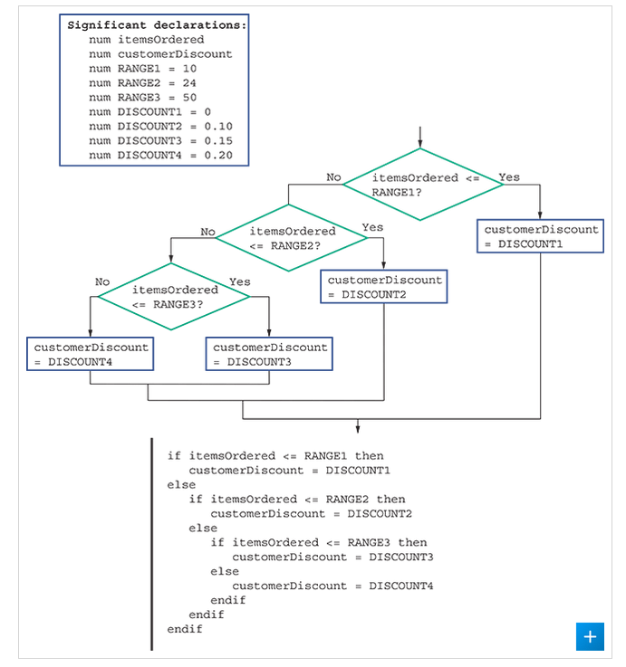

# Selection Range


## Range Check

> the comparison of a variable to a series of values that mark the limiting ends of ranges.


-------


So, AND/OR statements are great for comparing ranges:

Here is how the book shows it off:




This would be a good way to bread down grades in a class ranges.

## THIS IS BETTER FOR A BINARY RANGE

Here is how you would do it with OR... and it be wrong:

```
num = input()
if  num >= 0 OR num <= 100:
    output "It is between 0 and 100"
endif
```

This is a bad way to do it, since it wouldn't work, so you should probably use AND

Here is how you would do it with AND:

```
num = input()
if num >= 0 AND num <= 100:
    output "It is between 0 and 100"
endif
```
