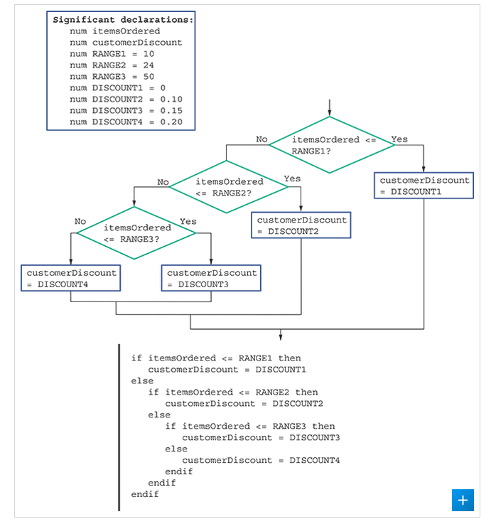

# Selection Range


## Range Check

> the comparison of a variable to a series of values that mark the limiting ends of ranges.


-------


So, AND/OR statements are great for comparing ranges:

Here is how the book shows it off:




This would be a good way to bread down grades in a class ranges.

## THIS IS BETTER FOR A BINARY RANGE

Here is how you would do it with OR... and it be wrong:

```
num = input()
if  num >= 0 OR num <= 100:
    output "It is between 0 and 100"
endif
```

This is a bad way to do it, since it wouldn't work, so you should probably use AND

Here is how you would do it with AND:

```
num = input()
if num >= 0 AND num <= 100:
    output "It is between 0 and 100"
endif
```


# The general rule of thumb is, if you need a range between values, use an AND statement; if you need to include number outside of a range of values, use an OR statement.

Like we saw, if we want to check if an input is between 0 and 100, we can use an AND statement to do so:

```
if num >= 0 AND num <= 100:
...
```

and if we wanted to check if something falls outside that range, i.e. less than 0 and greater than 100, we can use OR:
```
if num < 0 OR num > 100:
...
```

Technically, you can also get these by negating whatever it is you are trying to exclude