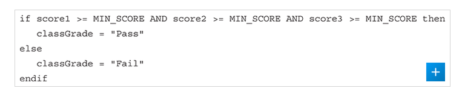
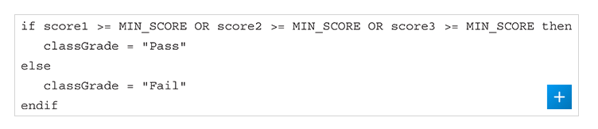
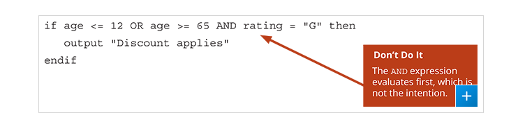

# Precedence

Sometimes, we can have multiple ANDs/ORs all in a string of booleans.

If these were contained within parentheses, there would be no problem.
But, sometimes they don't.

## ALL ANDS

If it was all AND's, then we know by the way
AND's work that everything just needs to be TRUE, and that's about it.

## ALL ORS

Similar to AND, we know that as long as there exists atleast 1 TRUE, then
the whole statement is true, so, that is all we would be evaluating for!

## ANDs and ORs

So, depending on the programming language, this could be different, but
in all the programming languages I looked up, this was the case.

AND is evaluated before the OR... i.e.
AND has higher precedence than OR.

