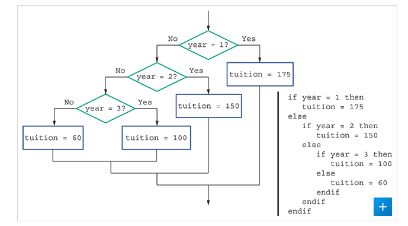
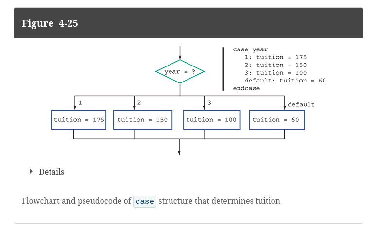

# Case Structure

Sometimes, when you are comparing a variable to a set of discrete values.

This can be annoying to do with if statements.

What can help fix this is using a case structure.

## Using If Statements

## Using Case Statements

