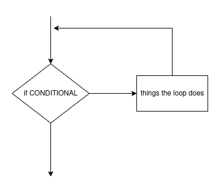
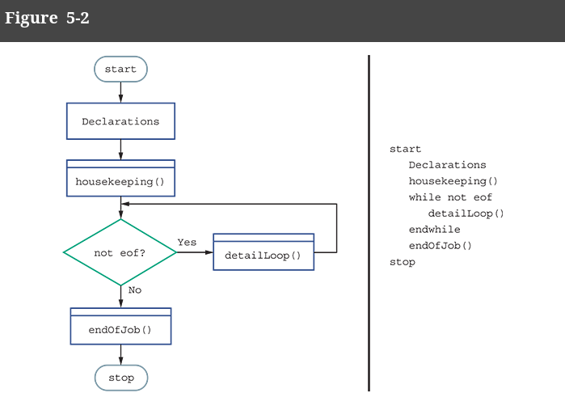
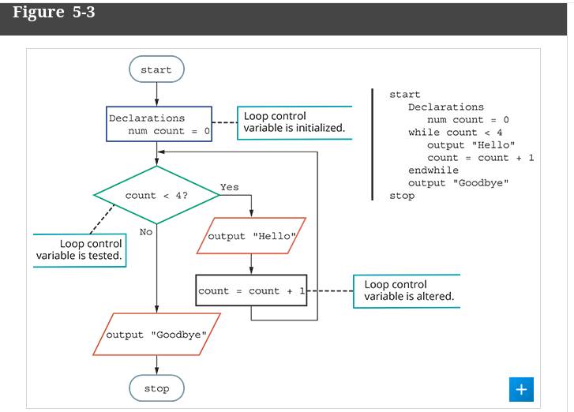
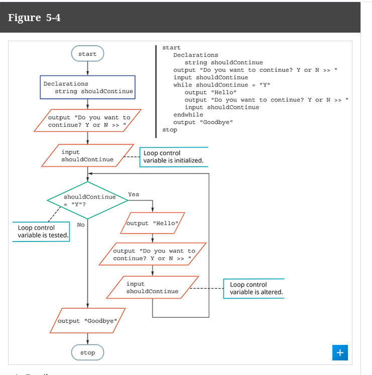
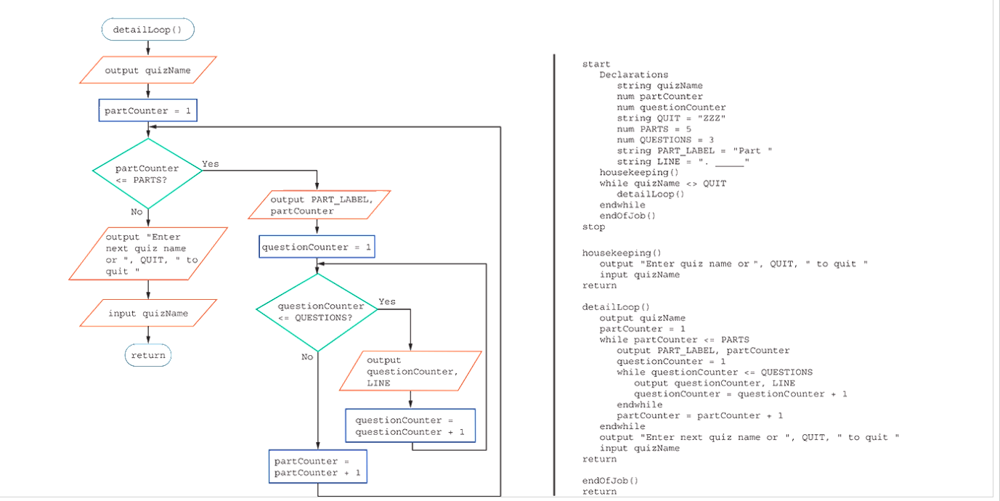
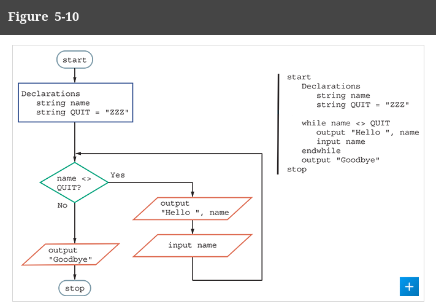
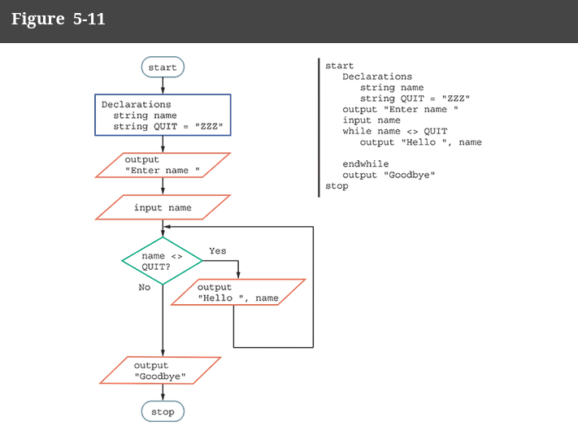
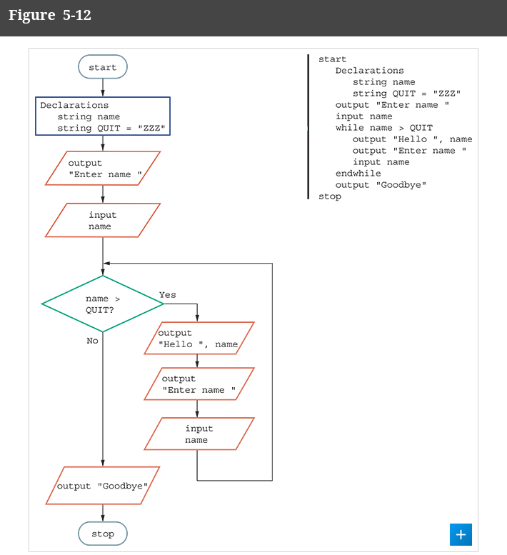
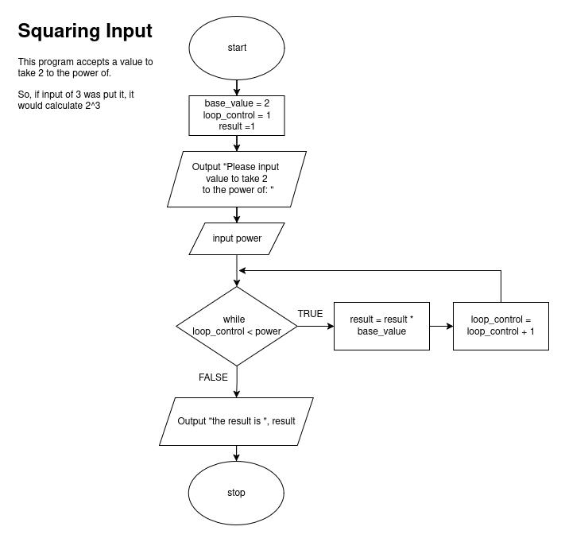
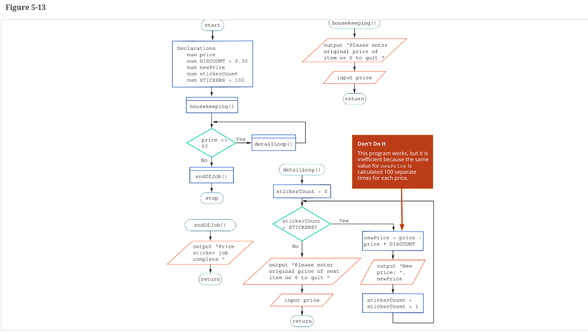

# Loops

We have just discussed decision/selection structures and everything
we could talk about one.

Today, we are talking about loops, which are basically selection statements which
keep checking until the boolean is false.

## What we have already seen:

As we know, a loop is a structure which runs as long as it's conditional is TRUE.

- They allow us to repeat code.
- Structurally, the TRUE/YES path needs to be the one which loops
- 


### Flowchart




### Psuedocode:

```
while conditional then
    code lol
endwhile
```


### Basic "Business Example"

As the book describes this, this is a basic exmaple
of how a loop is used.

We have used this, but it can diminish the complexities of many systems.




--------------

# Loop Control Variable

> *Loop Control Loop*: a variable that determines whether loop execution will continue.

When making a loop, have a variable to control the loop is essential.

Typically, we see two instances of a lcv.

- **Counter-Controlled Loop**: variable incrementing/decrementing towards a specific count 'count < 4'; A loop whose repetitions are managed by a counter
- **Sentinel Value**: variable which is used to determine if a loop should end creating an "indefinite loop", like 'number_inputted == -1'

If we do not properly create these loops, we can accidently create an infinite loop.


## Definitive Loop

> a loop for which the number of repetitions is a predetermined value.




## Indefinitive Loop

> a loop for which the number of executions cannot be predicted when the program is written.

Technically, these kind of programs can run forever.
This is kinda most programs.

Think of video games, browsers, text editors and most applications. You start them, and they keep on running until you turn them off.
To REALLY simplify them, they are all indefinitive loops,  as you can't really predict when the program ends because it will
be when you jkust close the application.



# Loops, working, in general

For this to work correctly, you need a few things:

- MUST provide an initial value for the variable controlling the loop
- Test the loop boolean expression to determine whether loop iterates
- MUST alter the variable in the loop (otherwise, probs never ends)

-------


# Nested Loop

With loops, you can always create loop inside other loops.
This is a nested loop

> loop structures that contain another loop structure.

With nested loops, we have new terms to know:

> **OUTER LOOP**: a loop that contains another loop nested within it. Contrast with inner loop.

> **INNER LOOP**: the loop that is contained within the other loop when loops are nested. Contrast with outer loop.

Here is an example:



# Complexity, simply

When you have nested loops, your code suddenly gets less efficient and more complex.

Lets looks at this code to go through a matrix:

```
start

r = 0
c = 0

matrix = [[...]]

number_of_rows = ...
number_of_columns = ...

while r < number_of_rows then
    while c < number_of_columns then
        print("Value in this position is: " + matrix[r][c] )
        c += 1
    endwhile
    r += 1
    c = 0
endwhile

begin
```

If we run this code, the problem size is exponetially growing.

We can compare this with the increasing problem sizing of an array, we
can see nester loops can cause inefficiencies in code.

------------

# Common Loop Mistakes

### Mistake: Failing to Initialize the Loop Control Variable



It is very easy to not initialize your variable, like the one found above. In most programming
langauges, this would result in a errored out program. In our code here, it just doesn't make sense.

### Mistake: Failing to Initialize the Loop Control Variable



In this loop, if it enters the loop, it nevers leaves and creates an infinite loop 
since it does not update the loop.

Erm, this is bad and dumb. Just update it.

### Mistake: Using the Wrong Type of Comparison When Testing the Loop Control Variable

Yeah this one is also wrong



### Off By One Error



In this problem, the loop ends early by being off by one. Currently, the loop control being set equal to 1 means
it will run the loop 1 less times than expected to calculate the solution. Making it 0 instead makes this work!

### Mistake: Including Statements inside the Loop Body That Belong outside the Loop



Thing in the loop lol. Shouldn't be there.
