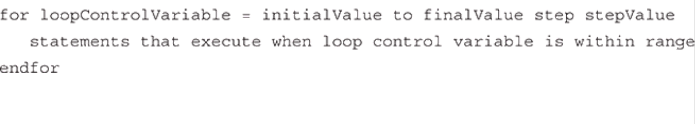
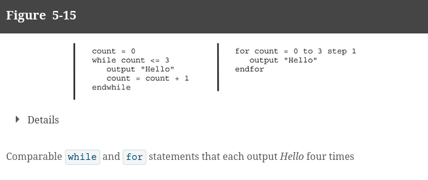
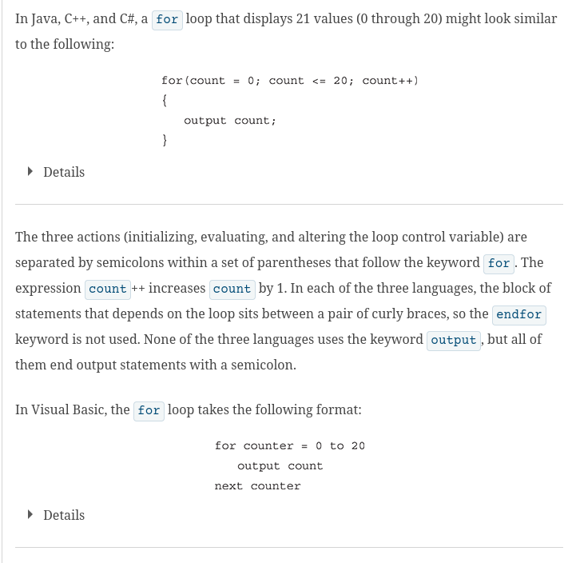
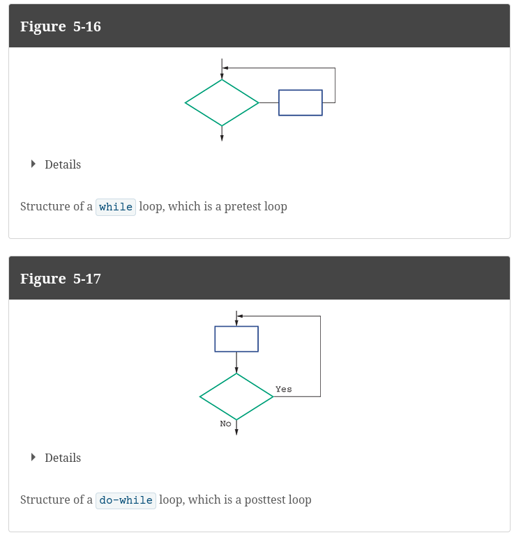

# New Loop Types

Up to this point, we have only discussed the while loop. There are more loop tho.

# For loop

### THESE MAKE FOR GREAT DEFINITIVE LOOPS!

For loops are used to do increments. They simplify the process of initializing a variable
to just us it to count to a number.

This is not only helpful for simple increments, but also
for going through types of lists.











# Posttest Loop

Up to this point, we have been doing just pretest loops. This is, the loop
first does its boolean check. It the will run.

This next loop type first executes its code, THEN tests whether it should repeat or not.



In psuedocode, this is typically shown as a do-while loop:

```
do 
    code ...
while CONDITIONAL

```
