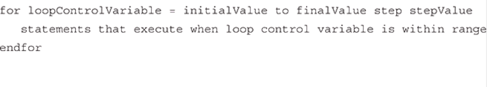
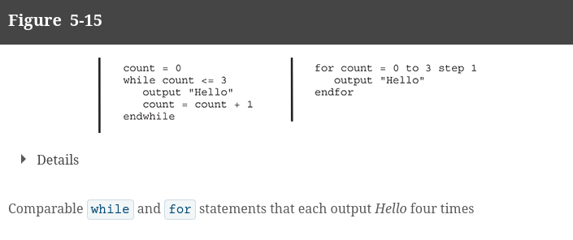
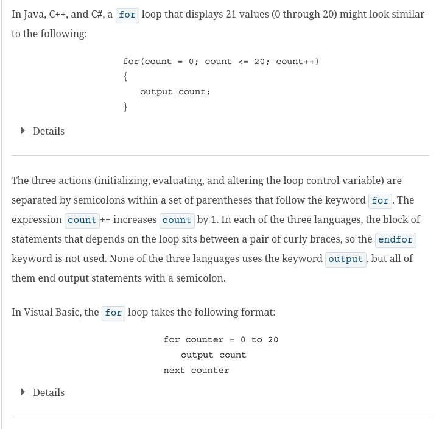
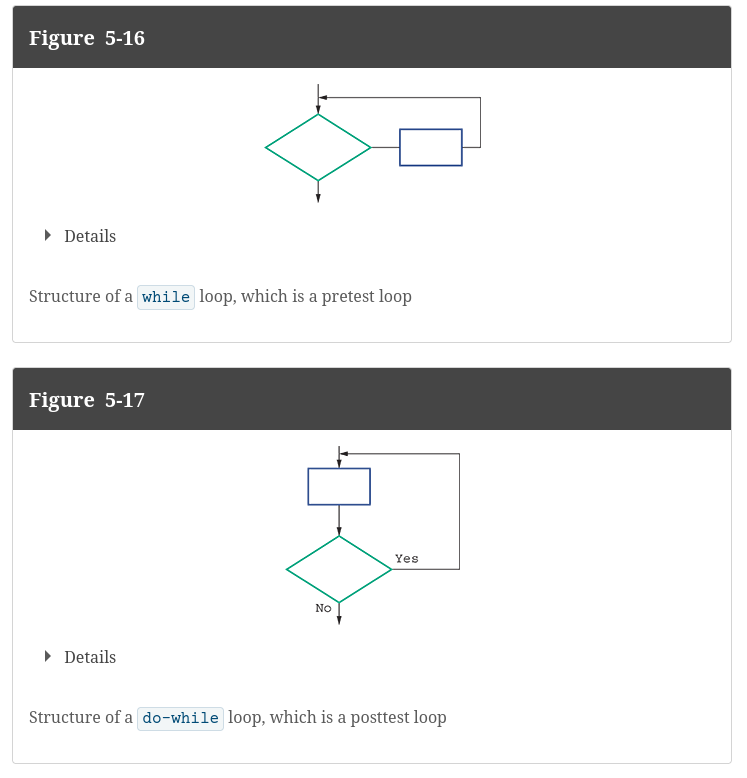
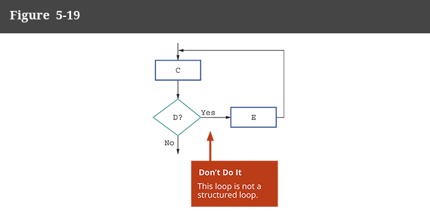

# New Loop Types

Up to this point, we have only discussed the while loop. There are more loop tho.

# For loop

### THESE MAKE FOR GREAT DEFINITIVE LOOPS!

For loops are used to do increments. They simplify the process of initializing a variable
to just us it to count to a number.

This is not only helpful for simple increments, but also
for going through types of lists.











# Posttest Loop

Up to this point, we have been doing just pretest loops. This is, the loop
first does its boolean check. It the will run.

This next loop type first executes its code, THEN tests whether it should repeat or not.



In psuedocode, this is typically shown as a do-while loop:

```
do 
    code ...
while CONDITIONAL

```

# Even with a do-while loop (posttest loop), you can still have unstructured code!

STRUCTURE STILL MATTERS HERE. Just cause code CAN appear before the boolean statement, it doesn't mean we can add both code BEFORE and AFTER.
Only one of the other.


All structured loops, both pretest and posttest, share these two characteristics:

- The loop-controlling evaluation must provide either the entry to or exit from the structure.

-  The loop-controlling evaluation provides the only entry to or exit from the structure.




# Finally Common uses of loops

- accumulate totals
- validate data

