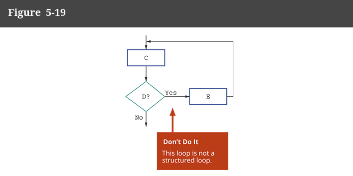

# Loop Finale

# Characteristics shared by all structure loops

STRUCTURE STILL MATTERS HERE. Just cause code CAN appear before the boolean statement, it doesn't mean we can add both code BEFORE and AFTER.
Only one of the other.

All structured loops, both pretest and posttest, share these two characteristics:

- The loop-controlling evaluation must provide either the entry to or exit from the structure.

-  The loop-controlling evaluation provides the only entry to or exit from the structure.
- 

# Common uses of loops

- accumulate totals
- validate data
