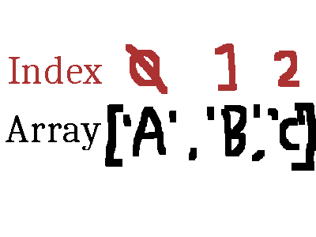
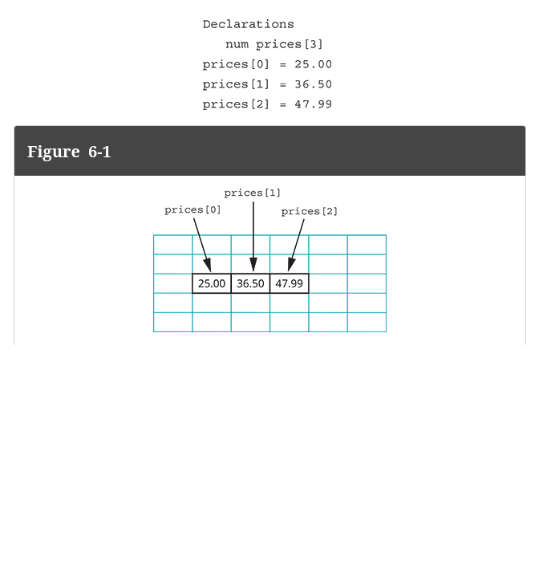

# Array Intro

Up to now, we have had variables holding specific values
but now, we are going to look at one of the first type of **DATA STRUCTURES**,
the ARRAY.

Per, the internet:
> **Data Structure**: An organization in software of data that allows more optimal searching, categorizing, or storage of information.


# An array... what is it?

Per the book:
> a series or list of variables or constants in contiguous computer memory locations, all of which have the same name but are differentiated with subscripts.

Typically, arrays are implemented with these contrictions:
- list of items
- these items are the same type
- the number of items in this list does not change

Rules per the textbook:

- An array is a list of data items in contiguous memory locations.
- Each data item in an array is an element.
- Each array element is the same data type; by default, this means that each element is the same size.
- Each element is differentiated from the others by a subscript, which is a whole number. (WE WILL SEE SUBSCRIPT BE CALLED INDEX AS TIME GOES ON)
- Usable subscripts for an array range from 0 to one less than the number of elements in an array.
- Each array element can be used in the same way as a single item of the same data type.


Typically, they are represented like this:

```
[2, 4, 5, 7, 10]
```

This is to say, you use brackets to surround the values in the array.
Within the array, the values are seperated by commas.

## Initializing

Typically, when initializing arrays, we can do 1 of two things:

Give a specific size:
```
array = 10 integer spaces array
```
OR

Create initial array values
```
array = [1, 4, 5, 2, 3, 6, 10]
```

Either way, we end up with an array with a specific type and a set size.

## Setting and getting Values

Arrays are **mutable**, and this means they can change.
They are not FULLY mutable, cause, again, we cannot change how many values
it can.

The values in the array CAN change tho.

The way we address each value in an array is by its INDEX.

> Index: Position of each value in an array starting at 0; designates the offset of 
> each variable from the first value in array



We can set the value for a position and get the value at a position
by using the array's reference (variable) followed by a pair of brackets and the position
desired inside.

So, here is setting a value in an array:

```java
class thing {
    public static void main(String[] args) {
     
        int[] array = {1, 2, 3};
        array[1] = 100;
        System.out.println(array); // ---> doesn't work, BUT, would be like [1, 100, 3]

    }
}
```

Here is how you get a value at a specific index:

```java
class thing {
    public static void main(String[] args) {
     
        int[] array = {1, 2, 3};
        System.out.println(array[2]); // ---> prints out 3!

    }
}
```


# Storing Data in Arrays, like actually on a computer

Within a computer, arrays are organized one after each other.
If variables are just references to a specific address in the computer
where your value is held,

all an array is IS a reference to a space in memory which has more of the same type after it.

That is to say, the other elements in an array are simply offsets from that original position.





