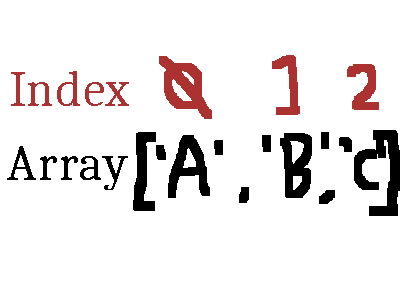
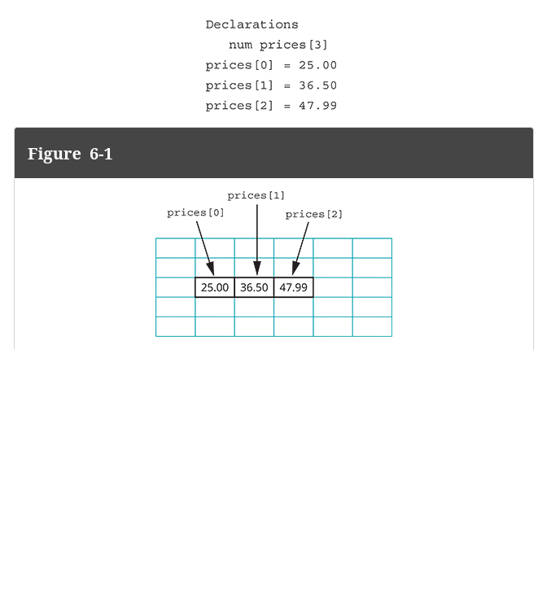
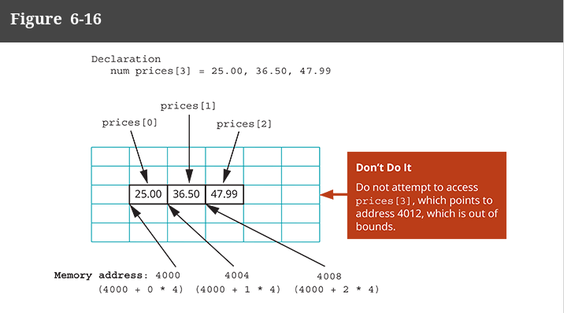

# Array Intro

Up to now, we have had variables holding specific values
but now, we are going to look at one of the first type of **DATA STRUCTURES**,
the ARRAY.

Per, the internet:
> **Data Structure**: An organization in software of data that allows more optimal searching, categorizing, or storage of information.


# An array... what is it?

> a series or list of variables or constants in contiguous computer memory locations, all of which have the same name but are differentiated with subscripts or array_name[index].

Typically, they are represented like this:

```
[2, 4, 5, 7, 10]
```

or something like this:

```
['a', 'b', 'c', 'x', 'y', 'z']
```

an empty array would look like:

```
[]
```

This is to say, you use brackets to surround the values in the array.
Within the array, the values are seperated by commas.

Rules:

- An array is a list of data items in contiguous memory locations.
- Each data item in an array is an element.
- Each array element is the same data type; by default, this means that each element is the same size.
- Each element is differentiated from the others by a subscript, which is a whole number. (WE WILL SEE SUBSCRIPT BE CALLED INDEX AS TIME GOES ON)
- Usable subscripts for an array range from 0 to one less than the number of elements in an array.
- Each array element can be used in the same way as a single item of the same data type.
- TYPICALLY, the number of items in the list does not change

## Initializing

Typically, when initializing arrays, we can do 1 of two things:

Give a specific size:
```
array = 10 integer spaces array
```
OR

Create initial array values
```
int[] array = [1, 4, 5, 2, 3, 6, 10]
```

Either way, we end up with an array with a specific type and a set size.


As a note, when we initialize an array to a certain size, it depends on the programming language what values are populated into those spaces.
So if we did the following:
```
array = 10 integer spaces array
```

some programming languages will automatically fill them with 0s, so equavlent to this:
```
int[] array = [0, 0, 0, 0, 0, 0, 0, 0, 0, 0]
```

while some programming languages will consider these places void or random data until you set a value there:
```
int[] array = [void, void, void, void, void, void, void, void, void, void]
```


Just to be sure, also define what is populating into these spaces, like this:
```
array = 10 integer spaces array initialized with 0
```


## Setting and getting Values

Arrays are **mutable**, and this means they can change.
They are not FULLY mutable, cause, again, we cannot change how many values
it can.

The values in the array CAN change tho.

The way we address each value in an array is by its INDEX.

> Index: Position of each value in an array starting at 0; designates the offset of 
> each variable from the first value in array



We can set the value for a position and get the value at a position
by using the array's reference (variable) followed by a pair of brackets and the position
desired inside.

For example, look at this example psuedocode. In this example, we are retrieving a value
from the array by addressing the index of the array:

```
int[] array = [1, 4, 5, 22, 3, 6, 10]
output array[3] 
```

This would print out the number 22.

If we wanted to first change the number at this space in the array, we would do the following:
```
int[] array = [1, 4, 5, 22, 3, 6, 10]
array[3] = 56
```

# Storing Data in Arrays, like actually on a computer

To get a better understanding of how array work, it is super helpful to see exactly how computers handle them

Within a computer, arrays are organized one after each other.
If variables are just references to a specific address in the computer
where your value is held,

all an array is IS a reference to a space in memory which has more of the same type after it.

That is to say, the other elements in an array are simply offsets from that original position.





# Using a real programming language


Here is initializing an array to a specified size:
```java
class thing {
    public static void main(String[] args) {
        int array = new int[7];
        // more code
    }
}

```


So, here is initializing an array with a few predefined values ands setting a value in an array:
```java
class thing {
    public static void main(String[] args) {
     
        int[] array = {1, 2, 3};
        array[1] = 100;
        System.out.println(array); // ---> doesn't work, BUT, would be like [1, 100, 3]

    }
}
```

Here is how you get a value at a specific index:

```java
class thing {
    public static void main(String[] args) {
     
        int[] array = {1, 2, 3};
        System.out.println(array[2]); // ---> prints out 3!

    }
}
```

# Remaining Within Array Bounds

Book Def:

> Out Of Bounds: describes an array subscript that is not within the range of acceptable subscripts.

When working with arrays, you may wonder: what if I try to go outside the bounds of an array?
An error.

This would result in an error.

In nearly all programming languages, this means that we would be trying to access memory not reserverd for
our array and this is not allowed!

We would be stretching into random data at this point!



To prevent this, we can add additional checks to our loops/controls of walking through arrays to ensure that
the index variable (or the subscript, as the book describes it) just do not exceed the allowable bounds.


