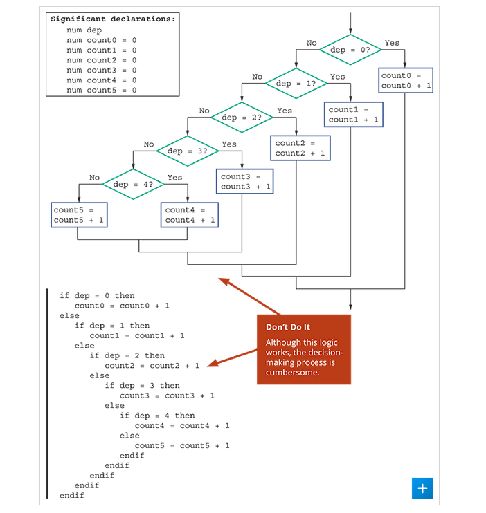
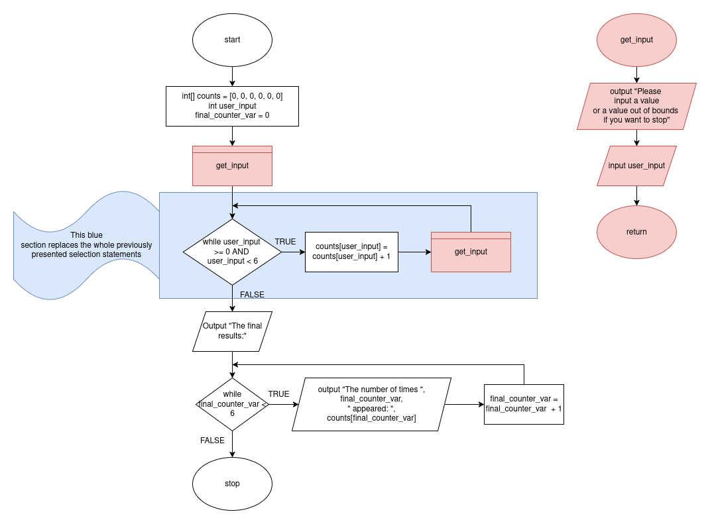
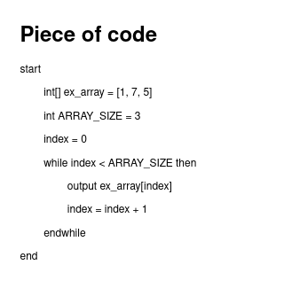
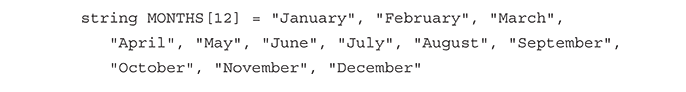
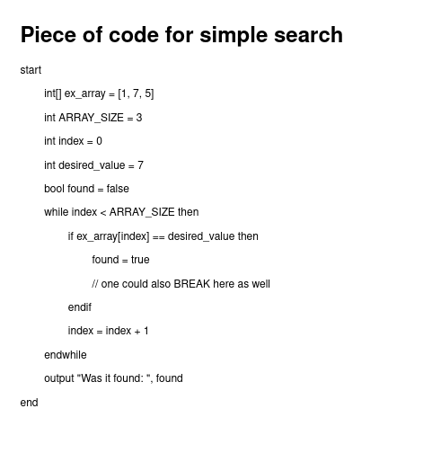
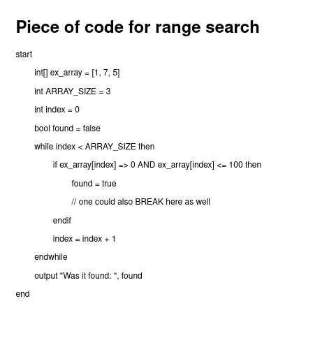
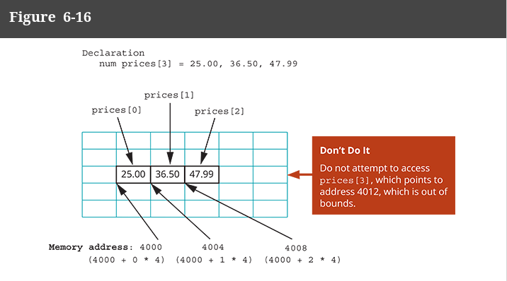

# Array More Info

# Describe How Arrays can Replace nested decisions

So, up to this point, if we wanted to compare a single variable with number of specific values, we could make a 
piece of code like the following (or use a SWITCH/CASE structure):



What we can do instead is use an array to represent each value being checked, and 
this allows us to just put the code WE KEEP REPEATING into a loop.

The piece of code above is part of a larger program which
continues to count the number of specific values until 
one inputs quit.

This part needs to check whether to add to a running total for numbers 0 to 5. 

Instead of having 5 selection statements, we can just make an array with specific indices
representing those values, like shown here:



#  Use Constants with Arrays

There are a few scenarios where constants can play an important role in conjunction with arrays

- Holding the size of the array
  - The array size should not change, and if you perhaps need to loop through your array, you can use a constant to hold that size
  - 
- Constants as Array Elements
  - perhaps there is a direct translation from an integer/position to the value needed, in which case an array can work as a translation tool:
  - 
- Constants as array subscripts/positions
  - Assign something for each position using external variables:
  - ```
    num INDIANA = 5
    num KENTUCKY = 6
    float[] sales = [0, 0, 0, 0, 0, 0, 0, 0, 0, 0, 0]
    output sales[INDIANA] // the INDIANA constant can be used to designate the sales for specifically INDIANA within the sale array
    ```
  - this is less useful as you could just store the sales for each state in a individual variable instead of using a constant for each state just to point us where that value is. THIS WOULD BE USEFUL if there was multiple arrays for different statistics all of which use these CONSTANTS to store their respective state's statistic. Probably would be better off to use some sort of object any ways but whatever


# Search an array for an exact match

A lot of times, you need to find a value inside an array,
This is pretty simple; walk through it until you find it.

In this example we are using a FLAG to distinguish whether we found the value or not



## THIS HERE IS A LINEAR SEARCH!!!!

Searching for things in data structures is its own set of theories and 
complexities which we are not going to get into here; just know
there are much more complex ways to search for things and
more complex ways to organize data to also accomplish this.

# Search Array for range match

Sometimes you need to also check the values within the array fall within a certain range.
In this piece of code, we find that we can test if one value in the array is within the given range of
0 to 100; this was really just a matter of changing the boolean from the last example



# Remaining Within Array Bounds

Book Def:

> Out Of Bounds: describes an array subscript that is not within the range of acceptable subscripts.

When working with arrays, you may wonder: what if I try to go outside the bounds of an array?
An error. 

This would result in an error.

In nearly all programming language, this means that we would be trying to access memory not reserverd for
our array and this is not allowed!

We would be stretching into random data at this point!



To prevent this, we can add additional checks to our loops/controls of walking through arrays to ensure that
the index variable (or the subscript, as the book describes it) just do not exceed the allowable bounds.


# Using for loop to process an array

In most programming languages, the for loop is perfect for going through an array.
When going through an array, you need integers to know the size of the array and a value
to walk through each position.

For loops help set these values up perfectly!


