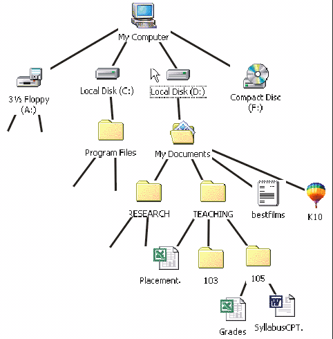
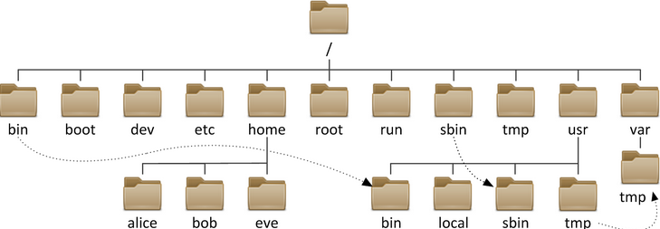
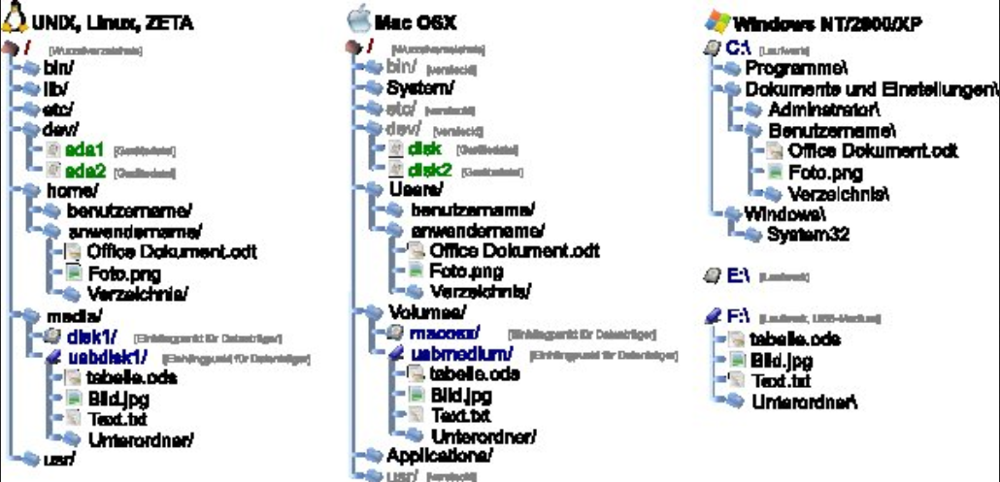

# Files Organization

When we save to a computer, we need to "put" them somewhere on a computer.

Now, if we just saved everything to the disk and that was the only organization we had, this would be horrible to try and 
navigate. Instead, we organize these files withing directories and folders/

# Directors/Folders

Every operating system you will ever use organizes files into FOLDERS or DIRECTORIES.

Folders and Directories are interchangeable terms. 
They both refer to the storage units on your device, or, as per the book:

> organization units on storage devices that can contain multiple files as well as additional directories; 

So, everything on your computer is either a file, or a directory.

## SHOW OFF FOLDERS ON DEVICE

# Hierarchy of DIRECTORIES (aka, FOLDERS)

The way these folders are organized are like a tree all starting from a root folder.
In Windows, the root is the typicaly the "C:\" directory, while Linux's and Mac's root
directory is from the "/" directory.

All other folders should extend from these points (unless you perhaps have an additional drive).

### Windows File Structure



### Linux File Structure



### ALl 3 File Structure



# Filepath

Def. of filepath
> the combination of the disk drive plus the complete hierarchy of directories in which a file resides.

A filepath tells us where a specific file or folder is on the computer. They list the folders that direct
us to a specific point.

So, if you have a file called "cat.txt" in the User folder, and the User folder was contained within the "C:\"
folder, the file path would be:
```
C:\User\cat.txt
```

If this was on a Linux/Mac device, the path would look like this:
```
/User/cat.txt
```

Notice that the path for the Mac/Linux machines have forwarded slashes to separate the directories/files, while
the Windows machine uses backward slashes. Typically, most programming languages will auto-convert these to 
whatever OS you are using so this should not be a huge issue, but do be aware as sometimes IT DOES NOT DO THIS.

Mac/Linux are both UNIX based Operating System, which is why they share this forward facing slash detail along with other
similar underlying pieces.

## Absolute Path

What we have shown here is the absolute path. This is the path from the root of the device.

- SHOW GETTING PATH FROM "File Properties"

## Relative Path

When working within a programming language, not everything needs to be or SHOULD be using 
absolute paths, and instead use relative paths. 

This is the path from a location.

So, for instance, given this full path to cat.png:

```
/User/josh/project/assets/cat.png
```

Maybe you are currently working within the "project" directory, so the relative path from THERE to the "cat.png"
file would be:
```
/assets/cat.png
```

So we just don't include the folder we are in!
