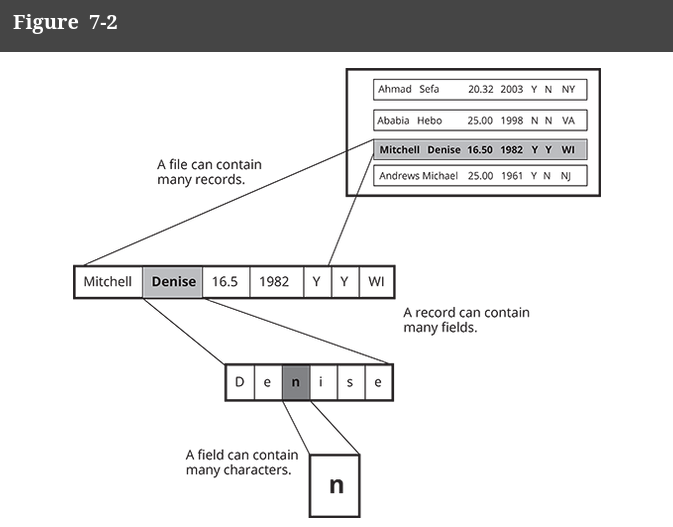

# Data Files.

When storing vast amount of data within files, there are many, many ways to accomplish this. 
Typically, data is stored in some type of database.

Per book:
> **Database**: a logical container that holds related data that can easily be retrieved to serve the information needs of an organization.

When data is stored in a database, it has to follow pretty strict schemas, that is, the data needs to be organized in 
a particular fashion. This fashion is really similar to how Microsoft Excel and programs like it store data, i.e.
in a table.

This is set up schema is considered "data hierarchy":

Per the book

> **Data Hierarchy**: represents the relationship between databases, files, records, fields, and characters.

# The Data Hierarchy:


This hierarchy is going to start at the smallest unit to the largest unit:

1. Characters: letters, numbers, or special symbols such as A, 7, or $.
2. Fields: single data items that represent a single attribute of a record or class, such as lastName, streetAddress, or annualSalary.
3. Records: groups of data fields that go together for some logical reason.
4. Files: groups of records that go together for some logical reason.

Here is a handy image showing off hierarchy from the book:




# CSV (Comma Separated Values) Files

One way to store this kind of type of arrangement of data is within CSV files.

This is one of the simplest ways to do so. 

This records all the data within the same file, and separates reach field by a comma.

The only addition to the data is that there exists a HEADER explaining what each field is.

Here is the example data in a CSV file (NOTE THE .csv EXTENSION TO HELP DESIGNATE WHAT FILE IT IS):

info.csv
```csv
First Name,Last Name,Pay Rate,Birth Year,Is Veteran,Allergic To Soy,State
Ahmad,Sefa,20.32,2003,Y,N,NY
Ababia,Hebo,25.00,1998,NM,N,VA
Mitchel,Denise,16.56,1982,Y,Y,WI
Andrews,Michael,25.00,1961,Y,N,NJ
```

Notice that:
- Each line is a record
- Each field is seperated by a comma; this is a **DELIMITER**: a character, such as a comma, used to separate fields in a data file.
