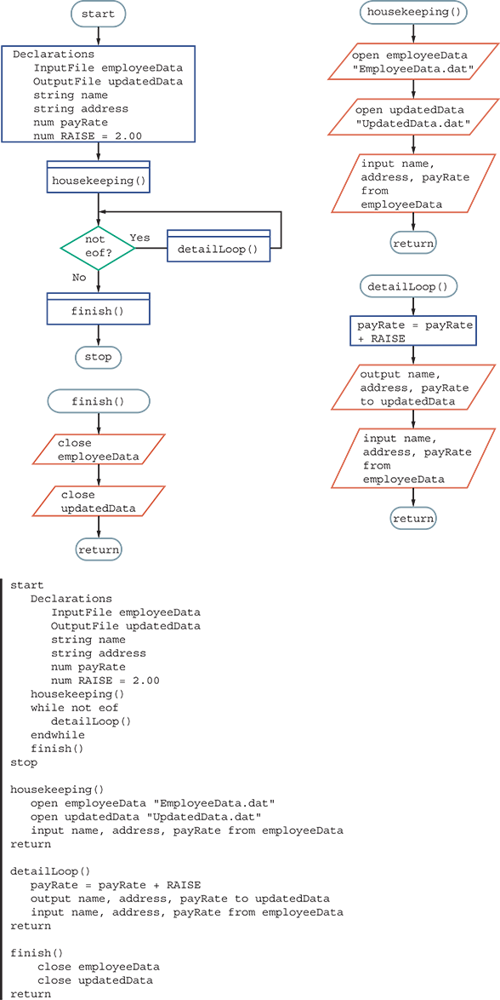

# Working With File in Code

When beginning to work with files in code, we need to be able to read and write to it.
How this is done in programming languages can be quite different, so 
we are going to be discussing this in pretty vague terminology

## Declaring Files

Let's say we are reading a file; we can do something like this:

```
InputFile employeeData
```

or if we are writing to a file
```
OutputFile updatedData
```

This simply gives us a variable to access the file by.

## Opening / Closing File

When working with a file, we need to make sure we always open and close the file.

We open the file when starting to use it, and close it when we are done.

This is not as "big" as a problem as it use to, but
this lets the computer know we are currently using the file and 
other processes should now use it.


Opening the file also points out what file we are trying to work with.

Closing the file tells the computer that we are no longer using it.

Technically, the program ending also tells the computer this information, but whatever.


Here is what it would look like in psuedocode:
```
open employeeData "C:\CompanyFiles\CurrentYear\EmployeeData.dat"
close employeeData
```

# Reading a file

Per the book:
> **Reading from a file**: the act of copying data from a file on a storage device into computer memory. Contrast with writing to a file.

Again, how this is done in a programming language can be very specific, for instance, is it reading the entire file, or just
a line of a file.

With psuedocode, we kinda just declare the amount we are reading within the file.

So we could do something like this:
```
input name from employeeData
input address from employeeData
input payRate from employeeData
```

You could simplify it to something like:
```
input name, address, payRate from employeeData
```

If we were doing something like reading a line from a CSV file to obtain a whole record, perhaps to then process it,
we should do something like this:

```
input line from employeeData
```

All of these statements would perhaps be in a loop, reading line by line, and then doing something with them.


# Writing to a file


If we had a file which we wanted to write to, the code would look very similar.
We would still want to open the file, but we would just want to make sure we make
the file object on which can write to the file instead of reading it. SOME PROGRAMMING
LANGUAGES DON'T MAKE THIS DISTINCTION, so, this may be unnecessary.

```
OutputFile updatedData
```

We still want to open and close this, but once it is all set up, our code would look something like this:

```
output name, address, payRate to updatedData
```

# Example Application





In this example, it shows the correct way to deal with files, but also lets us see
an example of a BACKUP file.

Our new file, 'updatedData', has what is now the employee's new pay, but we do still have
the old file still existing. This can be kept and stored so that there always remains a record of the
employee's pay at this point in time:

Per the book:
> **backup file**: a copy of a file that is kept in case altered values need to be restored to their original state.

In a circumstance like this, the ORIGINAL file which is also the backup is considered the **parent file**, and 
the resulting file is the **child file**!

