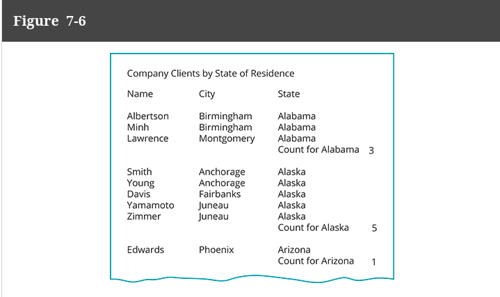
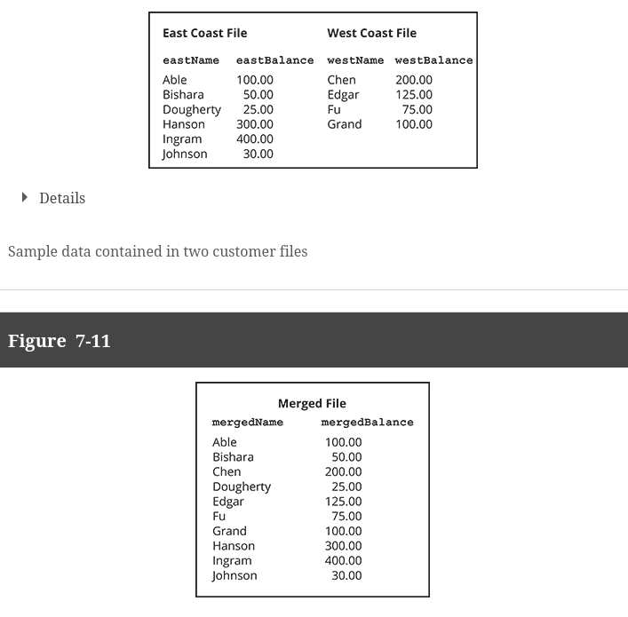
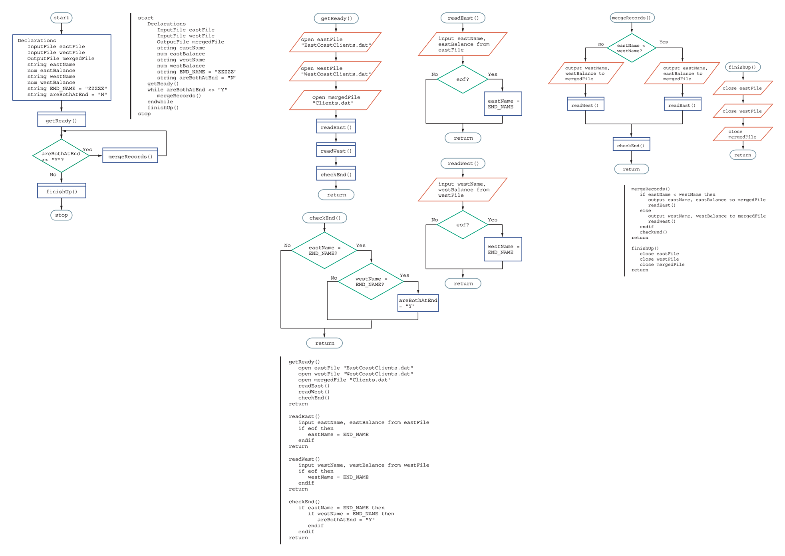

# Extra File Info

# Sequential Files

Def per the book:
> files in which records are stored one after another in some order and whose records must be accessed in sequence. Contrast with random access files.

Think for instance of a file which contains all employee data and pay rates; typically, these are sorted to some extent.
We would need to process the data one line at a time to get to the data we may need.

Sequential Files are very good for things like **batch processing**, i.e. 
a data handling technique that performs the same tasks with many records in sequence.

For example, if we need to get the paychecks for everyone at a company, we just need a file with everyone's pay rate
and we just walk through it. Simple as that.

# Random Access Files

Def per the book:
> files that contain records that can be accessed directly. Contrast with sequential files.

Instead of have one large file which needs to be read and looked at one at a time, a random access file
stores a group of data individually. This is efficient for when we, as people, perhaps need to look
up just 1 person's information. It would be slow to look through EVERYONE's data. Instead, there would exist
a file to just see an individual's data. This would be a random access file, or an "**instant access file**", or also
a "**direct access file**".

This type of file would be very inefficient for batch processing, as this would require the program to walk through
multiple files just to do its task.

We are not going to worry too much about this right now, you just need to know it exists. 

(this can also be a file with uniquer ID's for everyone, where you know Jimmy is ID 40; this means you can just jump to
that line in a file and get the data. This would still be INSTANT access)

# Control Breaks

Def per the book:
> **Control Break**:  a temporary detour in the logic of a program for special group processing.

A control break would look something like this:

Sometimes, there exists a field indicating this exists; this is the control break field.

Per the book:
> **Control Break Field**: a variable that holds the value that signals a special processing break in a program.

# Merging Files

Let's say we want to do a very common task, merging data from two files, as shown below.

We first want to make sure they have the same fields, otherwise this wouldn't really want to make sense.
Otherwise, look below:

Merging files from two sequential sources might be a bit complicated, but we are going to look exactly how it is done 
here:

