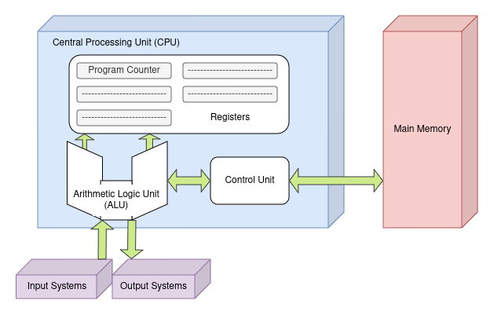

# Von Neumann Architecture

Computers today rely on what is known as the Von Neumann Architecture.

This is how computers are built.

During WW2, two individuals working on the ENIAC proposed an idea of saving instruction sets to 
memory instead of rewiring a billion things, which would be known as a new machine EDVAC.
There is also the portion about the way the portions of the computer were structurally connected too!

These individuals were **John W. Mauchly** and **J. Presper Eckert**.

They never got time to REALLY publicize their work because of WW2 and all; so,
John von Neumann, a smart man in his own right (famous hungarian mathematician), saw
the proposal of the idea and published and publicized the idea himself.

He did such a good job selling the idea that the architecture is now known under his name instead
of the two actual inventors!

# Yeah, okay but what is it?

Basically, it is how computers should be structured, under the hood!

If you every heard of a CPU or memory, which I know you have, this is how it is typically organized:

It features a few things:
- A central processing unit, which contains
  - An arithmetic logic unit
  - registers (small storage areas)
  - a program counter
  - a control unit
- A main memory system which golds programs to control the computers operation
- an I/O system

In addition, the system:
- has the capacity of carry out sequential instruction processing
- **The Von Neumann Bottleneck**:  a single path between the main memory system and the control unit of the cpu, forcing alteration of instruction and execution cycle

### Von Neumann Execution Cycle (aka the fetch-decode-execute cycle)

1. The control unit fetches the next program instruction from the memory, using the program counter to determine where the instruction is located
2. The instruction is decoded into a language the ALU can understand
3. Any data operands required to execute the instruction are fetched from memory and place in registers in the CPU
4. The ALU execute the instruction and places the results in registers or memory

There are many more things we can discuss concerning this, but we don't really need to, so we aren't!
