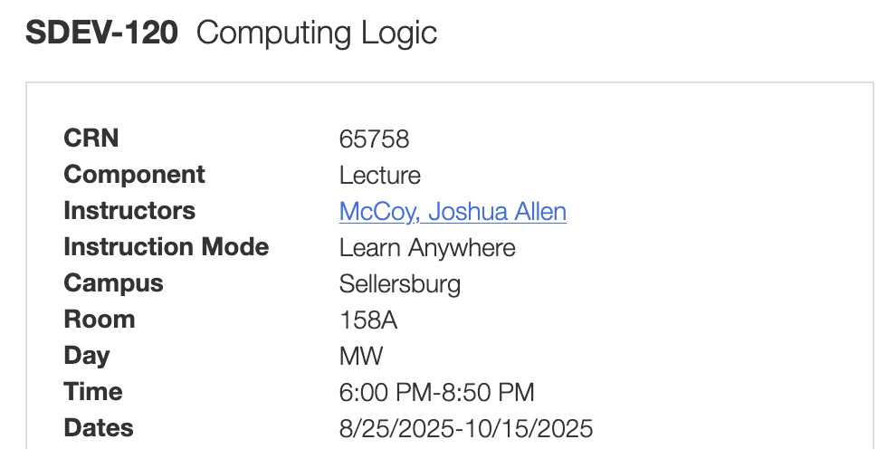

# SDEV 120

| Week / Module | Mon        | Wed        | Topics | Ch         |
|---------------|------------|------------|--------|------------|
| 1             | 8/25/2025  | 8/27/2025  |        | 1          |
| 2             | 9/1/2025   | 9/3/2025   |        | 2          |
| 3             | 9/8/2025   | 9/10/2025  |        | Appendix A |
| 4             | 9/15/2025  | 9/17/2025  |        | 3          |
| 5             | 9/22/2025  | 9/24/2025  |        | Appendix B |
| 6             | 9/29/2025  | 10/1/2025  |        | 4          |
| 7             | 10/6/2025  | 10/8/2025  |        | 5 & 6      |
| 8             | 10/13/2025 | 10/15/2025 |        | 7 & 8      |

# MAJOR COURSE LEARNING OBJECTIVES: Upon successful completion of this course, the student will be expected to 

- Demonstrate the usage of Flowcharts, Pseudocode, and UML (Unified Modeling Language) diagrams to visualize/express algorithms and document system and software design.
- Utilize logical and relational operators, control structures(sequence, selection, and repetition) and modularity to design and implement algorithms as simple programs.
- Apply a variety of strategies to test and debug simple programs.
- Analyze and explain the behavior of simple programs that utilize variables, expressions, assignments, I/O, control structures, and functions.
- Apply base numbering systems techniques to convert numeric data  between binary, decimal and hexadecimal.
- Illustrate the applications of hex and binary numbers within computing, including representation of numeric data (integer and real numbers), character values (ASCII/Unicode), data storage, hardware(/memory addresses MAC  addresses), networking (addressing/masking), color codes, images, sound, and video.
- Identify the uses of various programming and scripting languages in computer systems.
- Compare/contrast various software/system development methodologies including SDLC, Iterative, and Prototyping.
- Discuss the concepts and justifications for using secure programming and secure design techniques.
- Describe the components of a simple Von Neumann computer architecture.
- Explore the use of logic gates (AND, OR, NOT, NAND, NOR, XOR, and XNOR) and combining logic gates to create/simulate simple logic circuits.
