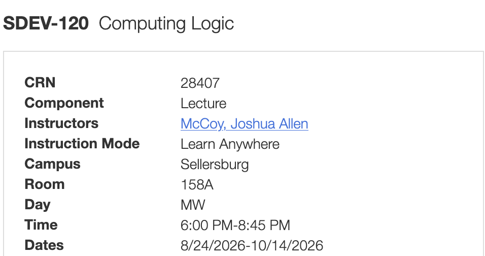

# SDEV 120

| Week / Module | Mon                        | Wed        | Learning Objectives ID's                                   | Various Other Topics | Ch         |
|---------------|----------------------------|------------|------------------------------------------------------------|----------------------|------------|
| 1             | 8/24/2026                  | 8/26/2026  | 01 (Flowcharts, Pseudocode)                                |                      | 1          |
| 2             | 8/31/2026                  | 9/2/2026   | 01 (Flowcharts, Pseudocode), 08 (SDLC), 04 (variables), 10 |                      | 2          |
| 3             | 9/7/2026 **_[LABOR DAY]_** | 9/9/2026   | 05 (HEX, BIN, DEC), 11 (logic gates), 06 (all of it)       |                      | Appendix A |
| 4             | 9/14/2026                  | 9/16/2026  | 02 (rational operators), 03 (testing, debugging)           |                      | 3          |
| 5             | 9/21/2026                  | 9/23/2026  | 01 (UML)                                                   |                      | Appendix B |
| 6             | 9/28/2026                  | 9/30/2026  | 02 (MORE rational operators??), 07 (lang i.e. python)      | Python               | 4          |
| 7             | 10/5/2026                  | 10/7/2026  | 9                                                          | Arrays and Loops     | 5 & 6      |
| 8             | 10/12/2026                 | 10/14/2026 | 04 (functions)                                             | Files, More Arrays   | 7 & 8      |

# MAJOR COURSE LEARNING OBJECTIVES: Upon successful completion of this course, the student will be expected to 

ID:

_01 - Demonstrate the usage of Flowcharts, Pseudocode, and UML (Unified Modeling Language) diagrams to visualize/express algorithms and document system and software design.

_02 - Utilize logical and relational operators, control structures (sequence, selection, and repetition) and modularity to design and implement algorithms as simple programs.

_03 - Apply a variety of strategies to test and debug simple programs.

_04 - Analyze and explain the behavior of simple programs that utilize variables, expressions, assignments, I/O, control structures, and functions.

_05 - Apply base numbering systems techniques to convert numeric data  between binary, decimal and hexadecimal.

_06 - Illustrate the applications of hex and binary numbers within computing, including representation of numeric data (integer and real numbers), character values (ASCII/Unicode), data storage, hardware(/memory addresses MAC  addresses), networking (addressing/masking), color codes, images, sound, and video.

_07 - Identify the uses of various programming and scripting languages in computer systems.

_08 - Compare/contrast various software/system development methodologies including SDLC, Iterative, and Prototyping.

_09 - Discuss the concepts and justifications for using secure programming and secure design techniques.

_10 - Describe the components of a simple Von Neumann computer architecture.

_11 - Explore the use of logic gates (AND, OR, NOT, NAND, NOR, XOR, and XNOR) and combining logic gates to create/simulate simple logic circuits.
