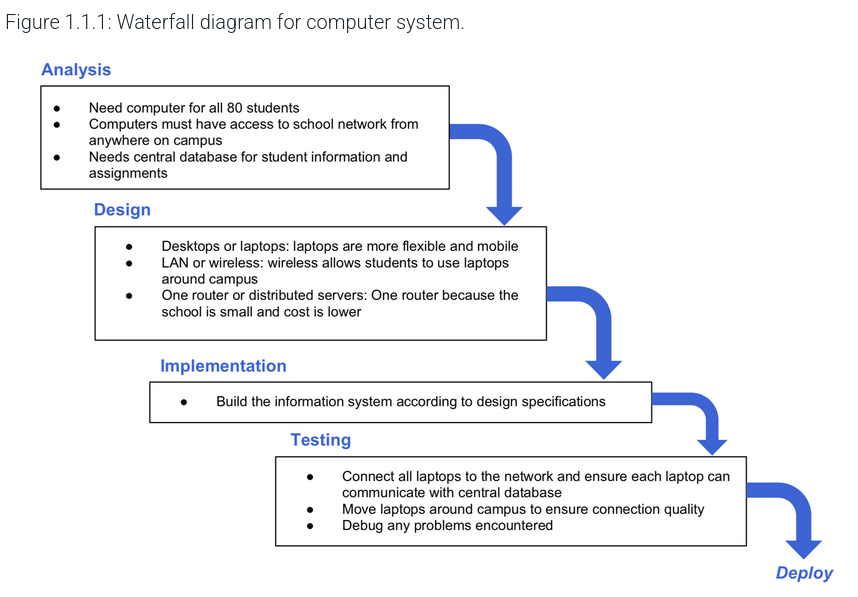
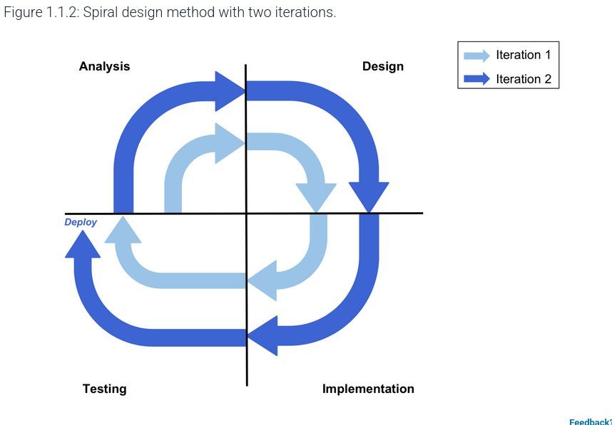
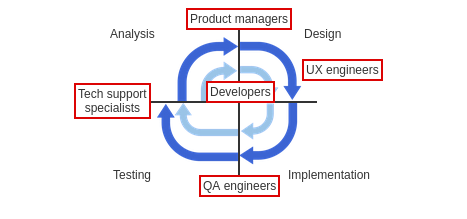

# ***Software Development Methodologies***

Software development is the process in which software is created, and many people have very passionate
opinions on how one should go about creating it.

### ***Waterfall***

As we go down the waterfall, the cost of correcting is increasing down each step. For example, it
is going to cost more to fix something when we are in the maintenance phase when compared to the cost of fixing
a mistake while we are in the design phase.

>THIS IS WHY IT IS VERY IMPORTANT TO HAVE THROUGH PLANNING AS TO FIX AS MANY MISTAKES AS YOU CAN IN EARLY STAGES.

## Spiral Design Method

The Spiral Design method is similar, in that we are still analysing the problems
at hand, designing solutions for it, and then testing to see
if it works, but this is one of the starts to what we know as
continuous development cycles.

The spiral model shows that all of these steps repeat.

When the waterfall model was first made, we had software development journeys which
ended up resulting in one, cumulative project which was completely done
at a certain deadline. In our modern age, this is not the case
for many projects, as with the internet and the ability to push constant updates, 
you can keep developing something even after you have initially "finished".

These software development charts also show us where many jobs find themselves 
positioned!

This is how software development looks like in very GENERAL TERMS
