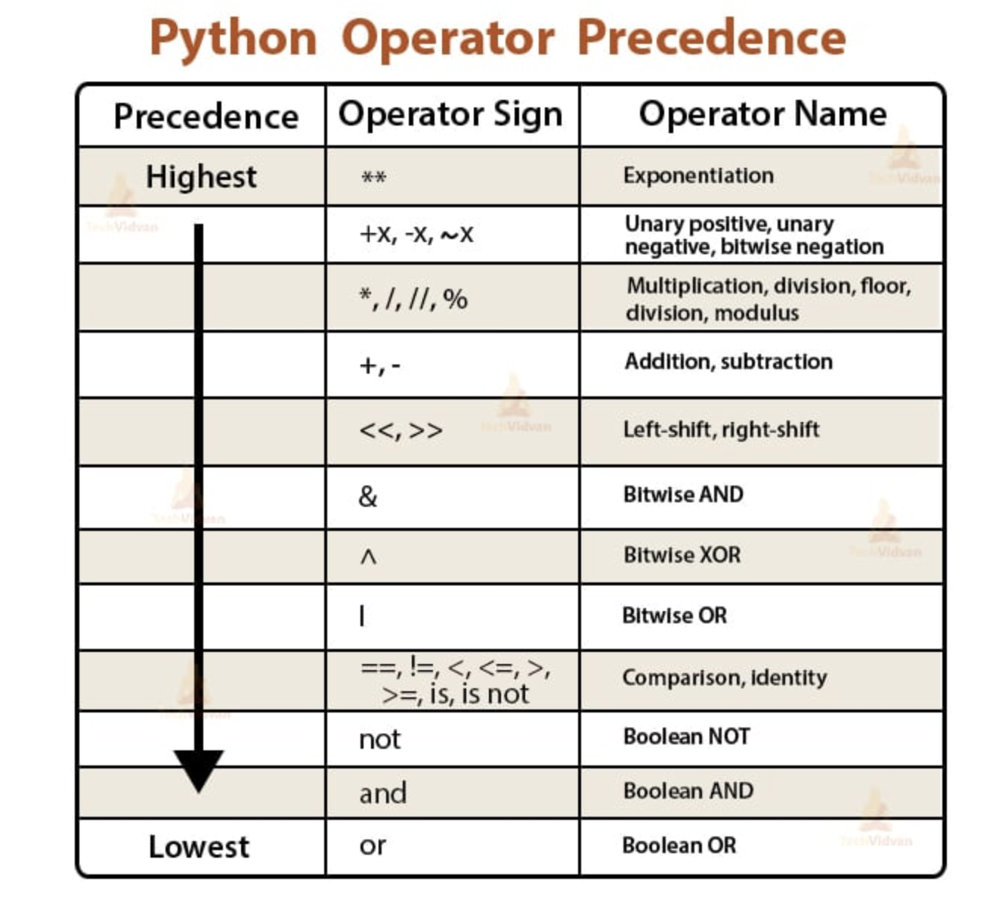

# Literal Types

Types represent the different kinds of data that the computer can understand and manipulate. 
These types define how data is stored in memory and what operations can be performed on it. 
In essence, types in Python are classifications that specify the nature of data objects, enabling the 
computer to interpret and process them accurately. They provide a structured framework for organizing 
and working with data in programs.


A data type consists of a set of values and a set of operations 
that can be performed on those values

Use the type() function to get the type of any object
```python
print(type('an object'))
```


```python
class example_defined_type:
    val: str

    def __init__(self, string):
        self.val = string


var = example_defined_type('example')
print(type(var))
```

-----

# None

Python's Equivalent To Nothing, Nil, Null (or None)
```python
None
print(None)
```

Prints out the type
```python
print(type(None))   # NoneType
```

Sometimes you need to know if something is nothing
```python
x = None
print(x == None)
print(x is None)

```

-------

# Boolean

Booleans are how python determines whether things are true or false

**Keywords in python for both boolean literal types**
```python
True
False
```

```
print(type(True))  # bool
```


At the very lowest layer this is stored as binary (technically)
As a bool, there are only two options, True, or False
Therefore, the computer really just knows these variable as False being 0 and True being 1
We can even see this in converting these bools to numbers:

```python
print(int(True)) # -> results in 1
```

Most times, we are not explicitly using the words True or False in our code,
Rather, we are using **EXPRESSIONS** which evaluates to either true or false

All an **expression** is _**SOMETHING THAT EVALUATES TO A SINGULAR TYPE/VALUE
THE BOOK DEFINES EXPRESSION AS_** "A description of a computation that produces a value"

```python
True # This is an expression

"Hey" # This is an expression

1 + 1 # This is an expression

val = 1 + 1 # THIS IS A FULL ON STATEMENT WHICH INCLUDES AN EXPRESSION
```


We can see there how boolean can result from "larger" expressions

```python
print(1 == 1)  # evaluates to True and prints it out
print(1 == 0)  # evaluates to False and print it out
print(1 > 0)   # evaluates to True
```

In these examples, we can see the first appearances of boolean OPERATORS
All an operator is IS TYPICALLY A SYMBOL WHICH APPLIES SOME SORT OF OPERATION ONE VALUES

we see a few here, those being == and > (or <)
- `==` compares two values and results in True if they are the same value, false otherwise
- `>` is the greater than operators and will return true if the left operand is greater than the right operand, and false otherwise
- (vice versa for `<`)

---------

# Integer
integers are just digits that are whole numbers
```python
10
0
9223372036854775807
-1
```

integers cannot consist of anything other than digits and underscores. 
Use underscores to more clearly indicate large numbers

```python
1_999_999_999

print(1_999_999_999 + 1)
```

### other than base 10 values

## BINARY

```python
1001_0110_0111_1111  # this may look like binaryn but this is NOT. This is a base 10 value
print(1001_0110_0111_1111 + 1)
```

denote binary values using the prefix 0b or 0B

```python
print(0B1001_0110_0111_1111)  # prints 38527 (integer equivalent)
print(bin(38527))             # prints 38527 as it's binary equivalent
```

## OCTAL VALUES
denote octal values using the prefix 0o or 0O

```python
print(0o113177)
print(oct(38527))
```

## HEXADECIMAL
denote hexadecimal values using the prefix 0x or 0X

```python
print(0x967f)
print(hex(38527))
```

--------

# Floating Point Values

For real numbers (values which contain a decimal) use floating point values
HERE ARE SOME VALID FLOATING POINT VALUES

```python
1.0
3.14159
-12309723905702937527.
```

you can also use sciencitific notation to declare a floating point value so instead of this:

```python
30_000.
```

you can do this:

```python
3e4
```

We can see this here as well

```python
print(30_000. == 3e4)  # This prints True, because these values are quite literally the same thing
```

represent small decimal values as well:

```python
print(4.5E-2)
```

if it is very small, python will print it out as scientific notation automatically

```python
print(4.5E-10)
```

-------

# Operators

**EXPRESSIONS**
Expression: a set of code which can be evaluated to a value
DO NOT CONFUSE THIS WITH STATEMENTS
Statement: An instruction to perform an action; typically a single line of code in python.
           Statements can consist of expression(s)!


If integers and floating point values were just here to be represented, that would be cool, but not super helpful
That's why we have operators!

## Addition
```python
1 + 1      # = 2
-10 + 20   # = 10
1.5 + 1.5  # = 3.0
1.0 + 1    # = 2.0
```

Not sure why you would do this, but THIS does work:
`True + 1   # = 2`

IF YOU ADD AN INT WITH A FLOAT, THE RESULT WILL ALWAYS BE A FLOATING POINT VALUE. SAME THING FOR ALL BINARY OPERATORS!


## Subtraction
```python
1 - 1      # = 0
-10 - 20   # = -30
4.5 - 1.5  # = 3.0
1.0 - 1    # = 0.0
```


## Mulitplication
```python
1 * 2          # = 2
2 * 0          # = 0
4.0 * 4        # = 16.0
.235 * 7.4566  # = 1.7523009999999999
```

## Exponents
```python
1 ** 2      # = 1^2 = 1
2 ** 3      # = 2^3 = 8
4.5 ** 2.5  # = 42.95673695708276
2 ** -1     # = 0.5
```

## Division (THIS WILL ALWAYS RESULT IN FLOATING POINT VALUES)
```python
1 / 1         # = 1.0
25 / 5        # = 5.0
35.0  / 4.0   # = 8.75
#5 / 0         # = AN ERROR
```


## Integer Division
This truncates then result of the division to the nearest whole number, even for floating point values
```python
8 // 3        # = 2
10.3435 // 3   # = 3.0
```

## Modulo (Remainder) Operator
Gives the remainder that would result from the division of the two numbers

```python
7 % 3         # = 1
10.3435 % 3   # = 1.3435000000000006
```

THIS IS SUPER HELPFUL FOR DETERMINING IF A NUMBER IS EVEN BTW!!!!!!!
i.e. (<num> % 2) == 0   -> if this is True, then it is even!!!!


# BOOLEAN OPERATORS
this applies just for boolean type values. Should seem familiar from SDEV 120


## not
inverses the boolean value
```python
not True      # = False
not False     # = True
not (1 == 1)  # = False
```

## and
ensures both are true to result in true
```python
True and True    # = True
True and False   # = False
False and False  # = False

val = 10
(val > 0) and (val < 20)  # = True
```

## or
ensures at least one is true to result in true
```python
True or True    # = True
True or False   # = True
False or False  # = False

val = 1
(val == 0) or (val == 1)  # = True
```


## Bitwise Operators
```python
print(bin(0B001100))
print(bin(0B001100>>2))
print(bin(0B001100<<2))
```


## PYTHON IS A STRONGLY TYPED LANGUAGE
before applying operators to operands, it ensures it is allowed to do that, and if not, it results in an error
These all results in errors due to this:

```python
1 + "dog"
"hey" / "soul sister"
-"dog"
ord(1)
chr('x')
```


## Operator Precedence



------

------


# Type Casting

convert between types (TYPE CASTING)

```python
7.0  # obviously a float but maybe we want it as an int
int(7.0)
```
TYPICALLY, it is done using this format: ` <type>(<value you want to cast>)`

You may lose data when converting between types though, for instance:


```python
int(7.5)  # results in 7


print("here is a number: " + str(5))  # this would result in an error if 5 was not casted to a string
```


A VERY IMPORTANT CASTING USE IS WHEN CONVERTING INPUTS TO EITHER FLOATS AND INTEGERS
we will talk about it in the input section though

```python
int("100") # -> 100
float("10.43") # 10.43

```

------

# Other Types We Will Get To Later

WE WILL TALK ABOUT THESE LATER

List
Tuple
Dictionary
Set


