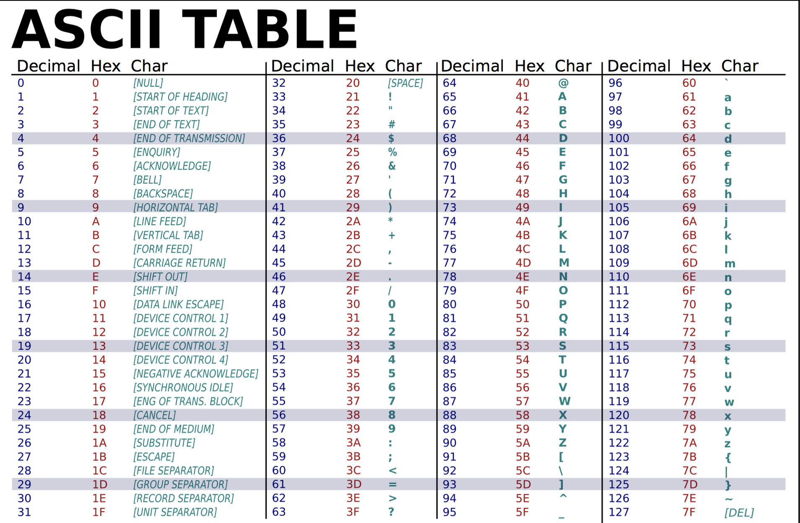

# Strings... but well first Characters


# Characters

just a single character
```python
"a"  # this is a singular character
'1'  # this is another character
```

Characters in python, and many other programming languages,
use ASCII to encode these characters:



ord() function takes a character and returns its corresponding ascii value as an int

```python
print(ord('a'))
```

chr() function takes an integer and returns its equivalent character as a string
```python
print(chr(1))
```


## special characters

Some characters can't be typed, but does need to be outputted!

So, we can use a few special rules to actually use these in our code!

### new line
```python
'\n'
print('dog\ncat')
```


### backspace
```python
'\b'
print('dog\b')
```


### tab character
```python
'\t'
print('dog\tcat')
```


### single quote/ double quote
```python
'\''
"\""
```


### backslash
```python
'\\'
print('\\thing')
```


-----------------

# Strings

a string is simply a list/array of characters placed one after each other

```python
"dog"  # string containing 3 characters
""     # string containing 0 characters, i.e. an empty string. Even
```

can use either ", ' or '''/"""

```python
"this is the same thing"
'this is the same thing'
"""this is the same thing"""
'''this is the same thing'''
```

use the three quote characters for multiline stirngs

```python
print(
'''
this
is
a
valid
string
'''
)
```

technically, all char objects are considered strings in python


```python
var = ''
print(type(var))

var: chr = ''
print(type(var))

print("This is just a string being printed out")  # just a long string
```

# Operators

Just like the mathematical operands, there are operators that can applied to strings

concatenation (adding strings together)
just put the + operator between two strings:   <str> + <str>

```python
print("Hi " + "bro")

print("Here" + " " + "I" + " " + "am adding a bunch of strings together")
```
more helpful when using variables

```python
first_name = "John"
last_name = "Smith"
print(first_name + " " + last_name)
```

Replication operator (multiplying strings)

Just place an * between a string followed by an int: <str> * <int>

```python
print("Z" * 5)  # results in 'ZZZZZ'

print("Z" * 0)  # results in an empty string

print('abc ' * 10)  # works with any size string
```
