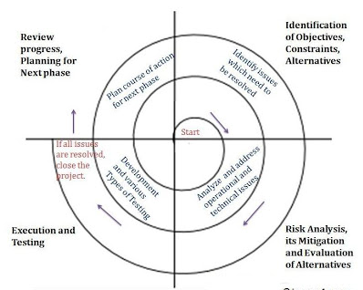
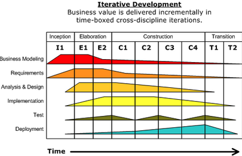

# Software Development Methodology

## History
- There were obviously older software development methodology
- Waterfall
    - Created during the 1970s
    - Already discussed
- There other processes made:
    - Spiral Model (1986)
    - 
    - Rational Unified Process (RUP) (1999~2003)
    - 
- Agile Manifesto created 2001

## AGILE
- Why Agile instead of Waterfall
    - Waterfall is what's considered a "heavyweight" software development methods
        - Very regulated (change to the project must be very controlled)
        - Planned out (hitting certain benchmarks by specific points)
        - Micromanaged
        - Often used for the sake of creating a product which will be complete at the end
        - End product is defined and fixed
- Agile is Lightweight!
    - Instead of strictly following a process, agile deems it more important for individuals to interact with each other to talk about their project
    - Instead of following strict documentation standards, agile deems it more important to create working code first and foremost
    - Instead of trusting an original contact on a project, agile encourages developers to reach our and collaborate with the customer as to what the product should be
    - Instead of sticking with a plan, agile prefers to respond to change as the need arises
    - These were the sentiments shared by the original creators of agile: https://agilemanifesto.org/
- Used whenever the project is under continuous development
- Based off features to add to project
- These are the general features of any agile development

## SCRUM (An extension of agile)
- See [THIS](https://speakerdeck.com/mikecohn/getting-agile-with-scrum-ndc-2014?slide=6)

## [Other Methodologies](https://deltanem.com/8-software-development-models-organized-in-charts-and-explained/)
